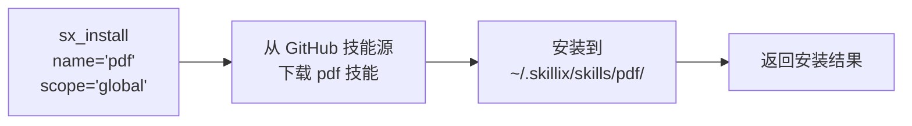
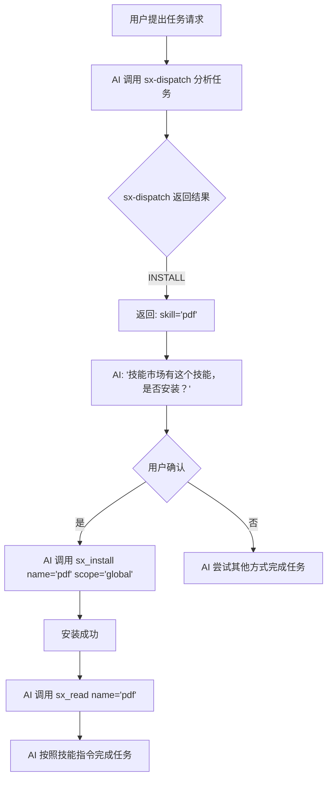
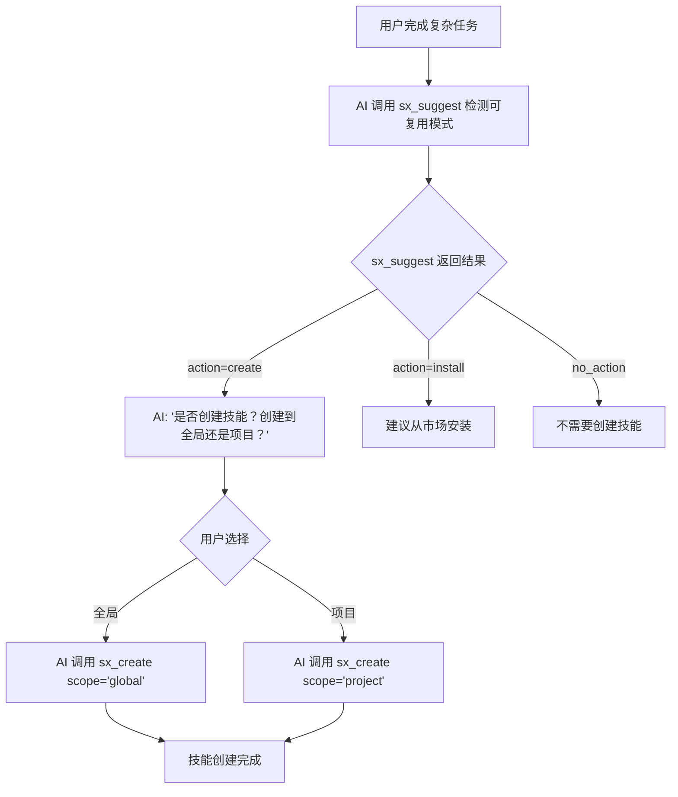
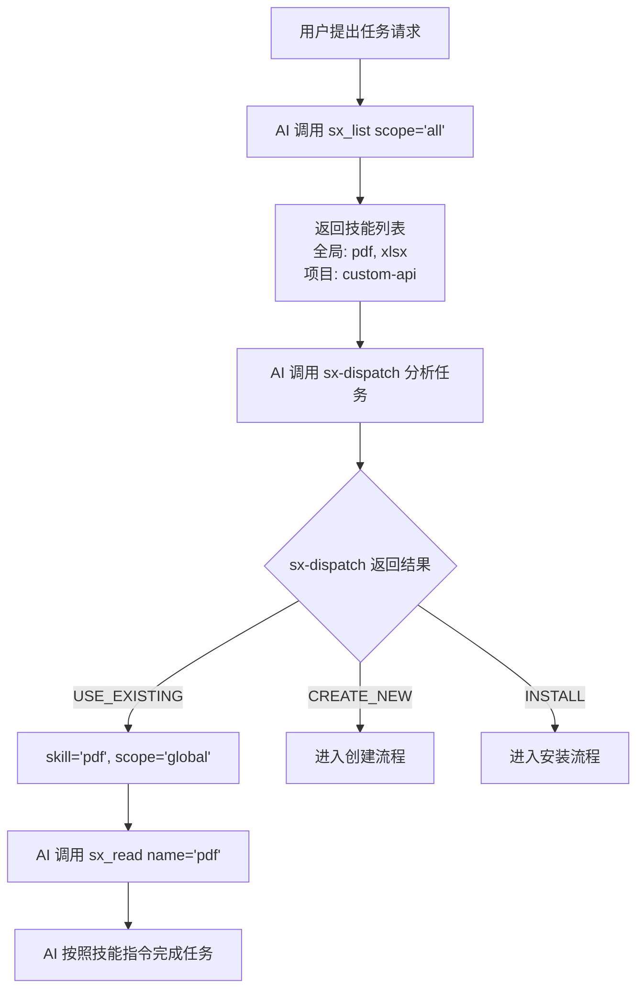
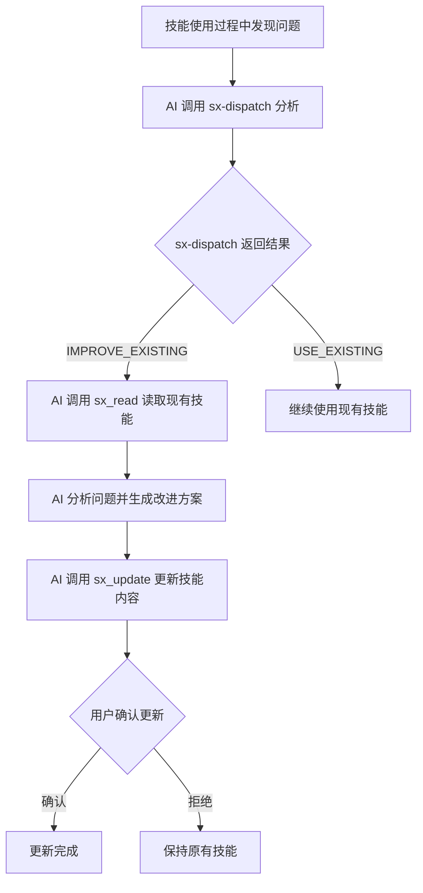
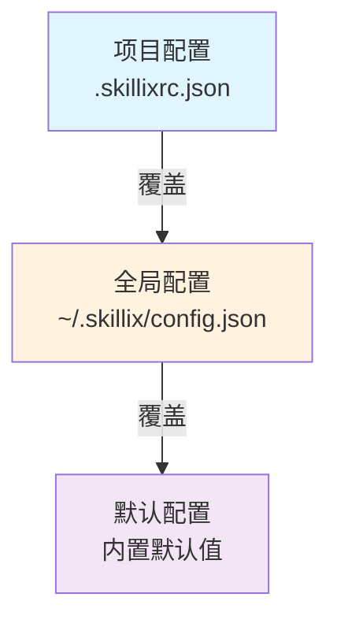

# Skillix 自动创建与进化设计

> 日期: 2026-01-11
> 来源: 从初步设计构想拆分
> 更新: 添加全局/项目技能管理和技能市场集成

---

## 一、背景与目标

### 1.1 背景

在使用 Skill 系统的过程中，我们发现以下痛点：

1. **手动创建繁琐** - 每次创建技能都需要手动创建文件夹和 SKILL.md
2. **更新不及时** - 技能内容可能过时，但没有机制提醒更新
3. **缺乏智能** - AI 不会主动建议创建技能，即使遇到重复的工作流程
4. **技能复用困难** - 好的技能无法在多个项目间共享

### 1.2 目标

设计一套机制，让 AI 能够：

1. **自动检测** - 识别可复用的工作流程
2. **智能建议** - 在适当时机建议创建或安装技能
3. **辅助创建** - 通过 MCP 工具快速生成符合规范的技能文件
4. **持续进化** - 基于使用反馈优化技能内容
5. **技能共享** - 支持从技能市场安装和分享技能

---

## 二、整体架构

### 2.1 双层技能架构

```
┌─────────────────────────────────────────────────────────────────────┐
│                         GitHub 技能市场                              │
├─────────────────────────────────────────────────────────────────────┤
│  skillix-skills (官方)          user/custom-skills (第三方)         │
│  ├── pdf/SKILL.md               ├── my-skill/SKILL.md              │
│  ├── xlsx/SKILL.md              └── ...                            │
│  └── ...                                                            │
└─────────────────────────────────────────────────────────────────────┘
                              │
                              │ sx_install / sx_search
                              ▼
┌─────────────────────────────────────────────────────────────────────┐
│                         全局技能层                                   │
├─────────────────────────────────────────────────────────────────────┤
│  ~/.skillix/                                                         │
│  ├── config.json              # 全局配置（技能源列表等）             │
│  └── skills/                  # 全局技能目录                         │
│      ├── pdf/SKILL.md         # 从市场安装的技能                     │
│      ├── xlsx/SKILL.md                                              │
│      └── ...                                                         │
└─────────────────────────────────────────────────────────────────────┘
                              │
                              │ 继承 + 覆盖
                              ▼
┌─────────────────────────────────────────────────────────────────────┐
│                         项目技能层                                   │
├─────────────────────────────────────────────────────────────────────┤
│  project/                                                            │
│  ├── .skillixrc.json          # 项目配置                            │
│  └── skills/                  # 项目级技能目录                       │
│      ├── custom-api/SKILL.md  # 项目特有技能                        │
│      └── pdf/SKILL.md         # 可覆盖全局技能                       │
└─────────────────────────────────────────────────────────────────────┘
```

### 2.2 技能查找优先级

```
1. 项目级技能 (project/skills/)     ← 最高优先级（可覆盖全局）
2. 全局技能 (~/.skillix/skills/)    ← 次优先级
3. 技能市场 (远程)                  ← 按需下载安装
```

### 2.3 MCP Server 架构

```
┌─────────────────────────────────────────────────────────────┐
│                   Skillix MCP Server                         │
├─────────────────────────────────────────────────────────────┤
│  Core Tools (核心工具):                                      │
│  ├── sx-dispatch    (智能分流)                                │
│  ├── sx_list      (列出技能 - 区分全局/项目)                │
│  ├── sx_read      (读取技能)                                │
│  ├── sx_create    (创建技能 - 支持选择范围)                 │
│  ├── sx_update    (更新技能)                                │
│  ├── sx_delete    (删除技能)                                │
│  └── sx_suggest   (自动建议)                                │
├─────────────────────────────────────────────────────────────┤
│  Market Tools (市场工具):                                    │
│  ├── sx_install   (从市场安装技能)                          │
│  ├── sx_uninstall (卸载技能)                                │
│  ├── sx_search    (搜索技能市场)                            │
│  └── sx_sources   (管理技能源)                              │
├─────────────────────────────────────────────────────────────┤
│  Evolution Tools (进化工具):                                 │
│  ├── sx_feedback  (记录使用反馈)                            │
│  └── sx_analyze   (分析反馈模式)                            │
└─────────────────────────────────────────────────────────────┘
```

---

## 三、核心组件设计

### 3.1 智能分流工具 (sx-dispatch)

**职责**：分析用户输入，智能判断应该执行什么操作

**返回动作**：

| Action | 说明 | 后续操作 |
|--------|------|----------|
| `USE_EXISTING` | 使用现有技能 | 调用 sx_read |
| `IMPROVE_EXISTING` | 改进现有技能 | 调用 sx_update |
| `CREATE_NEW` | 创建新技能 | 调用 sx_create |
| `COMPOSE` | 组合多个技能 | 返回技能列表 |
| `INSTALL` | **从市场安装** | **调用 sx_install** |
| `NO_SKILL_NEEDED` | 不需要技能 | 直接执行任务 |

**返回示例**：
```xml
<dispatch_result>
  <action>INSTALL</action>
  <skill>pdf</skill>
  <source>skillix-skills</source>
  <confidence>0.92</confidence>
  <reason>未找到本地 pdf 技能，但技能市场有匹配的技能</reason>
</dispatch_result>
```

### 3.2 自动建议工具 (sx_suggest)

**职责**：分析当前上下文，建议是否应该创建或安装技能

**触发条件**：

| 条件 | 说明 | 建议动作 |
|------|------|----------|
| 重复模式 | 同类任务执行 3 次以上 | 建议创建技能 |
| 复杂流程 | 任务包含 5+ 步骤 | 建议创建技能 |
| 专业领域 | 涉及特定领域知识 | 建议创建或安装技能 |
| 技能失效 | 技能指令执行失败 | 建议更新技能 |
| 市场匹配 | 市场有相关技能 | **建议安装技能** |

**返回格式**：
```xml
<skill_suggestion>
  <action>install</action>
  <suggested_name>pdf</suggested_name>
  <suggested_source>skillix-skills</suggested_source>
  <suggested_scope>global</suggested_scope>
  <reason>检测到 PDF 处理任务，技能市场有现成的 pdf 技能</reason>
</skill_suggestion>
```

### 3.3 技能创建工具 (sx_create)

**职责**：快速创建符合规范的技能文件

**工具定义**：
```typescript
{
  name: "sx_create",
  description: "创建新技能",
  inputSchema: {
    type: "object",
    properties: {
      name: {
        type: "string",
        description: "技能名称（英文，小写，连字符分隔）"
      },
      description: {
        type: "string",
        description: "技能描述"
      },
      content: {
        type: "string",
        description: "技能正文内容（Markdown 格式）"
      },
      scope: {
        type: "string",
        enum: ["global", "project"],
        description: "创建范围：global=全局, project=项目级（默认）"
      }
    },
    required: ["name", "description", "content"]
  }
}
```

**创建位置**：
- `scope: "global"` → `~/.skillix/skills/<name>/SKILL.md`
- `scope: "project"` → `./skills/<name>/SKILL.md`

### 3.4 技能安装工具 (sx_install)

**职责**：从技能市场安装技能到本地

**工具定义**：
```typescript
{
  name: "sx_install",
  description: "从技能市场安装技能",
  inputSchema: {
    type: "object",
    properties: {
      name: {
        type: "string",
        description: "技能名称"
      },
      source: {
        type: "string",
        description: "技能源名称（默认使用官方源）"
      },
      scope: {
        type: "string",
        enum: ["global", "project"],
        description: "安装范围：global=全局（默认）, project=项目级"
      }
    },
    required: ["name"]
  }
}
```

**安装流程**：



---

## 四、工作流程

### 4.1 技能发现与安装流程



### 4.2 技能创建流程



### 4.3 技能使用流程



### 4.4 技能更新流程



---

## 五、技能进化机制

### 5.1 反馈收集

通过 `sx_feedback` 工具记录使用反馈：

```typescript
{
  name: "sx_feedback",
  description: "记录技能使用反馈",
  inputSchema: {
    type: "object",
    properties: {
      skill: { type: "string", description: "技能名称" },
      scope: { type: "string", enum: ["global", "project"] },
      task: { type: "string", description: "执行的任务" },
      result: { type: "string", enum: ["success", "failure", "partial"] },
      notes: { type: "string", description: "备注（可选）" }
    },
    required: ["skill", "task", "result"]
  }
}
```

反馈自动记录到对应技能目录的 `FEEDBACK.md`。

### 5.2 定期优化

当反馈累积到一定数量时，AI 可以：

1. 调用 `sx_analyze` 分析反馈模式
2. 识别常见问题
3. 提出优化建议
4. 用户确认后调用 `sx_update` 更新

### 5.3 版本管理

使用 Git 管理技能变更：

```bash
# 创建项目级技能后
git add skills/new-skill/
git commit -m "feat: add new-skill for xxx"

# 更新技能后
git add skills/existing-skill/SKILL.md
git commit -m "fix: update existing-skill to handle xxx"
```

---

## 六、本地存储与配置

### 6.1 全局目录结构 (~/.skillix/)

```
~/.skillix/
├── config.json              # 全局配置文件
├── skills/                  # 全局技能目录
│   ├── pdf/SKILL.md
│   ├── xlsx/SKILL.md
│   └── ...
├── logs/                    # 日志目录
│   ├── skillix.log          # 主日志文件
│   └── skillix.log.1        # 轮转日志
├── cache/                   # 缓存目录
│   ├── sources/             # 技能源索引缓存
│   └── downloads/           # 下载临时目录
└── data/                    # 数据目录
    ├── feedback.json        # 反馈数据汇总
    └── statistics.json      # 使用统计
```

### 6.2 全局配置 (config.json)

```json
{
  "version": "1.0.0",
  "sources": [
    {
      "name": "official",
      "url": "https://github.com/user/skillix-skills",
      "branch": "main",
      "default": true
    },
    {
      "name": "team-skills",
      "url": "https://github.com/team/custom-skills",
      "branch": "main",
      "default": false
    }
  ],
  "defaultScope": "global",
  "format": "xml",
  "autoSuggest": true,
  "suggestThreshold": {
    "repeatCount": 3,
    "stepCount": 5
  },
  "logging": {
    "level": "info",
    "maxFiles": 5,
    "maxSize": "10MB"
  },
  "cache": {
    "enabled": true,
    "ttl": 3600
  }
}
```

### 6.3 项目配置 (.skillixrc.json)

```json
{
  "skillsDir": "./skills",
  "inheritGlobal": true,
  "sources": [
    {
      "name": "project-specific",
      "url": "https://github.com/project/skills",
      "branch": "main"
    }
  ],
  "format": "xml",
  "autoSuggest": true,
  "feedback": {
    "enabled": true,
    "autoRecord": false
  }
}
```

### 6.4 配置优先级



### 6.5 反馈数据存储

反馈数据存储在 `~/.skillix/data/feedback.json`：

```json
{
  "skills": {
    "pdf": {
      "totalUsage": 15,
      "successCount": 12,
      "failureCount": 2,
      "partialCount": 1,
      "lastUsed": "2026-01-11T10:30:00.000Z",
      "feedbacks": [
        {
          "task": "转换 PDF 为图片",
          "result": "success",
          "timestamp": "2026-01-11T10:30:00.000Z"
        }
      ]
    }
  }
}
```

---

## 七、技能格式规范

### 7.1 SKILL.md 格式

```markdown
---
name: skill-name
description: 清晰描述技能用途和触发场景
version: 1.0.0
author: your-name
tags: [tag1, tag2]
---

# 技能标题

## 使用说明

[详细指令]

## 依赖

[依赖列表]

## 示例

[使用示例]
```

### 7.2 目录结构

```
skill-name/
├── SKILL.md           # 必需
├── FEEDBACK.md        # 可选：使用反馈
├── scripts/           # 可选：辅助脚本
├── references/        # 可选：参考文档
└── assets/            # 可选：资源文件
```

---

*本文档为 Skillix 自动创建与进化设计文档*
*支持全局技能和项目级技能，可从技能市场安装和分享技能*
