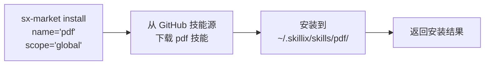
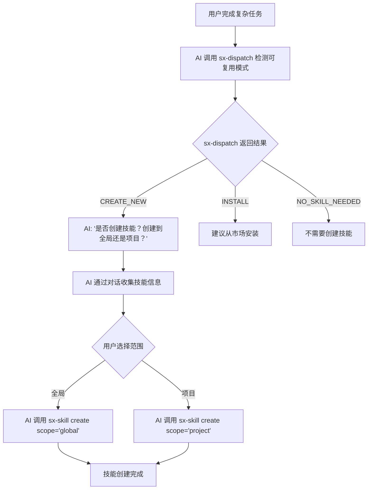
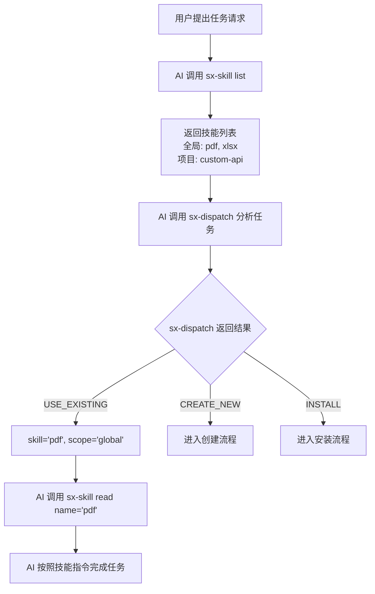
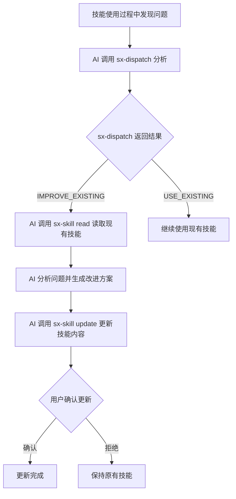
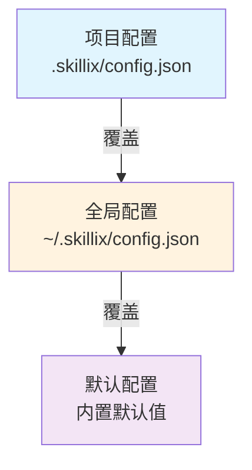

# Skillix 自动创建与进化设计

> 日期: 2026-01-11
> 来源: 从初步设计构想拆分
> 更新: 2026-01-22 同步代码实现，更新工具命名和架构

---

## 一、背景与目标

### 1.1 背景

在使用 Skill 系统的过程中，我们发现以下痛点：

1. **手动创建繁琐** - 每次创建技能都需要手动创建文件夹和 SKILL.md
2. **更新不及时** - 技能内容可能过时，但没有机制提醒更新
3. **缺乏智能** - AI 不会主动建议创建技能，即使遇到重复的工作流程
4. **技能复用困难** - 好的技能无法在多个项目间共享

### 1.2 目标

设计一套机制，让 AI 能够：

1. **自动检测** - 识别可复用的工作流程
2. **智能建议** - 在适当时机建议创建或安装技能
3. **辅助创建** - 通过 MCP 工具快速生成符合规范的技能文件
4. **持续进化** - 基于使用反馈优化技能内容
5. **技能共享** - 支持从技能市场安装和分享技能

---

## 二、整体架构

### 2.1 双层技能架构

```
┌─────────────────────────────────────────────────────────────────────┐
│                         GitHub 技能市场                              │
├─────────────────────────────────────────────────────────────────────┤
│  skillix-hub (官方)             user/custom-skills (第三方)         │
│  ├── pdf/SKILL.md               ├── my-skill/SKILL.md              │
│  ├── xlsx/SKILL.md              └── ...                            │
│  └── ...                                                            │
└─────────────────────────────────────────────────────────────────────┘
                              │
                              │ sx-market install / search
                              ▼
┌─────────────────────────────────────────────────────────────────────┐
│                         全局技能层                                   │
├─────────────────────────────────────────────────────────────────────┤
│  ~/.skillix/                                                         │
│  ├── config.json              # 全局配置（技能源列表等）             │
│  ├── skills/                  # 全局技能目录                         │
│  │   ├── pdf/SKILL.md         # 从市场安装的技能                     │
│  │   └── xlsx/SKILL.md                                              │
│  ├── cache/                   # 缓存目录                             │
│  │   └── sources/             # 技能源索引缓存                       │
│  └── data/                    # 数据目录                             │
│      └── feedback.json        # 反馈数据                             │
└─────────────────────────────────────────────────────────────────────┘
                              │
                              │ 继承 + 覆盖
                              ▼
┌─────────────────────────────────────────────────────────────────────┐
│                         项目技能层                                   │
├─────────────────────────────────────────────────────────────────────┤
│  project/                                                            │
│  └── .skillix/                # 项目配置目录                         │
│      ├── config.json          # 项目配置                            │
│      └── skills/              # 项目级技能目录                       │
│          ├── custom-api/SKILL.md  # 项目特有技能                    │
│          └── pdf/SKILL.md     # 可覆盖全局技能                       │
└─────────────────────────────────────────────────────────────────────┘
```

### 2.2 技能查找优先级

```
1. 项目级技能 (.skillix/skills/)    ← 最高优先级（可覆盖全局）
2. 全局技能 (~/.skillix/skills/)    ← 次优先级
3. 技能市场 (远程)                  ← 按需下载安装
```

### 2.3 MCP Server 架构

采用 `sx-` 前缀的统一工具设计（kebab-case 命名），每个工具通过 `action` 参数区分子命令：

```
┌─────────────────────────────────────────────────────────────────┐
│                   Skillix MCP Server                            │
├─────────────────────────────────────────────────────────────────┤
│  sx-skill (技能管理):                                           │
│  ├── action: list      列出技能（区分全局/项目）                │
│  ├── action: read      读取技能内容                             │
│  ├── action: create    创建技能（AI First 模式）                │
│  ├── action: update    更新技能                                 │
│  └── action: delete    删除技能                                 │
├─────────────────────────────────────────────────────────────────┤
│  sx-config (配置管理):                                          │
│  ├── action: get       获取配置                                 │
│  ├── action: set       设置配置                                 │
│  ├── action: init      初始化项目配置                           │
│  └── action: sources   管理技能源（list/add/remove）            │
├─────────────────────────────────────────────────────────────────┤
│  sx-market (技能市场):                                          │
│  ├── action: search    搜索技能市场                             │
│  ├── action: install   从市场安装技能                           │
│  ├── action: uninstall 卸载技能                                 │
│  ├── action: sync      同步技能源缓存                           │
│  └── action: status    查看技能源状态                           │
├─────────────────────────────────────────────────────────────────┤
│  sx-dispatch (智能分流):                                        │
│  └── 分析任务，推荐最佳操作                                     │
├─────────────────────────────────────────────────────────────────┤
│  sx-feedback (反馈管理):                                        │
│  ├── action: record    记录使用反馈                             │
│  ├── action: list      列出反馈记录                             │
│  ├── action: analyze   分析反馈模式                             │
│  └── action: clear     清除反馈记录                             │
├─────────────────────────────────────────────────────────────────┤
│  sx-help (帮助信息):                                            │
│  └── topic: overview/skill/config/market/dispatch/feedback/all  │
└─────────────────────────────────────────────────────────────────┘
```

---

## 三、核心组件设计

### 3.1 智能分流工具 (sx-dispatch)

**职责**：分析用户输入，智能判断应该执行什么操作

**参数**：

```typescript
interface SxDispatchParams {
  task: string;        // 任务描述（必需）
  context?: string;    // 上下文信息
  hints?: string[];    // 提示词列表
  projectRoot?: string; // 项目根目录
}
```

**返回动作**：

| Action | 说明 | 后续操作 |
|--------|------|----------|
| `USE_EXISTING` | 使用现有技能 | 调用 sx-skill read |
| `IMPROVE_EXISTING` | 改进现有技能 | 调用 sx-skill update |
| `CREATE_NEW` | 创建新技能 | 调用 sx-skill create |
| `COMPOSE` | 组合多个技能 | 返回技能列表 |
| `INSTALL` | 从市场安装 | 调用 sx-market install |
| `NO_SKILL_NEEDED` | 不需要技能 | 直接执行任务 |

**返回结构**：

```typescript
interface DispatchResult {
  action: DispatchActionType;
  skill?: string;           // 推荐技能名称
  source?: string;          // 技能来源
  confidence: number;       // 置信度 (0-1)
  reason: string;           // 推荐理由
  alternatives?: DispatchAlternative[];  // 备选方案
  matchDetails?: SkillMatch[];           // 匹配详情
  updateSuggestion?: UpdateSuggestion;   // 更新建议（IMPROVE_EXISTING 时）
}
```

**使用示例**：

```json
{
  "action": "INSTALL",
  "skill": "pdf",
  "source": "official",
  "confidence": 0.92,
  "reason": "未找到本地 pdf 技能，但技能市场有匹配的技能"
}
```

### 3.2 技能管理工具 (sx-skill)

**职责**：本地技能的 CRUD 操作

**工具定义**：

```typescript
interface SxSkillParams {
  action: 'list' | 'read' | 'create' | 'update' | 'delete';
  name?: string;
  scope?: 'global' | 'project';
  projectRoot?: string;
  metadata?: SkillMetadata;
  body?: string;
}
```

**创建位置**：
- `scope: "global"` → `~/.skillix/skills/<name>/SKILL.md`
- `scope: "project"` → `.skillix/skills/<name>/SKILL.md`

**AI First 创建模式**：

创建技能时，AI 代理应先通过对话收集用户需求，再调用 create：

1. 确认技能用途和触发场景
2. 收集技能名称（hyphen-case 格式）
3. 收集描述信息和标签
4. 收集具体的操作步骤和示例
5. 调用 sx-skill create 创建技能

### 3.3 技能市场工具 (sx-market)

**职责**：技能市场的搜索、安装、卸载、同步操作

**工具定义**：

```typescript
interface SxMarketParams {
  action: 'search' | 'install' | 'uninstall' | 'sync' | 'status';
  query?: string;           // 搜索关键词
  name?: string;            // 技能名称
  source?: string;          // 技能源名称
  scope?: 'global' | 'project';
  tags?: string[];          // 按标签筛选
  force?: boolean;          // 强制覆盖
  limit?: number;           // 结果数量限制
  projectRoot?: string;
}
```

**安装流程**：



### 3.4 反馈管理工具 (sx-feedback)

**职责**：记录和分析技能使用反馈，支持技能进化

**工具定义**：

```typescript
interface SxFeedbackParams {
  action: 'record' | 'list' | 'analyze' | 'clear';
  skillName?: string;
  result?: 'success' | 'failure' | 'partial';
  task?: string;
  notes?: string;
  scope?: 'global' | 'project';
  projectRoot?: string;
  days?: number;  // 时间范围（天）
}
```

**反馈分析结果**：

```typescript
interface FeedbackAnalysis {
  skillName: string;
  totalCount: number;
  successCount: number;
  failureCount: number;
  partialCount: number;
  successRate: number;
  shouldUpdate: boolean;
  updateReason?: string;
  recentFeedbacks: SkillFeedback[];
}
```

---

## 四、工作流程

### 4.1 技能发现与安装流程


### 4.2 技能创建流程（AI First 模式）



### 4.3 技能使用流程



### 4.4 技能更新流程



---

## 五、技能进化机制

### 5.1 反馈收集

通过 `sx-feedback record` 记录使用反馈：

```typescript
// 记录反馈
{
  action: 'record',
  skillName: 'pdf',
  result: 'success',  // success | failure | partial
  task: '转换 PDF 为图片',
  notes: '处理速度很快'
}
```

反馈数据存储在 `~/.skillix/data/feedback.json`。

### 5.2 定期优化

当反馈累积到一定数量时，AI 可以：

1. 调用 `sx-feedback analyze skillName='pdf'` 分析反馈模式
2. 识别常见问题和成功率
3. 提出优化建议
4. 用户确认后调用 `sx-skill update` 更新

**分析结果示例**：

```json
{
  "skillName": "pdf",
  "totalCount": 15,
  "successCount": 12,
  "failureCount": 2,
  "partialCount": 1,
  "successRate": 0.8,
  "shouldUpdate": true,
  "updateReason": "成功率低于阈值，建议更新技能内容"
}
```

### 5.3 版本管理

使用 Git 管理技能变更：

```bash
# 创建项目级技能后
git add .skillix/skills/new-skill/
git commit -m "feat: add new-skill for xxx"

# 更新技能后
git add .skillix/skills/existing-skill/SKILL.md
git commit -m "fix: update existing-skill to handle xxx"
```

---

## 六、本地存储与配置

### 6.1 全局目录结构 (~/.skillix/)

```
~/.skillix/
├── config.json              # 全局配置文件
├── skills/                  # 全局技能目录
│   ├── pdf/SKILL.md
│   ├── xlsx/SKILL.md
│   └── ...
├── logs/                    # 日志目录
│   ├── skillix.log          # 主日志文件
│   └── skillix.log.1        # 轮转日志
├── cache/                   # 缓存目录
│   ├── sources/             # 技能源索引缓存
│   │   ├── manifest.json    # 聚合清单
│   │   └── <source-id>/     # 各源的索引和仓库
│   └── downloads/           # 下载临时目录
└── data/                    # 数据目录
    ├── feedback.json        # 反馈数据汇总
    └── statistics.json      # 使用统计
```

### 6.2 全局配置 (config.json)

```json
{
  "version": "1.0.0",
  "sources": [
    {
      "name": "official",
      "url": "https://github.com/shetengteng/skillix-hub",
      "branch": "main",
      "default": true
    },
    {
      "name": "team-skills",
      "url": "https://github.com/team/custom-skills",
      "branch": "main",
      "default": false
    }
  ],
  "defaultScope": "global",
  "format": "xml",
  "autoSuggest": true,
  "suggestThreshold": {
    "repeatCount": 3,
    "stepCount": 5
  },
  "logging": {
    "level": "info",
    "maxFiles": 5,
    "maxSize": "10MB"
  },
  "cache": {
    "enabled": true,
    "ttl": 3600
  }
}
```

### 6.3 项目配置 (.skillix/config.json)

```json
{
  "sources": [
    {
      "name": "project-specific",
      "url": "https://github.com/project/skills",
      "branch": "main"
    }
  ],
  "format": "xml",
  "autoSuggest": true,
  "feedback": {
    "enabled": true,
    "autoRecord": false
  }
}
```

### 6.4 配置优先级



---

## 七、技能格式规范

### 7.1 SKILL.md 格式

```markdown
---
name: skill-name
description: 清晰描述技能用途和触发场景
version: 1.0.0
author: your-name
tags: [tag1, tag2]
---

# 技能标题

## 使用说明

[详细指令]

## 依赖

[依赖列表]

## 示例

[使用示例]
```

### 7.2 目录结构

```
skill-name/
├── SKILL.md           # 必需：技能定义文件
├── scripts/           # 可选：辅助脚本
├── references/        # 可选：参考文档
└── assets/            # 可选：资源文件
```

### 7.3 命名规则

- 格式: hyphen-case（小写字母、数字、连字符）
- 开头: 必须以小写字母开头
- 长度: 2-64 字符
- 示例: ✅ `pdf-converter` ❌ `PDF_Converter`

---

## 八、类型定义参考

### 8.1 分流相关类型

```typescript
// 分流操作类型
type DispatchActionType =
  | 'USE_EXISTING'      // 使用现有技能
  | 'IMPROVE_EXISTING'  // 改进现有技能
  | 'CREATE_NEW'        // 创建新技能
  | 'INSTALL'           // 从市场安装
  | 'COMPOSE'           // 组合多个技能
  | 'NO_SKILL_NEEDED';  // 无需技能

// 技能匹配结果
interface SkillMatch {
  name: string;
  description: string;
  scope: SkillScope;
  source: string;
  score: number;           // 匹配分数 (0-1)
  nameScore: number;       // 名称匹配分
  descriptionScore: number; // 描述匹配分
  tagScore: number;        // 标签匹配分
  domainScore?: number;    // 领域同义词匹配分
  matchedKeywords?: string[];
  matchedDomains?: string[];
}

// 更新建议
interface UpdateSuggestion {
  reason: UpdateSuggestionReason;
  confidence: number;
  suggestedChanges: string[];
  missingFeatures?: string[];
  matchedKeywords?: string[];
  unmatchedKeywords?: string[];
}
```

### 8.2 反馈相关类型

```typescript
// 反馈结果类型
type FeedbackResult = 'success' | 'failure' | 'partial';

// 技能反馈记录
interface SkillFeedback {
  id: string;
  skillName: string;
  result: FeedbackResult;
  task?: string;
  notes?: string;
  timestamp: string;
}

// 反馈分析结果
interface FeedbackAnalysis {
  skillName: string;
  totalCount: number;
  successCount: number;
  failureCount: number;
  partialCount: number;
  successRate: number;
  shouldUpdate: boolean;
  updateReason?: string;
  recentFeedbacks: SkillFeedback[];
}
```

---

*本文档为 Skillix 自动创建与进化设计文档*
*支持全局技能和项目级技能，可从技能市场安装和分享技能*
*最后更新: 2026-01-22*
