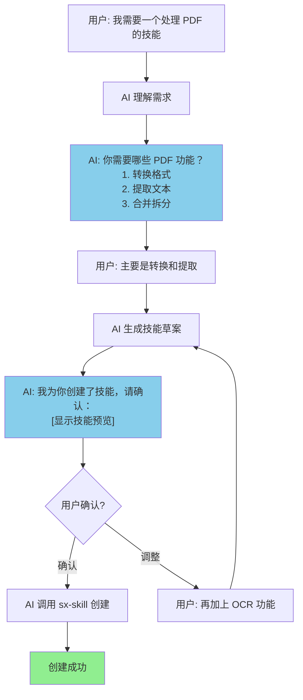
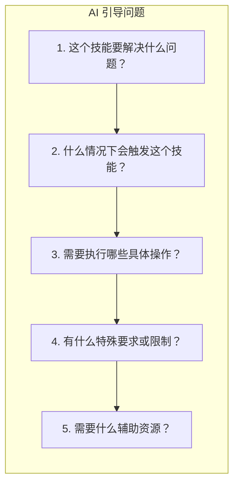
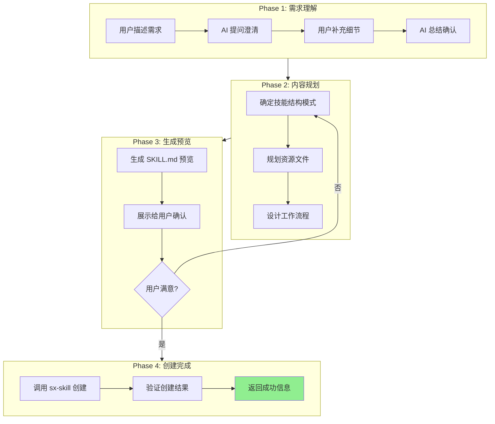
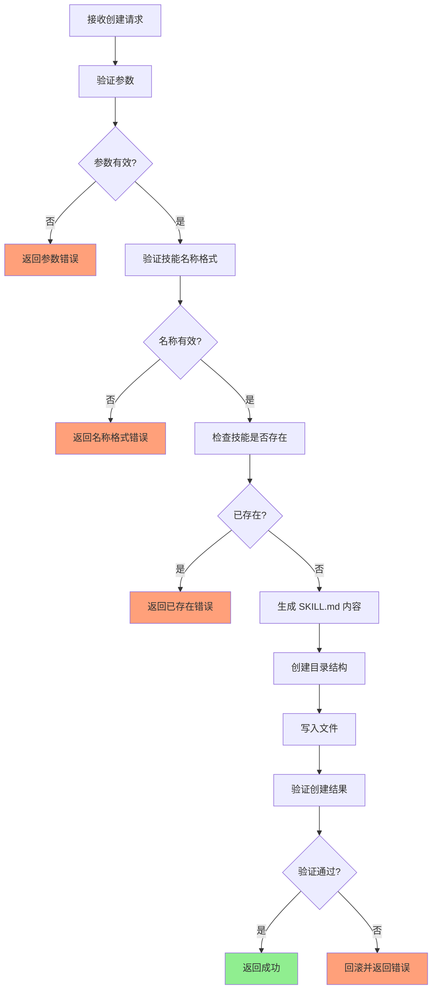
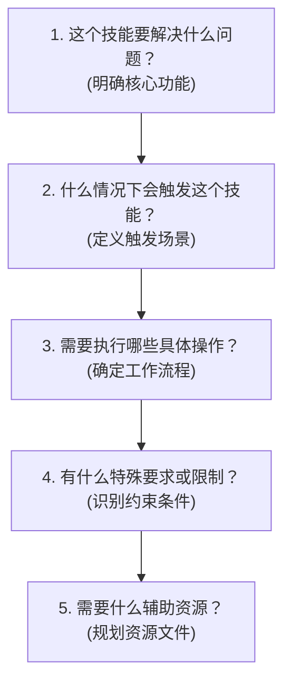
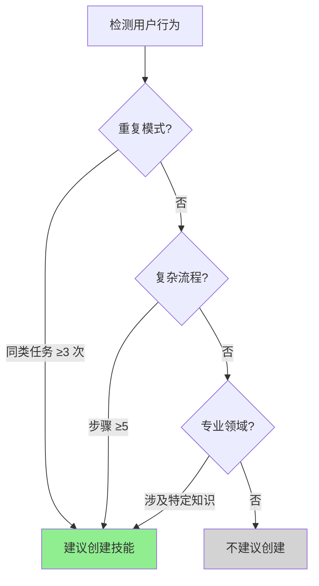
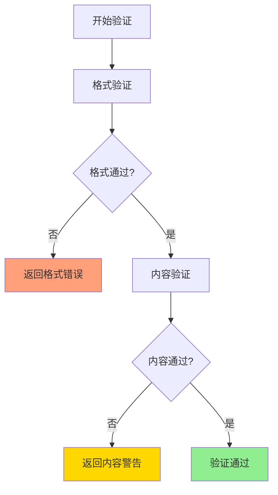
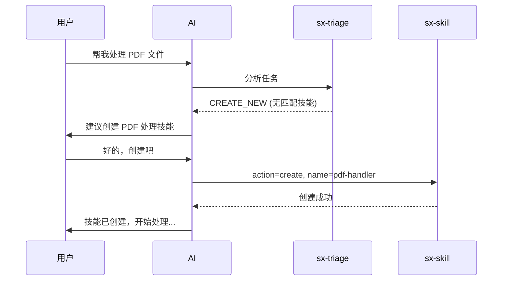
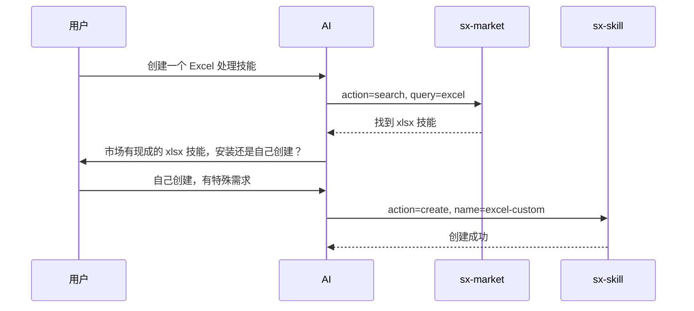

# Skillix 技能创建逻辑设计

> 日期: 2026-01-11
> 参考: Skill-Creator 实现原理分析、SkillForge 项目分析

---

## 一、概述

### 1.1 设计目标

设计 Skillix 的技能创建逻辑，实现：

1. **AI First** - AI 主导创建过程，用户只需描述需求
2. **对话式创建** - 通过自然对话逐步完善技能
3. **质量内建** - 验证机制内置于创建流程
4. **渐进式披露** - 支持从简单到复杂的技能结构

### 1.2 核心理念：AI First

> **技能是给 AI 用的，不是给人读的文档。**

传统方式：用户手动编写 SKILL.md → 容易出错、格式不规范、内容不完整

AI First 方式：
```
用户描述需求 → AI 分析理解 → AI 生成技能 → 用户确认/调整 → 完成
```

### 1.3 参考来源

| 来源 | 借鉴内容 |
|------|----------|
| **Skill-Creator** | 技能格式规范、验证规则、渐进式披露模式、目录结构 |
| **SkillForge** | 4 阶段架构、思维透镜、质量评估 |

---

## 二、AI First 创建流程

### 2.1 对话式创建流程（推荐）

用户只需用自然语言描述需求，AI 主导整个创建过程：



### 2.2 AI 引导问题框架

AI 通过关键问题引导用户完善需求（参考 Skill-Creator）：



**问题示例**：

| 问题 | 目的 | 示例回答 |
|------|------|----------|
| "这个技能要解决什么问题？" | 明确核心功能 | "处理 PDF 文件的各种操作" |
| "什么情况下会触发这个技能？" | 定义触发场景 | "当用户提到 PDF、转换、提取时" |
| "需要执行哪些具体操作？" | 确定工作流程 | "转换格式、提取文本、OCR 识别" |
| "有什么特殊要求或限制？" | 识别约束条件 | "需要支持中文 OCR" |
| "需要什么辅助资源？" | 规划资源文件 | "需要 Python 脚本处理 PDF" |

### 2.3 完整创建流程（复杂技能）



---

## 三、核心组件设计

### 3.1 技能创建工具 (sx-skill action=create)

#### 3.1.1 工具定义

```typescript
// 精简版工具
{
  name: "sx-skill",
  description: "技能管理：列出、读取、创建、更新、删除技能",
  inputSchema: {
    type: "object",
    properties: {
      action: {
        type: "string",
        enum: ["list", "read", "create", "update", "delete"],
        description: "操作类型"
      },
      // create 操作参数
      name: {
        type: "string",
        description: "技能名称（英文，小写，连字符分隔）"
      },
      description: {
        type: "string",
        description: "技能描述（最大 1024 字符）"
      },
      content: {
        type: "string",
        description: "技能正文内容（Markdown 格式）"
      },
      scope: {
        type: "string",
        enum: ["global", "project"],
        description: "创建范围：global=全局, project=项目级（默认 project）"
      },
      // 可选：高级选项
      version: {
        type: "string",
        description: "版本号（默认 1.0.0）"
      },
      author: {
        type: "string",
        description: "作者名称"
      },
      tags: {
        type: "array",
        items: { type: "string" },
        description: "标签列表"
      }
    },
    required: ["action"]
  }
}
```

#### 3.1.2 创建流程



### 3.2 技能名称验证规则

```typescript
interface NameValidation {
  // 规则
  rules: {
    pattern: /^[a-z][a-z0-9]*(-[a-z0-9]+)*$/;  // hyphen-case
    minLength: 2;
    maxLength: 64;
    reserved: ['skillix', 'skill', 'config', 'test'];  // 保留名称
  };
  
  // 验证函数
  validate(name: string): ValidationResult;
}

interface ValidationResult {
  valid: boolean;
  errors: string[];
}
```

**验证规则说明**：

| 规则 | 说明 | 示例 |
|------|------|------|
| 格式 | hyphen-case（小写字母、数字、连字符） | ✅ `pdf-converter` ❌ `PDF_Converter` |
| 开头 | 必须以小写字母开头 | ✅ `my-skill` ❌ `1-skill` |
| 连字符 | 不能以连字符开头/结尾，不能连续 | ✅ `my-skill` ❌ `my--skill` |
| 长度 | 2-64 字符 | ✅ `pdf` ❌ `a` |
| 保留 | 不能使用保留名称 | ❌ `skillix` ❌ `config` |

### 3.3 技能描述验证规则

```typescript
interface DescriptionValidation {
  rules: {
    maxLength: 1024;
    forbiddenChars: ['<', '>'];  // 不允许尖括号
    minWords: 3;  // 至少 3 个词
  };
  
  validate(description: string): ValidationResult;
}
```

### 3.4 SKILL.md 生成模板

```typescript
function generateSkillMd(params: CreateParams): string {
  const { name, description, content, version, author, tags } = params;
  
  return `---
name: ${name}
description: ${description}
version: ${version || '1.0.0'}
${author ? `author: ${author}` : ''}
${tags?.length ? `tags: [${tags.join(', ')}]` : ''}
---

${content}
`;
}
```

---

## 四、技能结构规范

> 参考 Anthropic Skill-Creator 官方规范

### 4.1 目录结构

```
skill-name/
├── SKILL.md           # 必需：技能定义文件
├── scripts/           # 可选：可执行脚本
│   └── *.py           # Python/Bash 脚本（可直接执行，无需加载到上下文）
├── references/        # 可选：参考文档
│   └── *.md           # 详细文档（按需加载到上下文）
├── assets/            # 可选：资源文件
│   └── *.*            # 模板、图片、字体等（用于输出，不加载到上下文）
└── logs/              # 可选：执行日志
    ├── execution.log  # 执行日志
    └── evolution.log  # 进化历史
```

### 4.2 资源目录详解

#### scripts/ - 可执行脚本

**用途**：存放可直接执行的代码，无需加载到上下文

**适用场景**：
- 相同代码被重复编写
- 需要确定性可靠性
- 数据处理、文件转换、API 调用

**示例**：
```
scripts/
├── rotate_pdf.py          # PDF 旋转
├── extract_text.py        # 文本提取
└── convert_format.py      # 格式转换
```

#### references/ - 参考文档

**用途**：存放详细文档，AI 按需加载到上下文

**适用场景**：
- API 文档、数据库 Schema
- 详细工作流指南
- 领域知识、公司政策

**示例**：
```
references/
├── api_docs.md            # API 参考
├── schema.md              # 数据库结构
└── workflows.md           # 工作流指南
```

**最佳实践**：
- 大文件 (>10k 词) 在 SKILL.md 中包含搜索模式
- 信息只在一处存在，避免重复
- 保持 SKILL.md 精简，详细内容放 references/

#### assets/ - 资源文件

**用途**：存放输出中使用的文件，不加载到上下文

**适用场景**：
- 模板文件（.pptx, .docx）
- 品牌资产（logo, 图片）
- 样板代码（HTML/React 模板）
- 字体文件

**示例**：
```
assets/
├── template.pptx          # PPT 模板
├── logo.png               # Logo 图片
└── frontend-template/     # 前端模板目录
```

### 4.3 不应包含的内容

> 技能是给 AI 用的，不是给人读的文档

**不要创建**：
- README.md
- INSTALLATION_GUIDE.md
- QUICK_REFERENCE.md
- CHANGELOG.md
- 用户面向的文档
- 创建过程的记录

### 4.4 SKILL.md 结构

#### 4.4.1 YAML Frontmatter

```yaml
---
name: skill-name                    # 必需：技能名称（hyphen-case）
description: 技能描述               # 必需：技能描述（含触发场景）
version: 1.0.0                      # 可选：版本号
author: author-name                 # 可选：作者
tags: [tag1, tag2]                  # 可选：标签
license: MIT                        # 可选：许可证
---
```

**description 字段要求**（关键！）：

> description 是技能的**主要触发机制**，AI 通过它判断何时使用技能

**好的 description**：
```yaml
description: 将 PDF 文件转换为图片格式，支持 PNG 和 JPEG。当用户需要：
  (1) 将 PDF 转为图片 (2) 提取 PDF 页面 (3) 批量转换 PDF 时使用此技能。
```

**不好的 description**：
```yaml
description: PDF 工具  # 太简单，无法判断何时触发
```

#### 4.4.2 正文结构模式

> 参考 Skill-Creator 的 4 种结构模式

**模式 1：工作流型（Workflow-Based）**

适用于顺序步骤的任务：

```markdown
# PDF 转换器

## 工作流程

1. **分析输入**: 确认 PDF 文件路径和格式
2. **选择输出**: 选择目标格式（PNG/JPEG）
3. **执行转换**: 运行 scripts/convert.py
4. **验证结果**: 检查输出文件

## 脚本使用

\`\`\`bash
python scripts/convert.py input.pdf --format png
\`\`\`
```

**模式 2：任务型（Task-Based）**

适用于提供多种操作的工具：

```markdown
# PDF 工具箱

## 快速开始

[基础用法示例]

## 功能列表

### 合并 PDF
[操作说明]

### 拆分 PDF
[操作说明]

### 提取文本
[操作说明]
```

**模式 3：参考型（Reference-Based）**

适用于需要大量参考资料的任务：

```markdown
# API 文档生成器

## 快速开始

[简要说明]

## 详细参考

- **OpenAPI 规范**: 见 [references/openapi.md](references/openapi.md)
- **注释格式**: 见 [references/comment-format.md](references/comment-format.md)
```

**模式 4：能力型（Capabilities-Based）**

适用于集成系统：

```markdown
# 数据分析助手

## 核心能力

### 1. 数据清洗
[说明]

### 2. 统计分析
[说明]

### 3. 可视化
[说明]
```

#### 4.4.3 渐进式披露原则

三级加载系统高效管理上下文：

```
Level 1: 元数据 (name + description)
         → 始终在上下文中 (~100 词)

Level 2: SKILL.md 正文
         → 技能触发时加载 (<5k 词，建议 <500 行)

Level 3: 捆绑资源 (scripts/references/assets)
         → AI 按需加载 (无限制)
```

**关键原则**：
- SKILL.md 保持精简，<500 行
- 详细内容放 references/
- 从 SKILL.md 清晰引用 references 文件

---

## 五、AI 自动生成示例

### 5.1 完整对话示例

展示 AI 如何通过对话引导用户创建技能：

```
用户: 我想创建一个处理 Excel 文件的技能

AI: 好的，我来帮你创建 Excel 处理技能。请问你需要哪些功能？
    1. 读取和写入数据
    2. 格式转换（xlsx/csv/json）
    3. 数据分析和统计
    4. 图表生成
    
用户: 主要是 1 和 2，还需要支持批量处理

AI: 明白了。我为你规划了以下技能结构：

    技能名称: excel-handler
    核心功能:
    - 读取 Excel/CSV 文件
    - 写入和创建 Excel 文件
    - 格式转换（xlsx ↔ csv ↔ json）
    - 批量文件处理
    
    资源文件:
    - scripts/convert.py (格式转换脚本)
    - scripts/batch_process.py (批量处理脚本)
    - references/api.md (API 参考)
    
    确认创建吗？[是/调整]

用户: 是

AI: [调用 sx-skill action=create]
    ✅ 技能创建成功！
    
    位置: .skillix/skills/excel-handler/
    文件:
    - SKILL.md
    - scripts/convert.py
    - scripts/batch_process.py
    - references/api.md
```

### 5.2 AI 生成的 SKILL.md 示例

```markdown
---
name: excel-handler
description: Excel 文件处理工具，支持读写、格式转换和批量处理。
  当用户需要：(1) 读取或写入 Excel/CSV 文件 (2) 转换 xlsx/csv/json 格式 
  (3) 批量处理多个文件时使用此技能。
version: 1.0.0
tags: [excel, csv, data, conversion]
---

# Excel 处理器

## 快速开始

读取 Excel 文件：
\`\`\`python
import pandas as pd
df = pd.read_excel('data.xlsx')
\`\`\`

## 功能列表

### 读取文件

支持 .xlsx, .xls, .csv 格式：
\`\`\`python
# Excel
df = pd.read_excel('file.xlsx', sheet_name='Sheet1')

# CSV
df = pd.read_csv('file.csv', encoding='utf-8')
\`\`\`

### 格式转换

使用 scripts/convert.py：
\`\`\`bash
python scripts/convert.py input.xlsx --output output.csv
python scripts/convert.py input.csv --output output.json
\`\`\`

### 批量处理

使用 scripts/batch_process.py：
\`\`\`bash
python scripts/batch_process.py ./input_folder --output ./output_folder
\`\`\`

## 详细参考

- **API 文档**: 见 [references/api.md](references/api.md)
```

### 5.3 AI 生成的脚本示例

**scripts/convert.py**:
```python
#!/usr/bin/env python3
"""
Excel 格式转换脚本

Usage:
    python convert.py input.xlsx --output output.csv
    python convert.py input.csv --output output.json
"""

import argparse
import pandas as pd
from pathlib import Path

def convert_file(input_path: str, output_path: str):
    """转换文件格式"""
    input_ext = Path(input_path).suffix.lower()
    output_ext = Path(output_path).suffix.lower()
    
    # 读取输入文件
    if input_ext in ['.xlsx', '.xls']:
        df = pd.read_excel(input_path)
    elif input_ext == '.csv':
        df = pd.read_csv(input_path)
    elif input_ext == '.json':
        df = pd.read_json(input_path)
    else:
        raise ValueError(f"不支持的输入格式: {input_ext}")
    
    # 写入输出文件
    if output_ext == '.xlsx':
        df.to_excel(output_path, index=False)
    elif output_ext == '.csv':
        df.to_csv(output_path, index=False)
    elif output_ext == '.json':
        df.to_json(output_path, orient='records', indent=2)
    else:
        raise ValueError(f"不支持的输出格式: {output_ext}")
    
    print(f"✅ 转换完成: {input_path} -> {output_path}")

if __name__ == "__main__":
    parser = argparse.ArgumentParser(description="Excel 格式转换")
    parser.add_argument("input", help="输入文件路径")
    parser.add_argument("--output", "-o", required=True, help="输出文件路径")
    args = parser.parse_args()
    
    convert_file(args.input, args.output)
```

---

## 六、智能辅助机制

### 6.1 需求分析框架

AI 使用 5 个核心问题引导用户：



### 6.2 内容生成原则

AI 在创建技能时遵循的原则：

| 原则 | 说明 | 示例 |
|------|------|------|
| **简洁优先** | 只包含必要信息 | 避免冗长解释，用代码示例代替 |
| **具体明确** | 指令要可执行 | "运行 scripts/convert.py" 而非 "转换文件" |
| **示例驱动** | 提供清晰示例 | 每个功能都有代码示例 |
| **渐进披露** | 分层组织内容 | 核心在 SKILL.md，详细在 references/ |

### 6.3 自动建议创建

当 AI 检测到以下模式时，主动建议创建技能：



---

## 七、验证机制

### 6.1 格式验证

```typescript
interface FormatValidation {
  // 检查项
  checks: {
    skillMdExists: boolean;      // SKILL.md 存在
    frontmatterValid: boolean;   // YAML frontmatter 有效
    nameValid: boolean;          // 名称格式正确
    descriptionValid: boolean;   // 描述格式正确
    contentNotEmpty: boolean;    // 正文不为空
  };
  
  validate(skillPath: string): ValidationResult;
}
```

### 6.2 内容验证

```typescript
interface ContentValidation {
  checks: {
    hasInstructions: boolean;    // 包含使用说明
    hasExamples: boolean;        // 包含示例（推荐）
    noTodoPlaceholders: boolean; // 无 TODO 占位符
    referencesExist: boolean;    // 引用的文件存在
  };
  
  validate(skillPath: string): ValidationResult;
}
```

### 6.3 验证流程



---

## 八、创建示例

### 7.1 简单技能创建

**用户请求**：
```
创建一个 PDF 转图片的技能
```

**AI 调用**：
```typescript
sx-skill({
  action: "create",
  name: "pdf-to-image",
  description: "将 PDF 文件转换为图片格式，支持 PNG 和 JPEG",
  content: `# PDF 转图片

## 使用说明

将 PDF 文件的每一页转换为独立的图片文件。

## 步骤

1. 确认输入 PDF 文件路径
2. 选择输出格式（PNG 或 JPEG）
3. 执行转换命令
4. 验证输出结果

## 示例

\`\`\`bash
# 使用 pdftoppm 转换
pdftoppm -png input.pdf output
\`\`\`

## 依赖

- pdftoppm (poppler-utils)
`,
  scope: "project",
  tags: ["pdf", "image", "conversion"]
})
```

**创建结果**：
```
.skillix/skills/pdf-to-image/
└── SKILL.md
```

### 7.2 复杂技能创建

**用户请求**：
```
创建一个 API 文档生成技能，需要支持多种格式
```

**AI 调用**：
```typescript
sx-skill({
  action: "create",
  name: "api-doc-generator",
  description: "从代码注释自动生成 API 文档，支持 OpenAPI、Markdown 等格式",
  content: `# API 文档生成器

## 使用说明

从代码注释自动提取并生成 API 文档。

## 支持格式

- OpenAPI 3.0 (YAML/JSON)
- Markdown
- HTML

## 工作流程

1. **分析代码**: 扫描源代码文件
2. **提取注释**: 解析 JSDoc/TSDoc 注释
3. **生成文档**: 按指定格式输出

## 详细参考

- **OpenAPI 规范**: 见 [references/openapi.md](references/openapi.md)
- **注释格式**: 见 [references/comment-format.md](references/comment-format.md)

## 示例

见 [references/examples.md](references/examples.md)
`,
  scope: "global",
  tags: ["api", "documentation", "generator"]
})
```

**创建结果**：
```
~/.skillix/skills/api-doc-generator/
├── SKILL.md
└── references/
    ├── openapi.md
    ├── comment-format.md
    └── examples.md
```

---

## 九、错误处理

### 8.1 错误类型

| 错误码 | 错误类型 | 说明 |
|--------|----------|------|
| `E001` | 参数缺失 | 必需参数未提供 |
| `E002` | 名称无效 | 技能名称格式错误 |
| `E003` | 描述无效 | 描述格式错误 |
| `E004` | 已存在 | 同名技能已存在 |
| `E005` | 写入失败 | 文件写入失败 |
| `E006` | 验证失败 | 创建后验证失败 |

### 8.2 错误响应格式

```xml
<create_result>
  <status>error</status>
  <error>
    <code>E002</code>
    <message>技能名称格式无效</message>
    <details>名称 "My_Skill" 不符合 hyphen-case 格式，应为 "my-skill"</details>
  </error>
</create_result>
```

### 8.3 成功响应格式

```xml
<create_result>
  <status>success</status>
  <skill>
    <name>pdf-to-image</name>
    <path>.skillix/skills/pdf-to-image/</path>
    <scope>project</scope>
    <files>
      <file>SKILL.md</file>
    </files>
  </skill>
</create_result>
```

---

## 十、与其他工具的集成

### 9.1 与 sx-triage 集成



### 9.2 与 sx-market 集成



---

## 十一、最佳实践

### 10.1 技能命名

| 推荐 | 不推荐 | 原因 |
|------|--------|------|
| `pdf-converter` | `PDFConverter` | 使用 hyphen-case |
| `api-doc-gen` | `api_doc_gen` | 使用连字符而非下划线 |
| `excel-handler` | `excel` | 名称要有描述性 |

### 10.2 技能描述

| 推荐 | 不推荐 | 原因 |
|------|--------|------|
| "将 PDF 文件转换为图片格式" | "PDF 工具" | 描述要具体 |
| "处理 Excel 文件的读写操作" | "Excel" | 说明功能范围 |

### 10.3 技能内容

| 推荐 | 不推荐 | 原因 |
|------|--------|------|
| 提供具体步骤 | 只说"处理文件" | 指令要可执行 |
| 包含示例代码 | 只有文字描述 | 示例更直观 |
| 说明依赖和前提 | 假设用户知道 | 完整性 |

---

*本文档为 Skillix 技能创建逻辑设计文档*
*参考 Skill-Creator 和 SkillForge 的最佳实践*
