# sx-skill create 设计 (AI First)

> 日期: 2026-01-14
> 参考: Skill-Creator、SkillForge
> 状态: 设计中

---

## 一、概述

### 1.1 核心理念

> **AI First**: 技能是给 AI 用的，不是给人读的文档。

**传统方式的问题**：
- 用户需要知道 `name`, `metadata`, `body` 的具体格式
- 用户需要手动编写 SKILL.md
- 容易出错、格式不规范、内容不完整

**AI First 方式**：
```
用户描述需求 → AI 引导对话 → AI 收集细节 → AI 生成技能 → 用户确认/调整 → 完成
```

### 1.2 设计目标

1. **零门槛** - 用户只需描述"我想要一个什么样的技能"
2. **引导式** - AI 通过对话引导用户完善需求
3. **智能判断** - AI 判断上下文是否足够创建技能
4. **高质量** - 生成符合规范的完整技能
5. **质量内建** - 验证机制内置于创建流程
6. **渐进式披露** - 支持从简单到复杂的技能结构

### 1.3 参考来源

| 来源 | 借鉴内容 |
|------|----------|
| **Skill-Creator** | 5 个关键问题、渐进式披露、验证规则、目录结构 |
| **SkillForge** | Phase 0 分流、深度分析、需求扩展（显式/隐式/未知）、质量评估 |

---

## 二、AI First 创建流程

### 2.1 整体流程

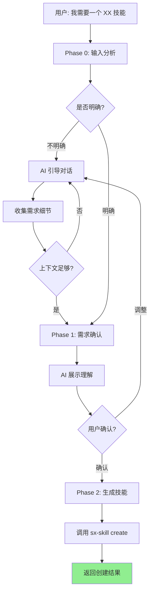

### 2.2 Phase 0: 输入分析

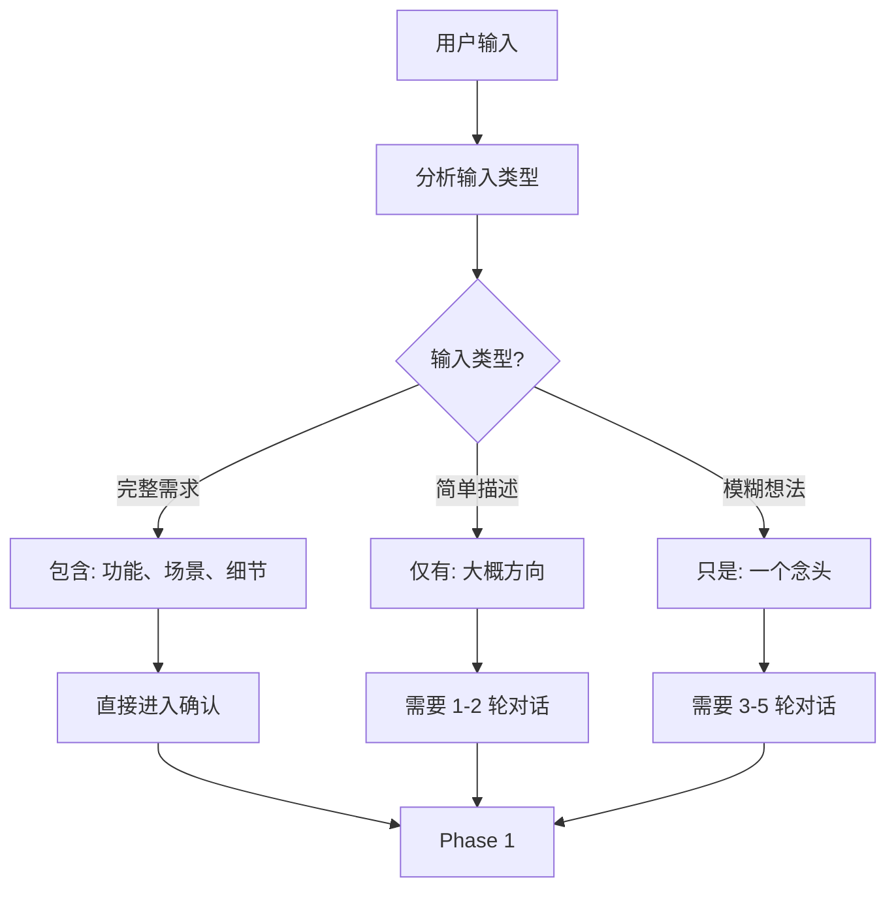

### 2.3 AI 引导对话框架


**问题详解**：

| 问题 | 目的 | 示例回答 | 映射到 |
|------|------|----------|--------|
| "这个技能要解决什么问题？" | 明确核心功能 | "处理 PDF 文件" | `description` |
| "什么情况下会触发？" | 定义触发场景 | "用户提到 PDF、转换" | `description` |
| "需要执行哪些操作？" | 确定工作流程 | "提取文本、转格式" | `body` |
| "有什么特殊要求？" | 识别约束条件 | "支持中文" | `body` |
| "需要什么资源？" | 规划资源 | "Python 脚本" | `body` |

### 2.4 上下文充分性判断

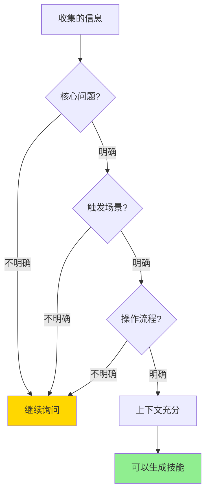

**判断标准**：

| 维度 | 最低要求 | 理想状态 |
|------|---------|---------|
| 核心问题 | ✅ 必须明确 | 具体到功能点 |
| 触发场景 | ✅ 必须明确 | 3-5 个触发词 |
| 操作流程 | ⚠️ 可以模糊 | 具体步骤 |
| 特殊要求 | ❌ 可选 | 明确约束 |
| 资源需求 | ❌ 可选 | 脚本/参考 |

---

## 三、对话式创建示例

### 3.1 完整对话示例

```
━━━━━━━━━━━━━━━━━━━━━━━━━━━━━━━━━━━━━━━━━━━━━━━━━━━
               AI First 技能创建示例
━━━━━━━━━━━━━━━━━━━━━━━━━━━━━━━━━━━━━━━━━━━━━━━━━━━

[Round 1: 初始输入]

用户: 我想创建一个处理 PDF 的技能

AI: 好的，我来帮你创建 PDF 处理技能。为了更好地设计，
    请告诉我几个问题：

    1. 这个技能主要解决什么问题？
       例如：提取文字、格式转换、合并拆分？

━━━━━━━━━━━━━━━━━━━━━━━━━━━━━━━━━━━━━━━━━━━━━━━━━━━

[Round 2: 明确核心功能]

用户: 主要是提取 PDF 中的文字，转成 Markdown 格式

AI: 明白了！PDF 文字提取并转换为 Markdown。
    
    2. 什么情况下会使用这个技能？
       例如：处理论文、阅读电子书、提取报告内容？

━━━━━━━━━━━━━━━━━━━━━━━━━━━━━━━━━━━━━━━━━━━━━━━━━━━

[Round 3: 定义触发场景]

用户: 主要是处理技术文档和论文，需要提取内容做笔记

AI: 了解！面向技术文档和论文的内容提取。
    
    3. 有什么特殊要求吗？
       例如：保留标题结构、支持中文、处理图片？

━━━━━━━━━━━━━━━━━━━━━━━━━━━━━━━━━━━━━━━━━━━━━━━━━━━

[Round 4: 识别约束条件]

用户: 需要保留标题结构，支持中英文，暂时不需要图片

AI: 收到！现在我对这个技能有了完整理解。
    
    让我确认一下：
    ┌─────────────────────────────────────────────┐
    │ 技能名称: pdf-to-markdown                    │
    │ 核心功能: 提取 PDF 文字，转换为 Markdown      │
    │ 使用场景: 技术文档、论文笔记                  │
    │ 特殊要求:                                    │
    │   - 保留标题结构                             │
    │   - 支持中英文                               │
    │   - 暂不处理图片                             │
    └─────────────────────────────────────────────┘
    
    确认创建吗？[是/调整]
    创建到全局还是项目级？[全局/项目]

━━━━━━━━━━━━━━━━━━━━━━━━━━━━━━━━━━━━━━━━━━━━━━━━━━━

[Round 5: 确认并创建]

用户: 是，全局

AI: 正在创建技能...
    
    ✅ 技能创建成功！
    
    位置: ~/.skillix/skills/pdf-to-markdown/
    文件: SKILL.md
    
    你可以通过以下方式使用：
    - "帮我提取这个 PDF 的文字"
    - "把这个 PDF 转成 Markdown"
    - "提取论文内容做笔记"

━━━━━━━━━━━━━━━━━━━━━━━━━━━━━━━━━━━━━━━━━━━━━━━━━━━
```

### 3.2 简单场景（用户输入足够）

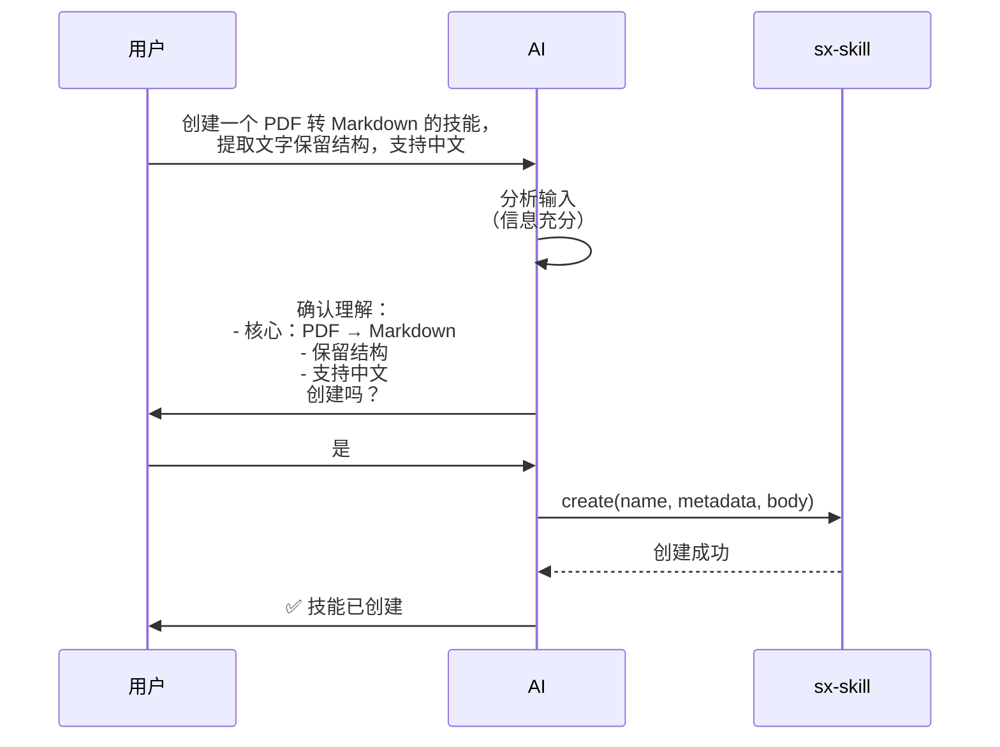

### 3.3 复杂场景（需要多轮对话）

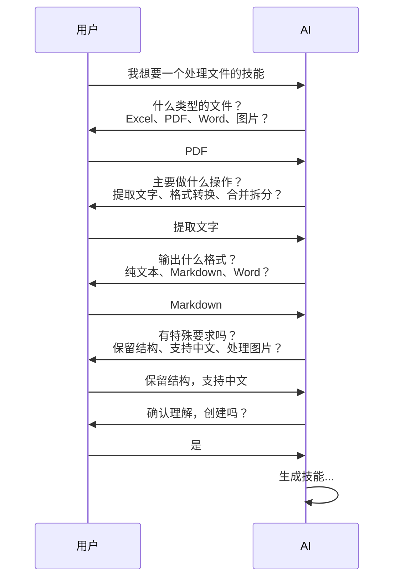

---

## 四、需求扩展机制

### 4.1 三层需求分析

> 参考 SkillForge 的需求扩展方法

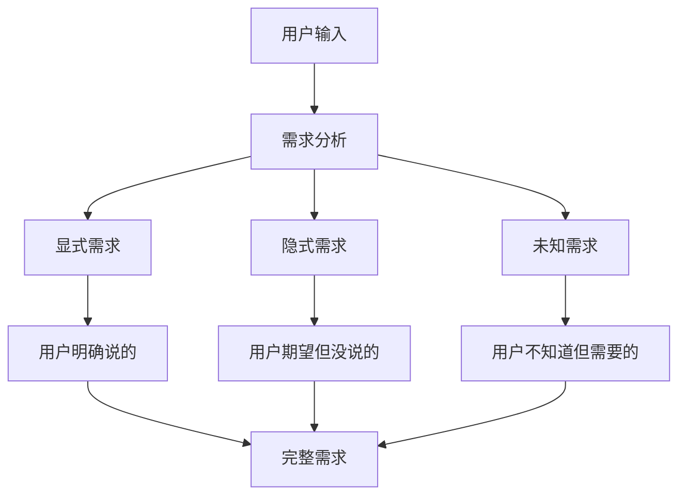

**三层需求**：

| 层级 | 说明 | 示例 |
|------|------|------|
| **显式需求** | 用户明确说的 | "提取 PDF 文字" |
| **隐式需求** | 用户期望但没说的 | 保持格式、正确编码 |
| **未知需求** | 用户不知道但需要的 | 处理加密 PDF、OCR 支持 |

### 4.2 AI 自动补充

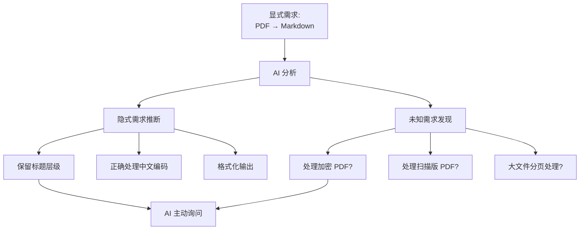

### 4.3 智能问题生成

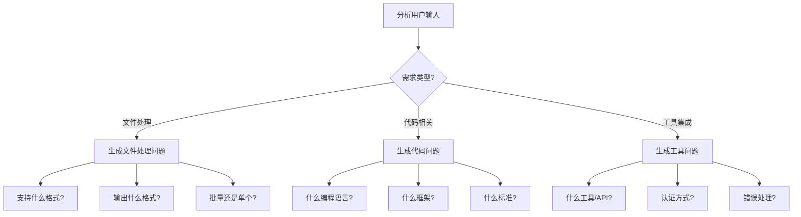

---

## 五、技能结构规范

> 参考 Anthropic Skill-Creator 官方规范

### 5.1 目录结构

```
skill-name/
├── SKILL.md           # 必需：技能定义文件
├── scripts/           # 可选：可执行脚本
│   └── *.py           # Python/Bash 脚本（可直接执行，无需加载到上下文）
├── references/        # 可选：参考文档
│   └── *.md           # 详细文档（按需加载到上下文）
├── assets/            # 可选：资源文件
│   └── *.*            # 模板、图片、字体等（用于输出，不加载到上下文）
└── logs/              # 可选：执行日志
    ├── execution.log  # 执行日志
    └── evolution.log  # 进化历史
```

### 5.2 资源目录详解

#### scripts/ - 可执行脚本

**用途**：存放可直接执行的代码，无需加载到上下文

**适用场景**：
- 相同代码被重复编写
- 需要确定性可靠性
- 数据处理、文件转换、API 调用

**示例**：
```
scripts/
├── rotate_pdf.py          # PDF 旋转
├── extract_text.py        # 文本提取
└── convert_format.py      # 格式转换
```

#### references/ - 参考文档

**用途**：存放详细文档，AI 按需加载到上下文

**适用场景**：
- API 文档、数据库 Schema
- 详细工作流指南
- 领域知识、公司政策

**最佳实践**：
- 大文件 (>10k 词) 在 SKILL.md 中包含搜索模式
- 信息只在一处存在，避免重复
- 保持 SKILL.md 精简，详细内容放 references/

#### assets/ - 资源文件

**用途**：存放输出中使用的文件，不加载到上下文

**适用场景**：
- 模板文件（.pptx, .docx）
- 品牌资产（logo, 图片）
- 样板代码（HTML/React 模板）
- 字体文件

### 5.3 不应包含的内容

> 技能是给 AI 用的，不是给人读的文档

**不要创建**：
- README.md
- INSTALLATION_GUIDE.md
- QUICK_REFERENCE.md
- CHANGELOG.md
- 用户面向的文档
- 创建过程的记录

### 5.4 SKILL.md 结构

#### YAML Frontmatter

```yaml
---
name: skill-name                    # 必需：技能名称（hyphen-case）
description: 技能描述               # 必需：技能描述（含触发场景）
version: 1.0.0                      # 可选：版本号
author: author-name                 # 可选：作者
tags: [tag1, tag2]                  # 可选：标签
license: MIT                        # 可选：许可证
---
```

**description 字段要求**（关键！）：

> description 是技能的**主要触发机制**，AI 通过它判断何时使用技能

**好的 description**：
```yaml
description: 将 PDF 文件转换为图片格式，支持 PNG 和 JPEG。当用户需要：
  (1) 将 PDF 转为图片 (2) 提取 PDF 页面 (3) 批量转换 PDF 时使用此技能。
```

**不好的 description**：
```yaml
description: PDF 工具  # 太简单，无法判断何时触发
```

#### 正文结构模式

> 参考 Skill-Creator 的 4 种结构模式

**模式 1：工作流型（Workflow-Based）** - 适用于顺序步骤的任务

**模式 2：任务型（Task-Based）** - 适用于提供多种操作的工具

**模式 3：参考型（Reference-Based）** - 适用于需要大量参考资料的任务

**模式 4：能力型（Capabilities-Based）** - 适用于集成系统

#### 渐进式披露原则

三级加载系统高效管理上下文：

```
Level 1: 元数据 (name + description)
         → 始终在上下文中 (~100 词)

Level 2: SKILL.md 正文
         → 技能触发时加载 (<5k 词，建议 <500 行)

Level 3: 捆绑资源 (scripts/references/assets)
         → AI 按需加载 (无限制)
```

---

## 六、技能生成逻辑

### 6.1 从对话到参数

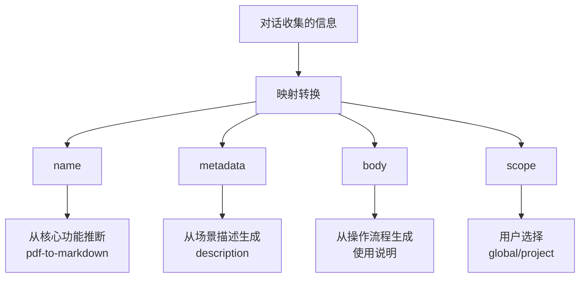

### 6.2 自动生成规则

| 字段 | 生成规则 | 示例 |
|------|---------|------|
| `name` | 核心功能 + 操作类型，hyphen-case | `pdf-to-markdown` |
| `description` | 功能 + 触发场景，<1024 字符 | "提取 PDF 文字转 Markdown，当..." |
| `version` | 默认 "1.0.0" | `1.0.0` |
| `tags` | 从对话中提取关键词 | `[pdf, markdown, converter]` |
| `body` | 工作流程 + 示例 + 注意事项 | Markdown 格式的说明 |

### 6.3 SKILL.md 生成模板

```typescript
function generateSkillMd(params: CreateParams): string {
  const { name, description, content, version, author, tags } = params;
  
  return `---
name: ${name}
description: ${description}
version: ${version || '1.0.0'}
${author ? `author: ${author}` : ''}
${tags?.length ? `tags: [${tags.join(', ')}]` : ''}
---

${content}
`;
}
```

---

## 七、验证机制

### 7.1 技能名称验证规则

| 规则 | 说明 | 有效示例 | 无效示例 |
|------|------|---------|---------|
| 格式 | hyphen-case | `pdf-converter` | `PDF_Converter` |
| 开头 | 小写字母 | `my-skill` | `1-skill` |
| 连字符 | 不能连续或在首尾 | `my-skill` | `my--skill` |
| 长度 | 2-64 字符 | `pdf` | `a` |
| 保留 | 不能使用保留词 | `my-config` | `skillix` |

### 7.2 技能描述验证规则

- 最大长度：1024 字符
- 不能包含尖括号 `<` 或 `>`
- 至少 3 个词

### 7.3 验证流程

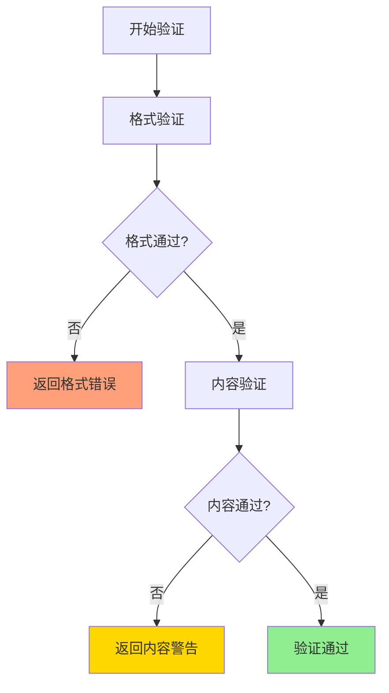

---

## 八、输入输出设计

### 8.1 AI First 模式参数

当用户不知道具体参数时，AI 引导收集信息：

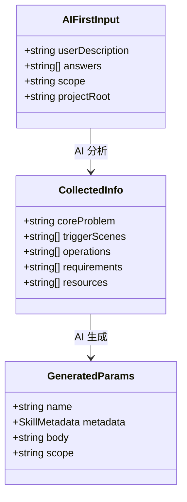

### 8.2 直接模式参数

当用户明确知道参数时，直接创建：

| 参数 | 类型 | 必需 | 说明 |
|------|------|------|------|
| action | string | ✅ | 固定为 "create" |
| name | string | ✅ | 技能名称 |
| metadata | object | ✅ | 技能元数据 |
| body | string | ✅ | 技能正文内容 |
| scope | string | ❌ | 范围，默认 "global" |
| projectRoot | string | ❌ | 项目根目录 |

### 8.3 响应格式

**成功响应**：

```json
{
  "success": true,
  "message": "成功创建技能 \"pdf-to-markdown\"",
  "data": {
    "name": "pdf-to-markdown",
    "scope": "global",
    "path": "~/.skillix/skills/pdf-to-markdown/",
    "metadata": {
      "name": "pdf-to-markdown",
      "description": "...",
      "version": "1.0.0",
      "tags": ["pdf", "markdown"]
    }
  }
}
```

**错误响应**：

| 错误码 | 错误类型 | 说明 |
|--------|----------|------|
| `E001` | 参数缺失 | 必需参数未提供 |
| `E002` | 名称无效 | 技能名称格式错误 |
| `E003` | 描述无效 | 描述格式错误 |
| `E004` | 已存在 | 同名技能已存在 |
| `E005` | 写入失败 | 文件写入失败 |
| `E006` | 验证失败 | 创建后验证失败 |

---

## 九、与其他工具的集成

### 9.1 与 sx-dispatch 集成

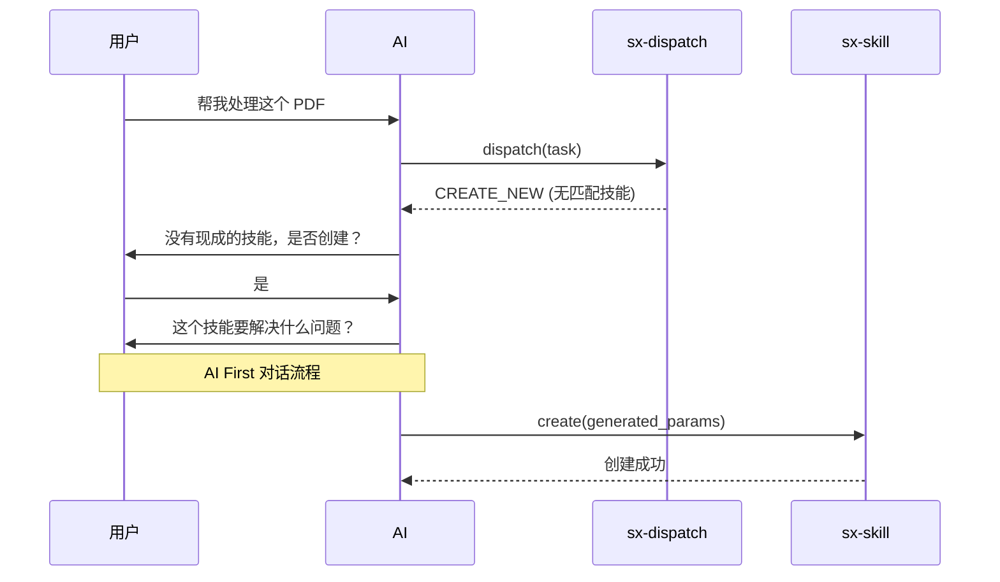

### 9.2 与 sx-market 集成

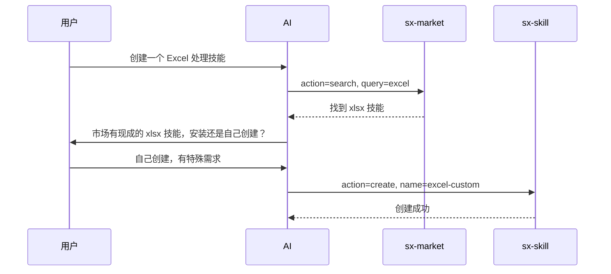

---

## 十、最佳实践

### 10.1 AI 引导原则

| 原则 | 说明 |
|------|------|
| **循序渐进** | 一次只问一个问题 |
| **提供选项** | 给出示例选项降低回答难度 |
| **及时确认** | 每收集到关键信息就确认 |
| **主动补充** | AI 主动补充隐式需求 |
| **允许调整** | 任何阶段都可以返回调整 |

### 10.2 对话设计建议

```
✅ 好的对话:
AI: "这个技能主要解决什么问题？
     例如：提取文字、格式转换、合并拆分？"

❌ 不好的对话:
AI: "请告诉我技能的名称、描述、版本、作者、标签、
     正文内容等信息。"
```

### 10.3 技能命名

| 推荐 | 不推荐 | 原因 |
|------|--------|------|
| `pdf-converter` | `PDFConverter` | 使用 hyphen-case |
| `api-doc-gen` | `api_doc_gen` | 使用连字符而非下划线 |
| `excel-handler` | `excel` | 名称要有描述性 |

### 10.4 技能描述

| 推荐 | 不推荐 | 原因 |
|------|--------|------|
| "将 PDF 文件转换为图片格式" | "PDF 工具" | 描述要具体 |
| "处理 Excel 文件的读写操作" | "Excel" | 说明功能范围 |

### 10.5 技能内容

| 推荐 | 不推荐 | 原因 |
|------|--------|------|
| 提供具体步骤 | 只说"处理文件" | 指令要可执行 |
| 包含示例代码 | 只有文字描述 | 示例更直观 |
| 说明依赖和前提 | 假设用户知道 | 完整性 |

---

## 附录：完整创建示例

### A.1 AI 生成的 SKILL.md 示例

```markdown
---
name: excel-handler
description: Excel 文件处理工具，支持读写、格式转换和批量处理。
  当用户需要：(1) 读取或写入 Excel/CSV 文件 (2) 转换 xlsx/csv/json 格式 
  (3) 批量处理多个文件时使用此技能。
version: 1.0.0
tags: [excel, csv, data, conversion]
---

# Excel 处理器

## 快速开始

读取 Excel 文件：
\`\`\`python
import pandas as pd
df = pd.read_excel('data.xlsx')
\`\`\`

## 功能列表

### 读取文件

支持 .xlsx, .xls, .csv 格式：
\`\`\`python
# Excel
df = pd.read_excel('file.xlsx', sheet_name='Sheet1')

# CSV
df = pd.read_csv('file.csv', encoding='utf-8')
\`\`\`

### 格式转换

使用 scripts/convert.py：
\`\`\`bash
python scripts/convert.py input.xlsx --output output.csv
python scripts/convert.py input.csv --output output.json
\`\`\`

### 批量处理

使用 scripts/batch_process.py：
\`\`\`bash
python scripts/batch_process.py ./input_folder --output ./output_folder
\`\`\`

## 详细参考

- **API 文档**: 见 [references/api.md](references/api.md)
```

### A.2 AI 生成的脚本示例

**scripts/convert.py**:
```python
#!/usr/bin/env python3
"""
Excel 格式转换脚本

Usage:
    python convert.py input.xlsx --output output.csv
    python convert.py input.csv --output output.json
"""

import argparse
import pandas as pd
from pathlib import Path

def convert_file(input_path: str, output_path: str):
    """转换文件格式"""
    input_ext = Path(input_path).suffix.lower()
    output_ext = Path(output_path).suffix.lower()
    
    # 读取输入文件
    if input_ext in ['.xlsx', '.xls']:
        df = pd.read_excel(input_path)
    elif input_ext == '.csv':
        df = pd.read_csv(input_path)
    elif input_ext == '.json':
        df = pd.read_json(input_path)
    else:
        raise ValueError(f"不支持的输入格式: {input_ext}")
    
    # 写入输出文件
    if output_ext == '.xlsx':
        df.to_excel(output_path, index=False)
    elif output_ext == '.csv':
        df.to_csv(output_path, index=False)
    elif output_ext == '.json':
        df.to_json(output_path, orient='records', indent=2)
    else:
        raise ValueError(f"不支持的输出格式: {output_ext}")
    
    print(f"✅ 转换完成: {input_path} -> {output_path}")

if __name__ == "__main__":
    parser = argparse.ArgumentParser(description="Excel 格式转换")
    parser.add_argument("input", help="输入文件路径")
    parser.add_argument("--output", "-o", required=True, help="输出文件路径")
    args = parser.parse_args()
    
    convert_file(args.input, args.output)
```

### A.3 简单技能创建示例

**用户请求**：
```
创建一个 PDF 转图片的技能
```

**AI 调用**：
```typescript
sx-skill({
  action: "create",
  name: "pdf-to-image",
  description: "将 PDF 文件转换为图片格式，支持 PNG 和 JPEG",
  content: `# PDF 转图片

## 使用说明

将 PDF 文件的每一页转换为独立的图片文件。

## 步骤

1. 确认输入 PDF 文件路径
2. 选择输出格式（PNG 或 JPEG）
3. 执行转换命令
4. 验证输出结果

## 示例

\`\`\`bash
# 使用 pdftoppm 转换
pdftoppm -png input.pdf output
\`\`\`

## 依赖

- pdftoppm (poppler-utils)
`,
  scope: "project",
  tags: ["pdf", "image", "conversion"]
})
```

**创建结果**：
```
.skillix/skills/pdf-to-image/
└── SKILL.md
```

### A.4 复杂技能创建示例

**用户请求**：
```
创建一个 API 文档生成技能，需要支持多种格式
```

**AI 调用**：
```typescript
sx-skill({
  action: "create",
  name: "api-doc-generator",
  description: "从代码注释自动生成 API 文档，支持 OpenAPI、Markdown 等格式",
  content: `# API 文档生成器

## 使用说明

从代码注释自动提取并生成 API 文档。

## 支持格式

- OpenAPI 3.0 (YAML/JSON)
- Markdown
- HTML

## 工作流程

1. **分析代码**: 扫描源代码文件
2. **提取注释**: 解析 JSDoc/TSDoc 注释
3. **生成文档**: 按指定格式输出

## 详细参考

- **OpenAPI 规范**: 见 [references/openapi.md](references/openapi.md)
- **注释格式**: 见 [references/comment-format.md](references/comment-format.md)

## 示例

见 [references/examples.md](references/examples.md)
`,
  scope: "global",
  tags: ["api", "documentation", "generator"]
})
```

**创建结果**：
```
~/.skillix/skills/api-doc-generator/
├── SKILL.md
└── references/
    ├── openapi.md
    ├── comment-format.md
    └── examples.md
```

### A.5 完整对话示例（Excel 处理技能）

```
用户: 我想创建一个处理 Excel 文件的技能

AI: 好的，我来帮你创建 Excel 处理技能。请问你需要哪些功能？
    1. 读取和写入数据
    2. 格式转换（xlsx/csv/json）
    3. 数据分析和统计
    4. 图表生成
    
用户: 主要是 1 和 2，还需要支持批量处理

AI: 明白了。我为你规划了以下技能结构：

    技能名称: excel-handler
    核心功能:
    - 读取 Excel/CSV 文件
    - 写入和创建 Excel 文件
    - 格式转换（xlsx ↔ csv ↔ json）
    - 批量文件处理
    
    资源文件:
    - scripts/convert.py (格式转换脚本)
    - scripts/batch_process.py (批量处理脚本)
    - references/api.md (API 参考)
    
    确认创建吗？[是/调整]

用户: 是

AI: [调用 sx-skill action=create]
    ✅ 技能创建成功！
    
    位置: .skillix/skills/excel-handler/
    文件:
    - SKILL.md
    - scripts/convert.py
    - scripts/batch_process.py
    - references/api.md
```

---

*本文档为 sx-skill create 设计文档*
*参考 Skill-Creator 和 SkillForge 的最佳实践*
*最后更新: 2026-01-14*
