# sx-skill list 技能列表设计

> 日期: 2026-01-14
> 关联: 20260111-01-项目设计.md
> 状态: 设计中

---

## 一、概述

### 1.1 功能定位

`sx-skill list` 是 Skillix 的技能发现工具，用于列出可用的技能。

**核心职责**：
- 扫描全局和项目技能目录
- 读取技能元数据
- 返回格式化的技能列表
- 支持过滤和搜索

### 1.2 设计目标

1. **快速响应** - 高效扫描和返回
2. **信息完整** - 包含必要的元数据
3. **清晰分类** - 区分全局和项目技能
4. **易于筛选** - 支持 scope 过滤

---

## 二、列表流程

### 2.1 主流程

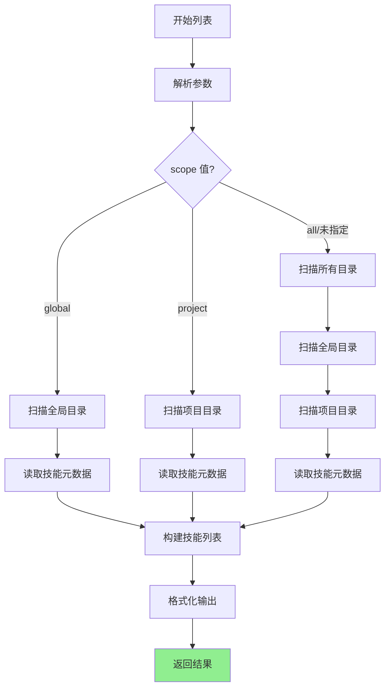

### 2.2 目录扫描流程

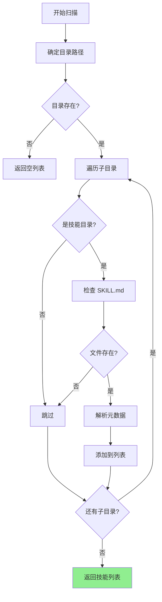

### 2.3 元数据读取流程

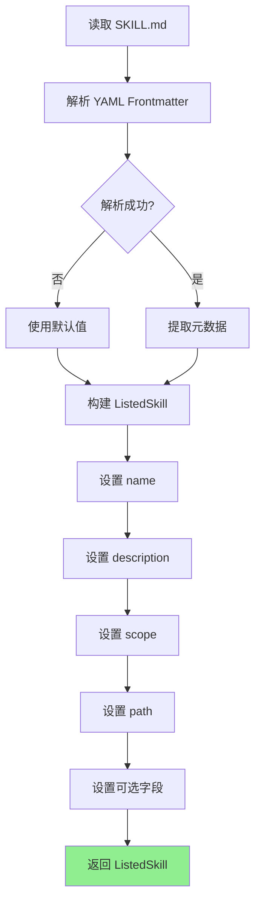

---

## 三、输入输出设计

### 3.1 输入参数

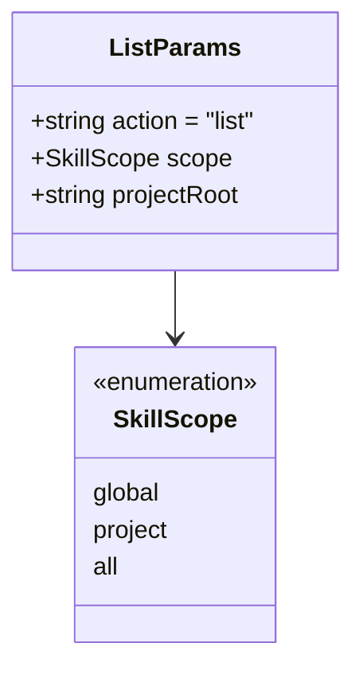

| 参数 | 类型 | 必需 | 说明 |
|------|------|------|------|
| action | string | ✅ | 固定为 "list" |
| scope | string | ❌ | 范围，默认 "all" |
| projectRoot | string | ❌ | 项目根目录（scope=project/all 时使用） |

### 3.2 输出响应

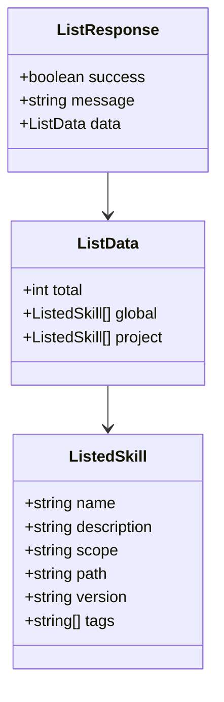

---

## 四、技能发现机制

### 4.1 扫描目录

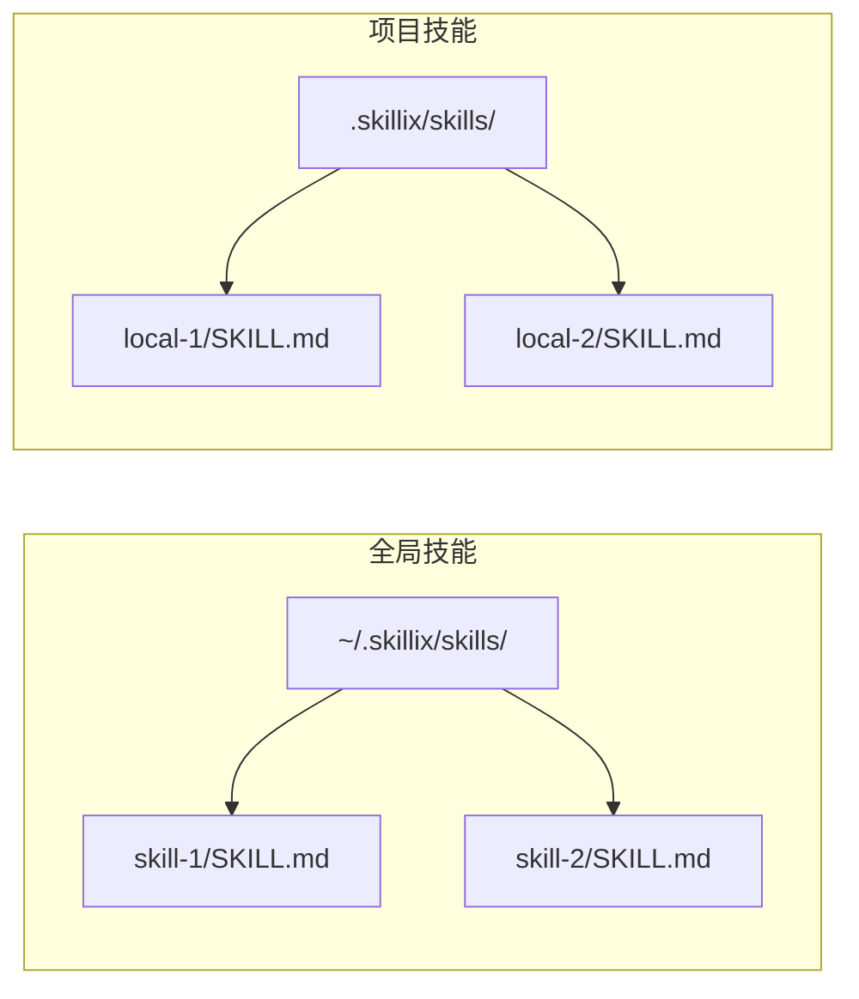

### 4.2 技能判定规则

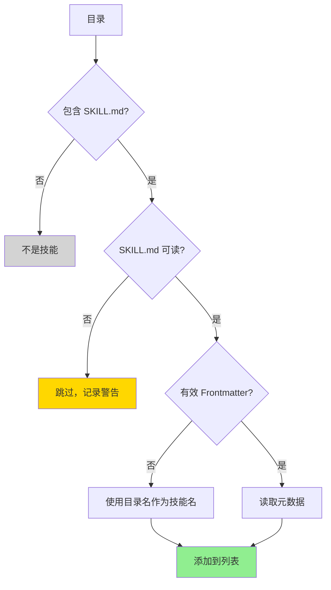

### 4.3 优先级规则

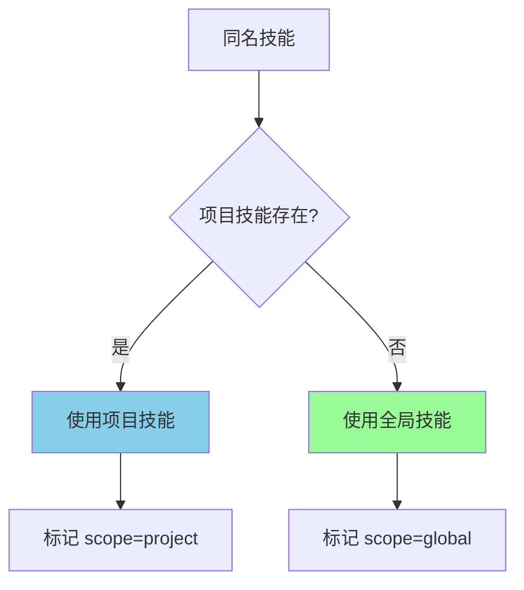

**覆盖规则**：项目技能优先级高于全局技能

---

## 五、列表展示

### 5.1 返回数据结构

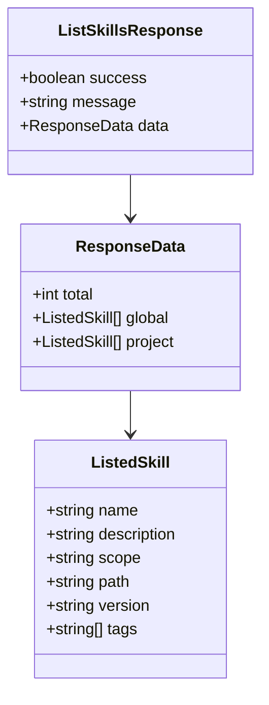

### 5.2 展示示例

```
技能列表:
━━━━━━━━━━━━━━━━━━━━━━━━━━━━━━━━━━━━━━━━━━━━━━━━━━━

全局技能 (2):
──────────────────────────────────────────────────
  pdf-converter
    描述: PDF 文件格式转换工具
    版本: 1.0.0
    标签: [pdf, converter]
    路径: ~/.skillix/skills/pdf-converter/
    
  excel-handler
    描述: Excel 文件处理工具
    版本: 1.0.0
    标签: [excel, data]
    路径: ~/.skillix/skills/excel-handler/

项目技能 (1):
──────────────────────────────────────────────────
  custom-api
    描述: 项目专用 API 技能
    版本: 1.0.0
    标签: [api, custom]
    路径: .skillix/skills/custom-api/

━━━━━━━━━━━━━━━━━━━━━━━━━━━━━━━━━━━━━━━━━━━━━━━━━━━
总计: 3 个技能
```

---

## 六、错误处理

### 6.1 错误场景

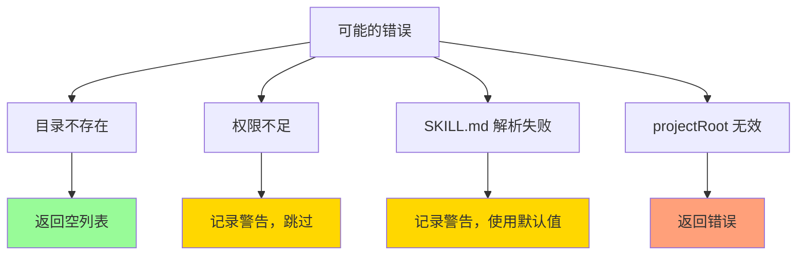

### 6.2 错误响应

| 场景 | 处理方式 | 响应 |
|------|----------|------|
| 目录不存在 | 静默处理 | 返回空列表 |
| 权限不足 | 记录警告 | 跳过该技能 |
| 解析失败 | 记录警告 | 使用默认值 |
| projectRoot 无效 | 返回错误 | success: false |

---

## 七、性能优化

### 7.1 优化策略

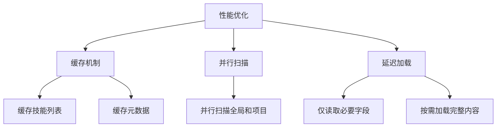

### 7.2 缓存策略

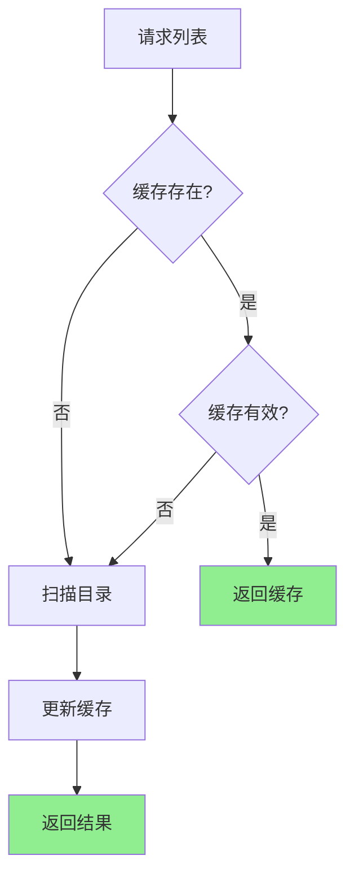

---

## 八、使用场景

### 8.1 AI 技能发现

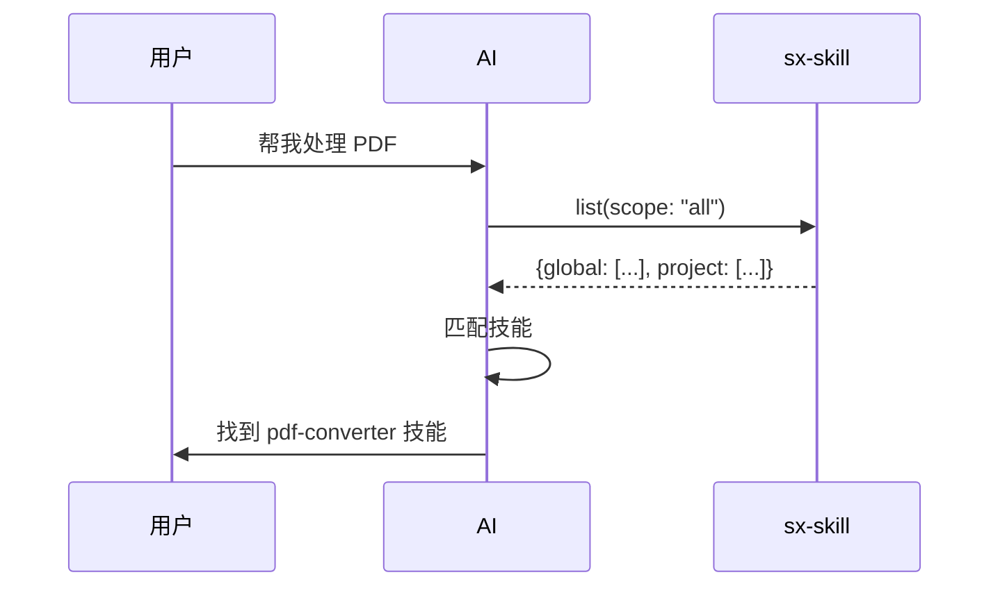

### 8.2 技能管理

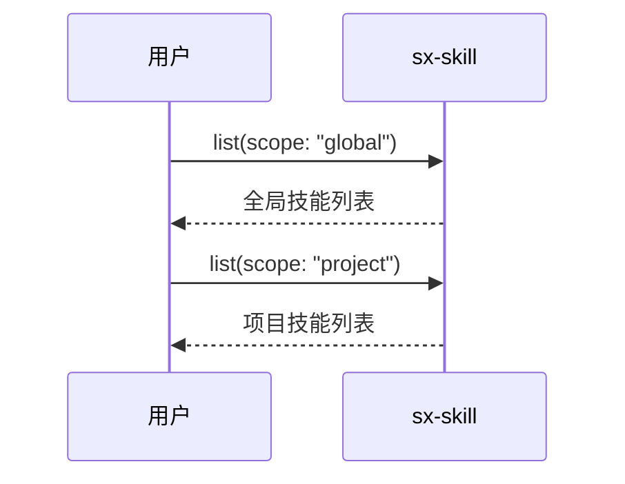

---

## 九、与其他工具的关系

### 9.1 工具关系图

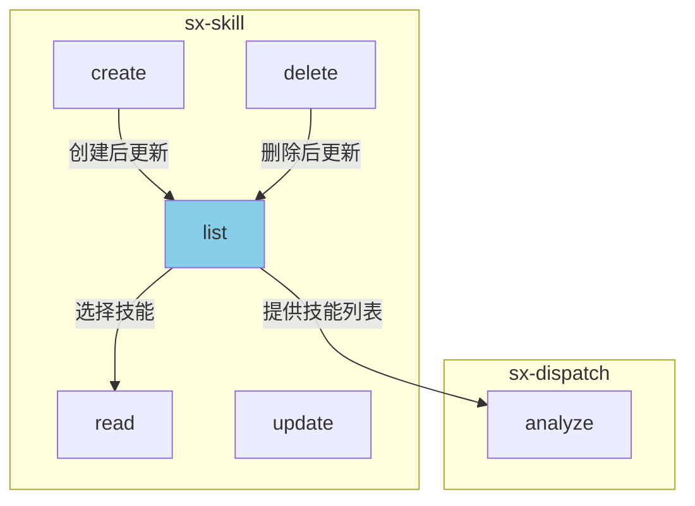

### 9.2 典型工作流

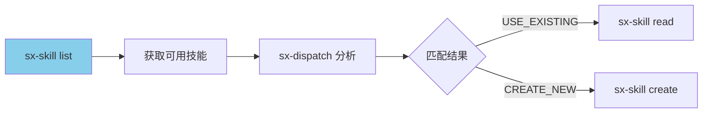

---

*本文档为 sx-skill list 设计文档*
*最后更新: 2026-01-14*
