# sx-config 配置管理设计

> 日期: 2026-01-14
> 关联: 20260111-01-项目设计.md
> 状态: 已实现

---

## 一、概述

### 1.1 功能定位

`sx-config` 是 Skillix 的配置管理工具，负责管理全局和项目级配置。

**核心职责**：
- 获取和设置配置项
- 初始化项目配置
- 管理技能源列表
- 支持全局和项目级配置

### 1.2 设计目标

1. **简单易用** - 直观的配置管理接口
2. **层级分明** - 清晰区分全局和项目配置
3. **灵活配置** - 支持多种配置项
4. **本地优先** - 项目配置优先于全局配置

### 1.3 配置层级

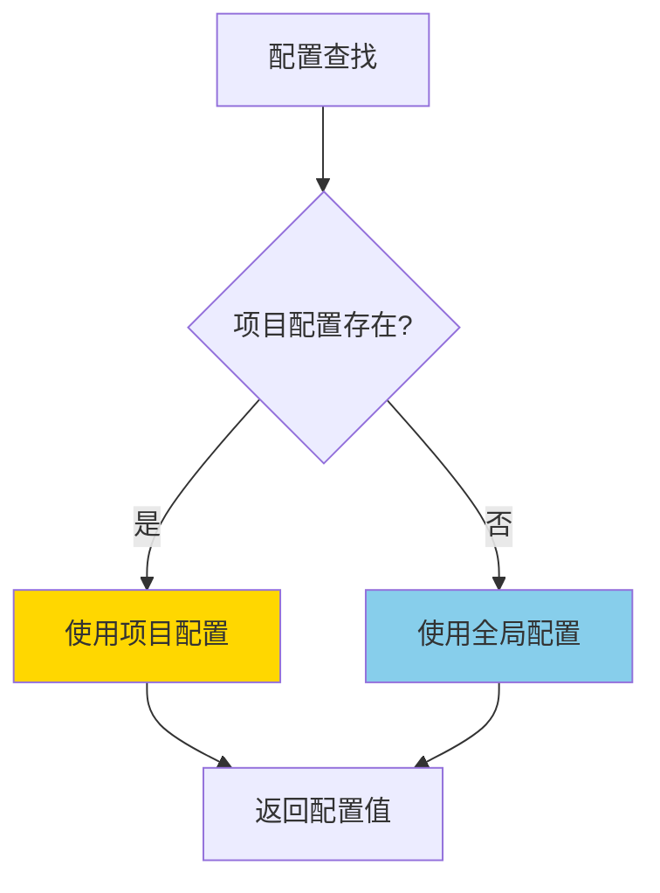

---

## 二、操作类型

### 2.1 支持的操作

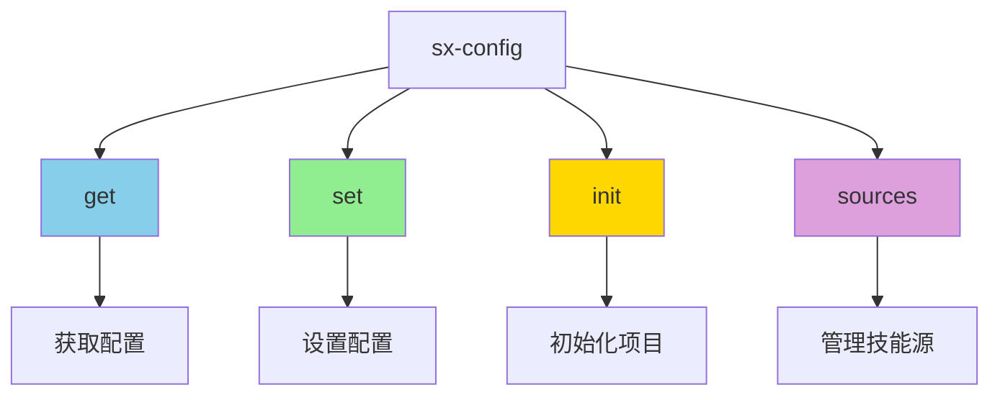

| 操作 | 说明 | 主要参数 |
|------|------|----------|
| get | 获取配置 | scope, key, projectRoot |
| set | 设置配置 | scope, key, value, projectRoot |
| init | 初始化项目配置 | projectRoot |
| sources | 管理技能源 | sourceAction, source, sourceName |

---

## 三、获取配置 (get)

### 3.1 获取流程

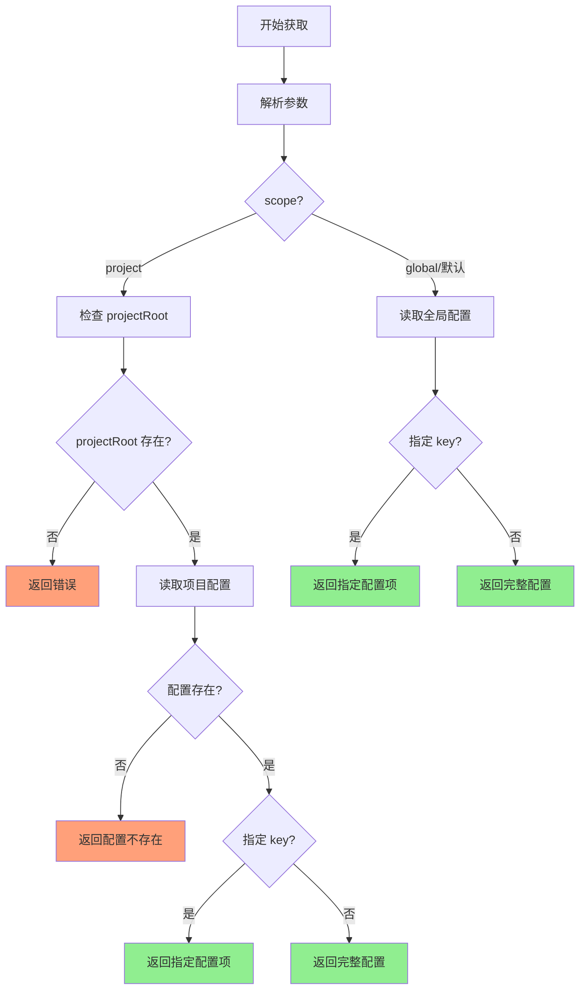

### 3.2 获取参数

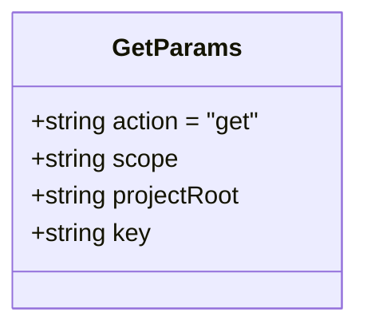

| 参数 | 类型 | 必需 | 说明 |
|------|------|------|------|
| action | string | ✅ | 固定为 "get" |
| scope | string | ❌ | 配置范围：global/project（默认 global） |
| projectRoot | string | ❌ | 项目根目录（scope=project 时必需） |
| key | string | ❌ | 配置键（不指定则返回完整配置） |

### 3.3 获取响应


### 3.4 获取示例

**获取全局配置**：
```
AI 调用:
sx-config({
  action: "get"
})

返回结果:
{
  "success": true,
  "message": "全局配置",
  "data": {
    "version": "1.0.0",
    "sources": [...],
    "defaultScope": "global",
    "format": "xml",
    "autoSuggest": true,
    ...
  }
}
```

**获取指定配置项**：
```
AI 调用:
sx-config({
  action: "get",
  key: "sources"
})

返回结果:
{
  "success": true,
  "message": "全局配置 sources",
  "data": {
    "sources": [
      {
        "name": "official",
        "url": "https://github.com/shetengteng/skillix-hub",
        "branch": "main",
        "default": true
      }
    ]
  }
}
```

**获取项目配置**：
```
AI 调用:
sx-config({
  action: "get",
  scope: "project",
  projectRoot: "/path/to/project"
})

返回结果:
{
  "success": true,
  "message": "项目配置",
  "data": {
    "sources": [],
    "format": "xml",
    "autoSuggest": true,
    "feedback": {
      "enabled": true,
      "autoRecord": false
    }
  }
}
```

---

## 四、设置配置 (set)

### 4.1 设置流程

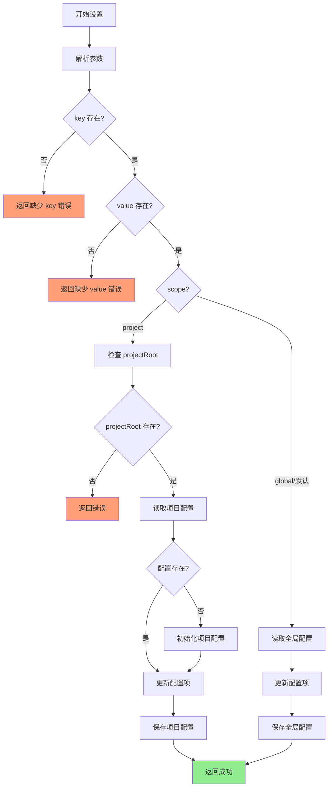

### 4.2 设置参数

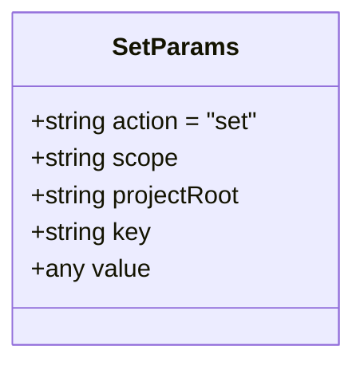

| 参数 | 类型 | 必需 | 说明 |
|------|------|------|------|
| action | string | ✅ | 固定为 "set" |
| key | string | ✅ | 配置键 |
| value | any | ✅ | 配置值 |
| scope | string | ❌ | 配置范围：global/project（默认 global） |
| projectRoot | string | ❌ | 项目根目录（scope=project 时必需） |

### 4.3 设置响应

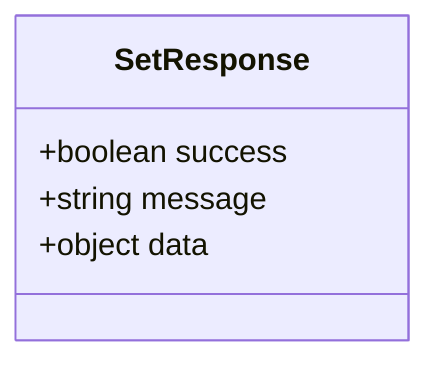

### 4.4 设置示例

**设置全局配置**：
```
AI 调用:
sx-config({
  action: "set",
  key: "autoSuggest",
  value: false
})

返回结果:
{
  "success": true,
  "message": "成功设置全局配置 autoSuggest",
  "data": {
    "autoSuggest": false
  }
}
```

**设置项目配置**：
```
AI 调用:
sx-config({
  action: "set",
  scope: "project",
  projectRoot: "/path/to/project",
  key: "format",
  value: "json"
})

返回结果:
{
  "success": true,
  "message": "成功设置项目配置 format",
  "data": {
    "format": "json"
  }
}
```

---

## 五、初始化项目 (init)

### 5.1 初始化流程

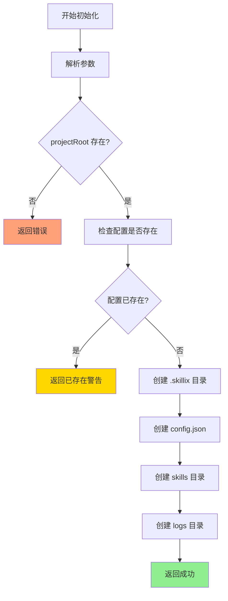

### 5.2 初始化参数

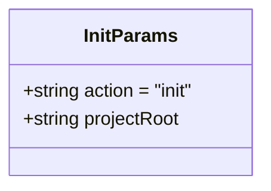

| 参数 | 类型 | 必需 | 说明 |
|------|------|------|------|
| action | string | ✅ | 固定为 "init" |
| projectRoot | string | ✅ | 项目根目录 |

### 5.3 初始化目录结构

```
project/
└── .skillix/
    ├── config.json        # 项目配置文件
    ├── skills/            # 项目级技能目录
    └── logs/              # 项目级日志目录
```

### 5.4 初始化示例

```
AI 调用:
sx-config({
  action: "init",
  projectRoot: "/path/to/project"
})

返回结果:
{
  "success": true,
  "message": "成功初始化项目配置",
  "data": {
    "sources": [],
    "format": "xml",
    "autoSuggest": true,
    "feedback": {
      "enabled": true,
      "autoRecord": false
    }
  }
}
```

**已存在时的响应**：
```
{
  "success": true,
  "message": "项目配置已存在",
  "data": {...},
  "warnings": ["项目配置已存在，未进行覆盖"]
}
```

---

## 六、管理技能源 (sources)

### 6.1 技能源操作

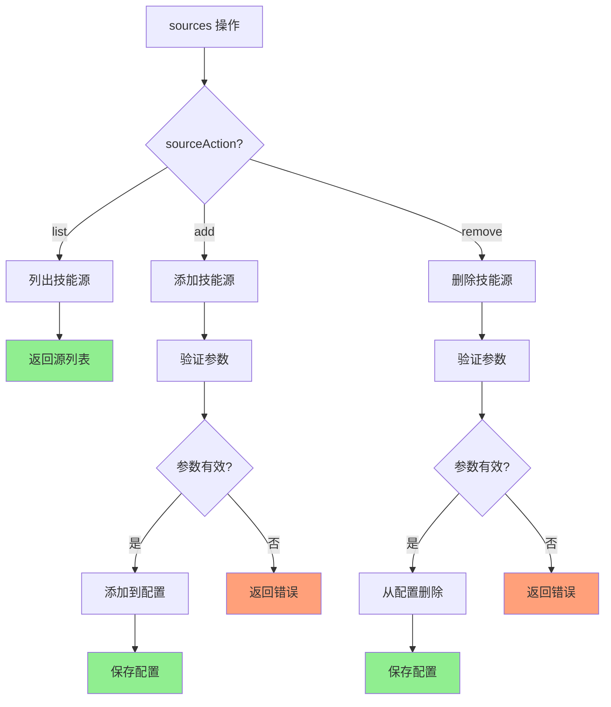

### 6.2 技能源参数

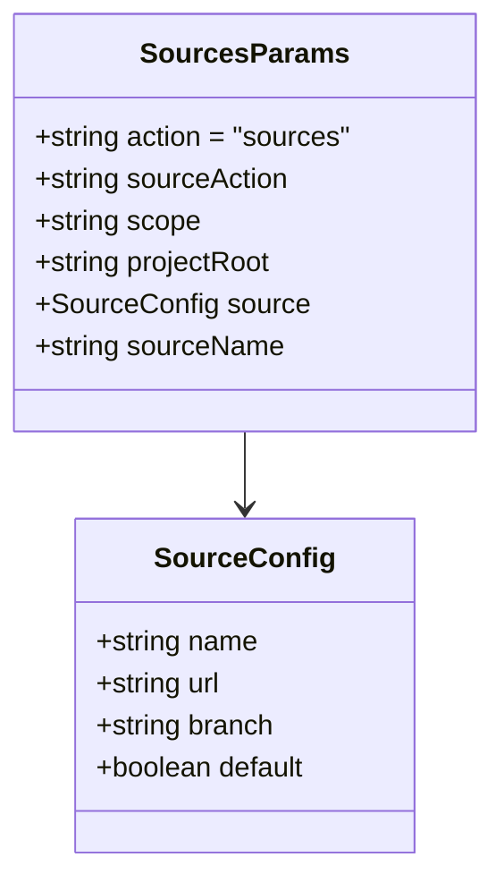

| 参数 | 类型 | 必需 | 说明 |
|------|------|------|------|
| action | string | ✅ | 固定为 "sources" |
| sourceAction | string | ❌ | 源操作：list/add/remove（默认 list） |
| scope | string | ❌ | 配置范围：global/project（默认 global） |
| projectRoot | string | ❌ | 项目根目录（scope=project 时必需） |
| source | object | ❌ | 技能源配置（add 时必需） |
| sourceName | string | ❌ | 技能源名称（remove 时必需） |

### 6.3 技能源配置结构

```typescript
interface SourceConfig {
  name: string;      // 源名称（唯一标识）
  url: string;       // GitHub 仓库 URL
  branch?: string;   // 分支名称（默认 main）
  default?: boolean; // 是否为默认源
}
```

### 6.4 列出技能源 (list)

```
AI 调用:
sx-config({
  action: "sources",
  sourceAction: "list"
})

返回结果:
{
  "success": true,
  "message": "找到 2 个技能源",
  "data": [
    {
      "name": "official",
      "url": "https://github.com/shetengteng/skillix-hub",
      "branch": "main",
      "default": true
    },
    {
      "name": "team",
      "url": "https://github.com/team/skills",
      "branch": "main",
      "default": false
    }
  ]
}
```

### 6.5 添加技能源 (add)

```
AI 调用:
sx-config({
  action: "sources",
  sourceAction: "add",
  source: {
    name: "community",
    url: "https://github.com/community/skills",
    branch: "main",
    default: false
  }
})

返回结果:
{
  "success": true,
  "message": "成功添加技能源 \"community\"",
  "data": {
    "name": "community",
    "url": "https://github.com/community/skills",
    "branch": "main",
    "default": false
  }
}
```

### 6.6 删除技能源 (remove)

```
AI 调用:
sx-config({
  action: "sources",
  sourceAction: "remove",
  sourceName: "community"
})

返回结果:
{
  "success": true,
  "message": "成功删除技能源 \"community\""
}
```

---

## 七、配置文件结构

### 7.1 全局配置 (~/.skillix/config.json)

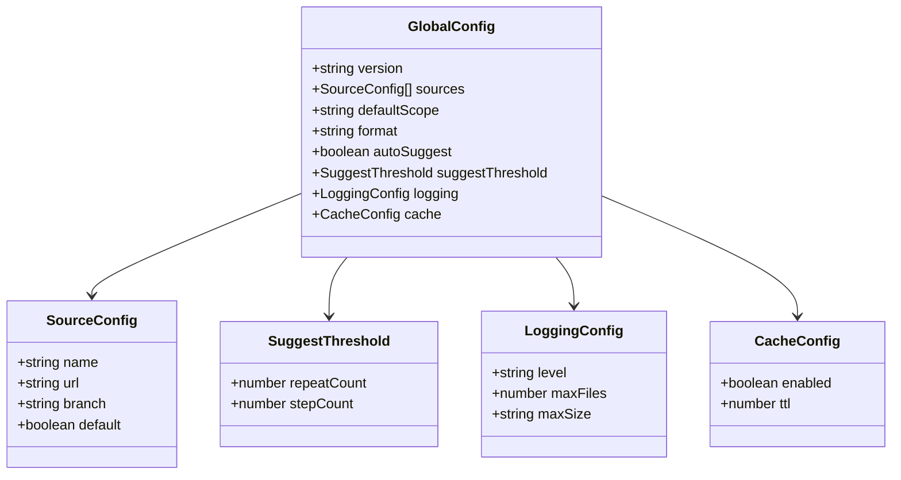

**完整示例**：
```json
{
  "version": "1.0.0",
  "sources": [
    {
      "name": "official",
      "url": "https://github.com/shetengteng/skillix-hub",
      "branch": "main",
      "default": true
    }
  ],
  "defaultScope": "global",
  "format": "xml",
  "autoSuggest": true,
  "suggestThreshold": {
    "repeatCount": 3,
    "stepCount": 5
  },
  "logging": {
    "level": "info",
    "maxFiles": 5,
    "maxSize": "10MB"
  },
  "cache": {
    "enabled": true,
    "ttl": 3600
  }
}
```

### 7.2 项目配置 (.skillix/config.json)

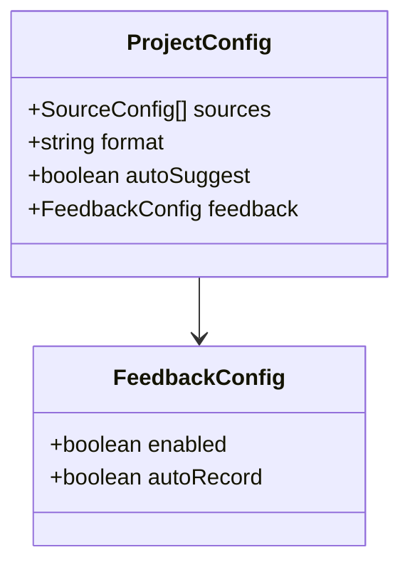

**完整示例**：
```json
{
  "sources": [
    {
      "name": "project-specific",
      "url": "https://github.com/project/skills",
      "branch": "main"
    }
  ],
  "format": "xml",
  "autoSuggest": true,
  "feedback": {
    "enabled": true,
    "autoRecord": false
  }
}
```

### 7.3 配置字段说明

#### 全局配置字段

| 字段 | 类型 | 默认值 | 说明 |
|------|------|--------|------|
| version | string | "1.0.0" | 配置文件版本 |
| sources | array | [official] | 技能源列表 |
| defaultScope | string | "global" | 默认技能范围 |
| format | string | "xml" | 默认输出格式 |
| autoSuggest | boolean | true | 是否启用自动建议 |
| suggestThreshold | object | {...} | 建议触发阈值 |
| logging | object | {...} | 日志配置 |
| cache | object | {...} | 缓存配置 |

#### 项目配置字段

| 字段 | 类型 | 默认值 | 说明 |
|------|------|--------|------|
| sources | array | [] | 项目级技能源 |
| format | string | "xml" | 输出格式 |
| autoSuggest | boolean | true | 是否启用自动建议 |
| feedback | object | {...} | 反馈配置 |

---

## 八、配置优先级

### 8.1 优先级规则

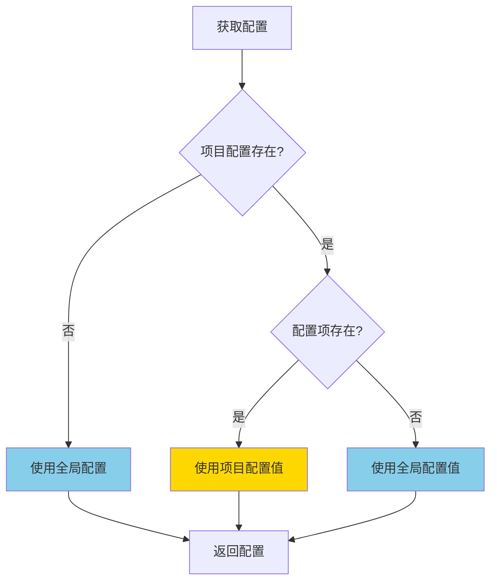

### 8.2 本地优先策略

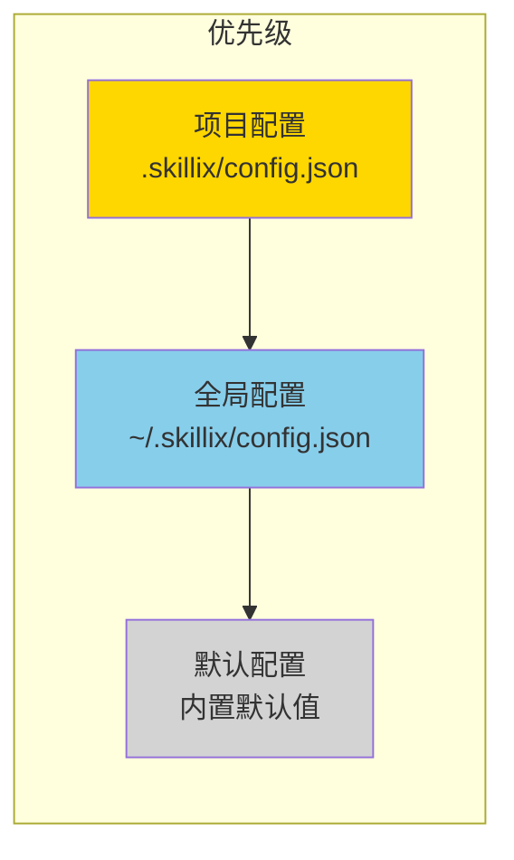

**核心原则**：
- 项目配置优先于全局配置
- 配置项独立，不进行合并
- 未设置的配置项使用全局或默认值

---

## 九、错误处理

### 9.1 错误场景

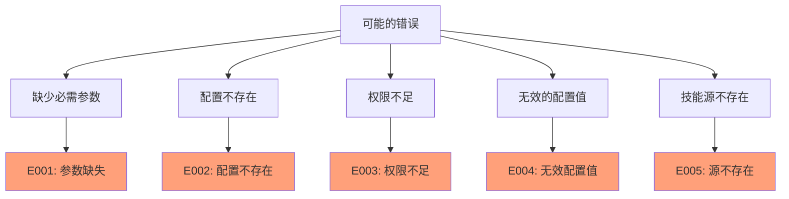

### 9.2 错误响应

| 错误码 | 错误类型 | 说明 | 建议操作 |
|--------|----------|------|----------|
| E001 | 参数缺失 | 必需参数未提供 | 检查参数 |
| E002 | 配置不存在 | 项目配置不存在 | 使用 init 初始化 |
| E003 | 权限不足 | 无法写入配置文件 | 检查目录权限 |
| E004 | 无效配置值 | 配置值格式错误 | 检查值格式 |
| E005 | 源不存在 | 要删除的源不存在 | 检查源名称 |

---

## 十、使用场景

### 10.1 初始化新项目

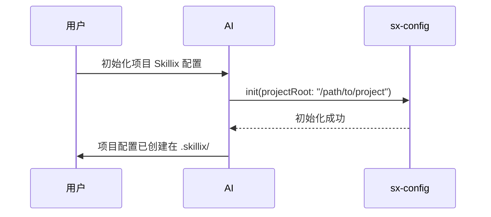

### 10.2 添加团队技能源

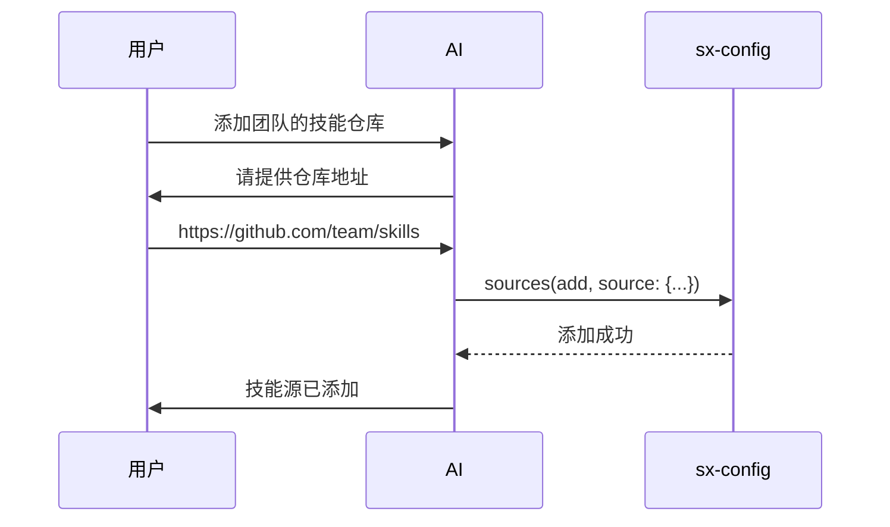

### 10.3 修改配置

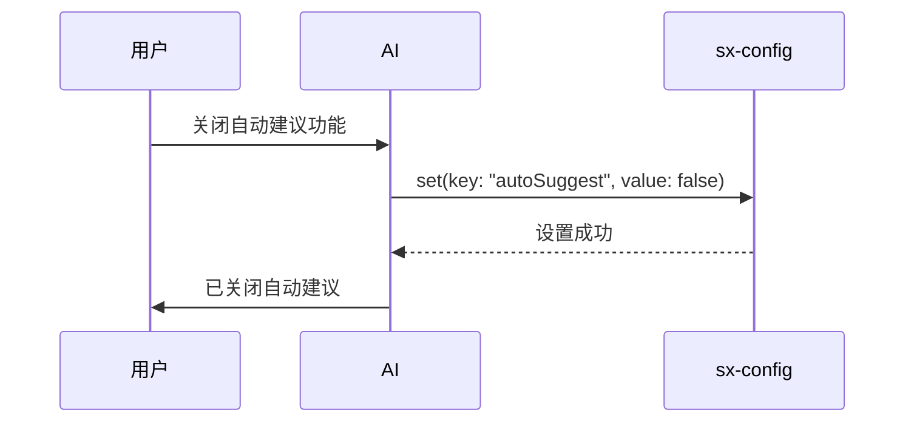

### 10.4 查看当前配置

```mermaid
sequenceDiagram
    participant U as 用户
    participant AI as AI
    participant C as sx-config
    
    U->>AI: 查看当前配置
    AI->>C: get()
    C-->>AI: 返回配置
    AI->>U: 当前配置：...
```

---

## 十一、与其他工具的集成

### 11.1 与 sx-market 集成

```mermaid
sequenceDiagram
    participant U as 用户
    participant AI as AI
    participant C as sx-config
    participant M as sx-market
    
    U->>AI: 从团队源安装技能
    AI->>C: sources(list)
    C-->>AI: 返回源列表
    AI->>M: search(source: "team", query: "api")
    M-->>AI: 搜索结果
    AI->>U: 找到以下技能...
```

### 11.2 与 sx-skill 集成

```mermaid
sequenceDiagram
    participant U as 用户
    participant AI as AI
    participant C as sx-config
    participant S as sx-skill
    
    U->>AI: 创建项目技能
    AI->>C: get(scope: "project")
    C-->>AI: 项目配置
    AI->>S: create(scope: "project", ...)
    S-->>AI: 创建成功
    AI->>U: 技能已创建
```

### 11.3 工具关系图

```mermaid
flowchart TD
    subgraph sx-config
        A[get]
        B[set]
        C[init]
        D[sources]
    end
    
    subgraph sx-market
        E[search]
        F[install]
    end
    
    subgraph sx-skill
        G[list]
        H[create]
    end
    
    D -->|提供源配置| E
    C -->|初始化项目| H
    A -->|获取配置| G
    
    style A fill:#87CEEB
    style B fill:#90EE90
    style C fill:#FFD700
    style D fill:#DDA0DD
```

---

## 十二、输入输出设计

### 12.1 工具参数 Schema

```typescript
{
  name: "sx-config",
  description: "配置管理工具，支持获取、设置配置和管理技能源",
  inputSchema: {
    type: "object",
    properties: {
      action: {
        type: "string",
        enum: ["get", "set", "init", "sources"],
        description: "操作类型"
      },
      scope: {
        type: "string",
        enum: ["global", "project"],
        description: "配置范围（默认 global）"
      },
      projectRoot: {
        type: "string",
        description: "项目根目录路径（项目级操作时需要）"
      },
      key: {
        type: "string",
        description: "配置键（get/set 时使用）"
      },
      value: {
        description: "配置值（set 时使用）"
      },
      sourceAction: {
        type: "string",
        enum: ["list", "add", "remove"],
        description: "源操作类型（sources 时使用）"
      },
      source: {
        type: "object",
        description: "技能源配置（sources add 时使用）",
        properties: {
          name: { type: "string" },
          url: { type: "string" },
          branch: { type: "string" },
          default: { type: "boolean" }
        }
      },
      sourceName: {
        type: "string",
        description: "技能源名称（sources remove 时使用）"
      }
    },
    required: ["action"]
  }
}
```

### 12.2 TypeScript 类型定义

```typescript
/**
 * sx-config 工具参数
 */
export interface SxConfigParams {
  /** 操作类型 */
  action: 'get' | 'set' | 'init' | 'sources';
  /** 配置范围 */
  scope?: 'global' | 'project';
  /** 项目根目录 */
  projectRoot?: string;
  /** 配置键 */
  key?: string;
  /** 配置值 */
  value?: any;
  /** 源操作类型 */
  sourceAction?: 'list' | 'add' | 'remove';
  /** 技能源配置 */
  source?: SourceConfig;
  /** 技能源名称 */
  sourceName?: string;
}

/**
 * 技能源配置
 */
export interface SourceConfig {
  name: string;
  url: string;
  branch?: string;
  default?: boolean;
}
```

---

## 十三、最佳实践

### 13.1 配置管理建议

| 建议 | 说明 |
|------|------|
| 使用全局配置存储通用设置 | 如默认技能源、日志级别 |
| 使用项目配置存储项目特定设置 | 如项目专用技能源 |
| 定期检查技能源 | 确保源地址有效 |

### 13.2 技能源管理建议

| 建议 | 说明 |
|------|------|
| 设置默认源 | 方便快速安装技能 |
| 使用有意义的源名称 | 如 "official", "team", "community" |
| 项目特定源放在项目配置 | 避免污染全局配置 |

### 13.3 初始化建议

| 建议 | 说明 |
|------|------|
| 新项目先初始化 | 确保项目配置存在 |
| 检查已有配置 | 避免覆盖现有配置 |
| 配置版本控制 | 将 .skillix/config.json 纳入版本控制 |

---

## 十四、目录结构

### 14.1 全局目录

```
~/.skillix/
├── config.json              # 全局配置文件
├── skills/                  # 全局技能目录
├── logs/                    # 系统日志目录
├── cache/                   # 缓存目录
│   ├── sources/             # 技能源索引缓存
│   └── downloads/           # 下载临时目录
└── data/                    # 数据目录
```

### 14.2 项目目录

```
project/
└── .skillix/
    ├── config.json          # 项目配置文件
    ├── skills/              # 项目级技能目录
    └── logs/                # 项目级日志目录
```

---

*本文档为 sx-config 配置管理设计文档*
*最后更新: 2026-01-14*
