# sx-skill update 技能更新设计

> 日期: 2026-01-19
> 关联: 20260111-03-自动创建与进化设计.md, 20260114-07-sx-create设计.md
> 状态: 设计中

---

## 一、概述

### 1.1 功能定位

`sx-skill update` 是 Skillix 的技能更新工具，用于更新现有技能的元数据和内容。

**核心职责**：
- 更新技能元数据（name, description, version, author, tags 等）
- 更新技能正文内容（body）
- 支持部分更新（仅更新指定字段）
- 保持未更新字段不变

### 1.2 设计目标

1. **灵活更新** - 支持部分更新，无需提供完整内容
2. **安全可靠** - 验证更新内容，防止破坏技能结构
3. **保持一致** - 更新后技能格式符合规范
4. **支持进化** - 为技能持续优化提供基础

### 1.3 与创建的区别

| 特性 | sx-skill create | sx-skill update |
|------|-----------------|-----------------|
| 目标 | 创建新技能 | 更新现有技能 |
| 技能存在性 | 必须不存在 | 必须已存在 |
| 参数要求 | 必须提供完整参数 | 支持部分更新 |
| 元数据 | 全新创建 | 合并更新 |
| 正文 | 必须提供 | 可选更新 |

---

## 二、更新流程

### 2.1 主流程

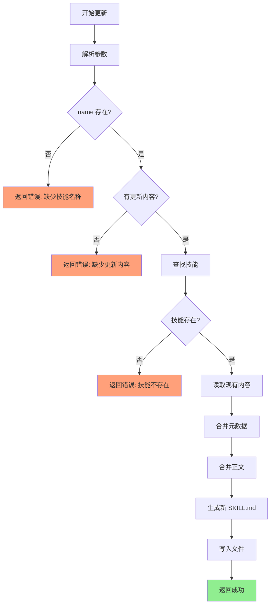
```mermaid
flowchart TD
    A[开始更新] --> B[解析参数]
    B --> C{name 存在?}
    
    C -->|否| D[返回错误: 缺少技能名称]
    C -->|是| E{有更新内容?}
    
    E -->|否| F[返回错误: 缺少更新内容]
    E -->|是| G[查找技能]
    
    G --> H{技能存在?}
    H -->|否| I[返回错误: 技能不存在]
    H -->|是| J[读取现有内容]
    
    J --> K[合并元数据]
    K --> L[合并正文]
    L --> M[生成新 SKILL.md]
    M --> N[写入文件]
    N --> O[返回成功]
    
    style O fill:#90EE90
    style D fill:#FFA07A
    style F fill:#FFA07A
    style I fill:#FFA07A
```

### 2.2 技能查找流程

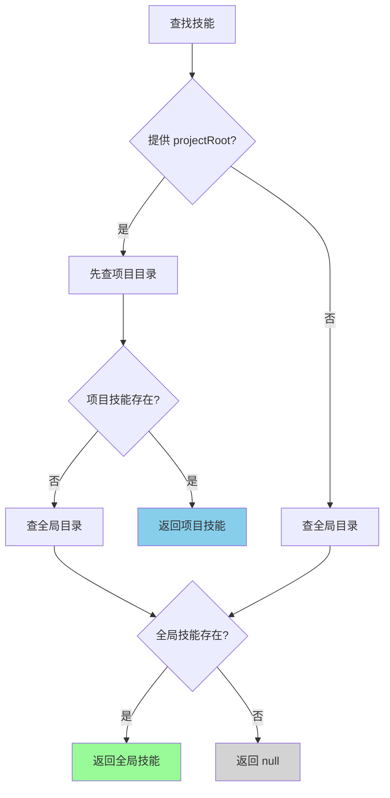
```mermaid
flowchart TD
    A[查找技能] --> B{提供 projectRoot?}
    
    B -->|是| C[先查项目目录]
    B -->|否| D[查全局目录]
    
    C --> E{项目技能存在?}
    E -->|是| F[返回项目技能]
    E -->|否| G[查全局目录]
    
    G --> H{全局技能存在?}
    D --> H
    
    H -->|是| I[返回全局技能]
    H -->|否| J[返回 null]
    
    style F fill:#87CEEB
    style I fill:#98FB98
    style J fill:#D3D3D3
```

### 2.3 元数据合并流程

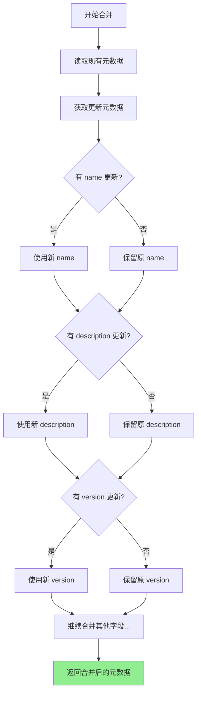
```mermaid
flowchart TD
    A[开始合并] --> B[读取现有元数据]
    B --> C[获取更新元数据]
    
    C --> D{有 name 更新?}
    D -->|是| E[使用新 name]
    D -->|否| F[保留原 name]
    
    E --> G{有 description 更新?}
    F --> G
    
    G -->|是| H[使用新 description]
    G -->|否| I[保留原 description]
    
    H --> J{有 version 更新?}
    I --> J
    
    J -->|是| K[使用新 version]
    J -->|否| L[保留原 version]
    
    K --> M[继续合并其他字段...]
    L --> M
    
    M --> N[返回合并后的元数据]
    
    style N fill:#90EE90
```

### 2.4 正文合并流程

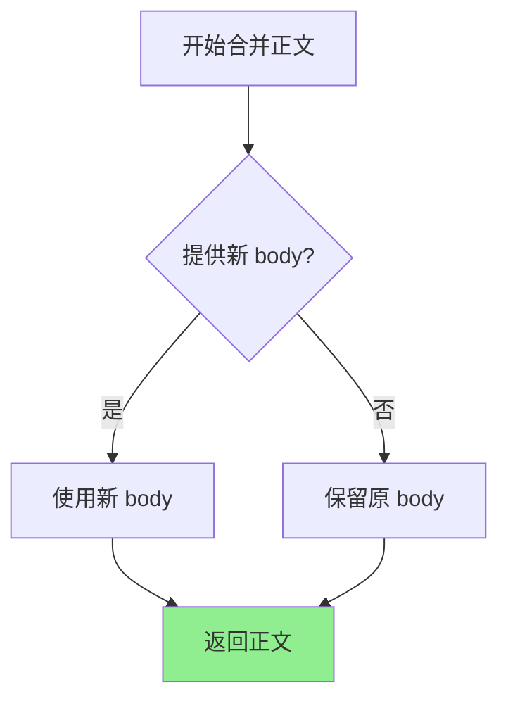
```mermaid
flowchart TD
    A[开始合并正文] --> B{提供新 body?}
    
    B -->|是| C[使用新 body]
    B -->|否| D[保留原 body]
    
    C --> E[返回正文]
    D --> E
    
    style E fill:#90EE90
```

---

## 三、输入输出设计

### 3.1 输入参数

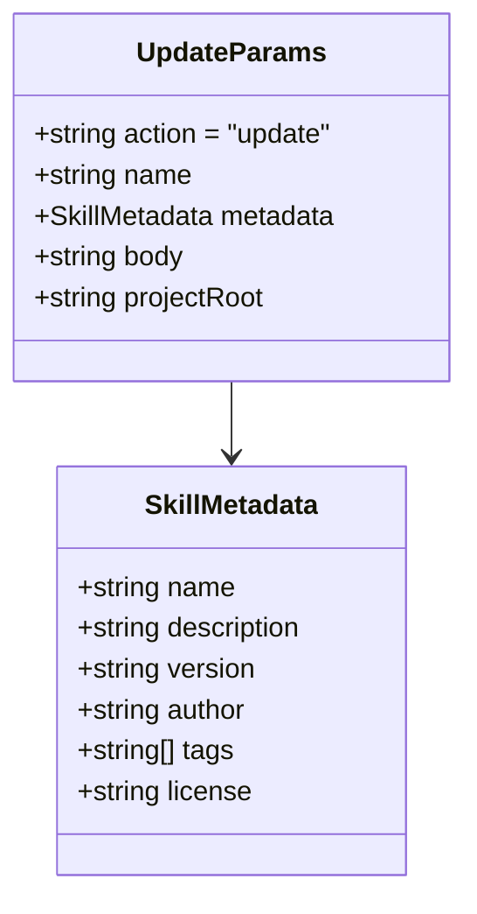
```mermaid
classDiagram
    class UpdateParams {
        +string action = "update"
        +string name
        +SkillMetadata metadata
        +string body
        +string projectRoot
    }
    
    class SkillMetadata {
        +string name
        +string description
        +string version
        +string author
        +string[] tags
        +string license
    }
    
    UpdateParams --> SkillMetadata
```

| 参数 | 类型 | 必需 | 说明 |
|------|------|------|------|
| action | string | ✅ | 固定为 "update" |
| name | string | ✅ | 要更新的技能名称 |
| metadata | object | ⚠️ | 要更新的元数据（与 body 至少提供一个） |
| body | string | ⚠️ | 要更新的正文内容（与 metadata 至少提供一个） |
| projectRoot | string | ❌ | 项目根目录（用于查找项目技能） |

### 3.2 元数据字段

| 字段 | 类型 | 说明 |
|------|------|------|
| name | string | 技能名称（hyphen-case） |
| description | string | 技能描述（含触发场景） |
| version | string | 版本号（如 1.0.0） |
| author | string | 作者 |
| tags | string[] | 标签列表 |
| license | string | 许可证 |

### 3.3 输出响应

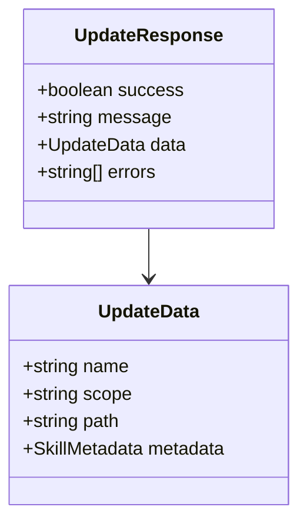
```mermaid
classDiagram
    class UpdateResponse {
        +boolean success
        +string message
        +UpdateData data
        +string[] errors
    }
    
    class UpdateData {
        +string name
        +string scope
        +string path
        +SkillMetadata metadata
    }
    
    UpdateResponse --> UpdateData
```

**成功响应**：

```json
{
  "success": true,
  "message": "成功更新技能 \"pdf-converter\"",
  "data": {
    "name": "pdf-converter",
    "scope": "global",
    "path": "~/.skillix/skills/pdf-converter/",
    "metadata": {
      "name": "pdf-converter",
      "description": "更新后的描述...",
      "version": "1.1.0",
      "author": "user",
      "tags": ["pdf", "converter", "new-tag"]
    }
  }
}
```

**错误响应**：

```json
{
  "success": false,
  "message": "技能 \"unknown-skill\" 不存在",
  "errors": ["未找到名为 \"unknown-skill\" 的技能"]
}
```

---

## 四、更新场景

### 4.1 仅更新元数据

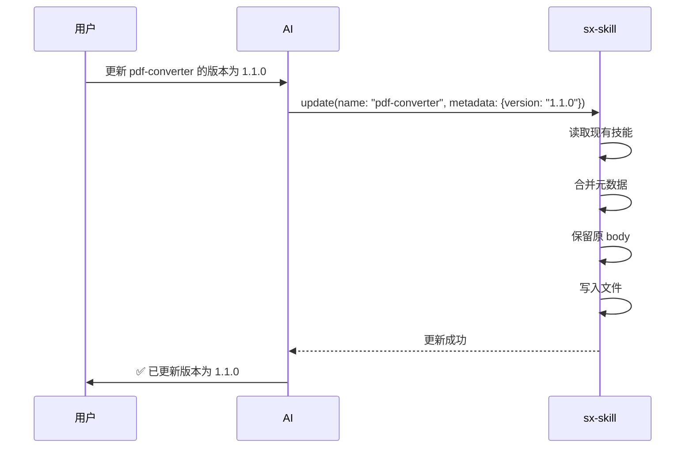
```mermaid
sequenceDiagram
    participant U as 用户
    participant AI as AI
    participant T as sx-skill
    
    U->>AI: 更新 pdf-converter 的版本为 1.1.0
    AI->>T: update(name: "pdf-converter", metadata: {version: "1.1.0"})
    T->>T: 读取现有技能
    T->>T: 合并元数据
    T->>T: 保留原 body
    T->>T: 写入文件
    T-->>AI: 更新成功
    AI->>U: ✅ 已更新版本为 1.1.0
```

**调用示例**：

```typescript
sx-skill({
  action: "update",
  name: "pdf-converter",
  metadata: {
    version: "1.1.0"
  }
})
```

### 4.2 仅更新正文

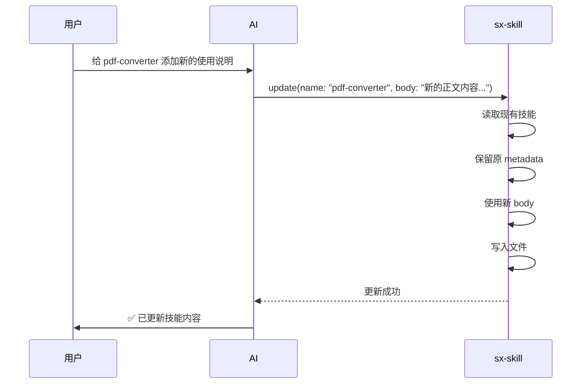
```mermaid
sequenceDiagram
    participant U as 用户
    participant AI as AI
    participant T as sx-skill
    
    U->>AI: 给 pdf-converter 添加新的使用说明
    AI->>T: update(name: "pdf-converter", body: "新的正文内容...")
    T->>T: 读取现有技能
    T->>T: 保留原 metadata
    T->>T: 使用新 body
    T->>T: 写入文件
    T-->>AI: 更新成功
    AI->>U: ✅ 已更新技能内容
```

**调用示例**：

```typescript
sx-skill({
  action: "update",
  name: "pdf-converter",
  body: `# PDF 转换器

## 使用说明

新增的使用说明内容...

## 示例

更新后的示例...
`
})
```

### 4.3 同时更新元数据和正文

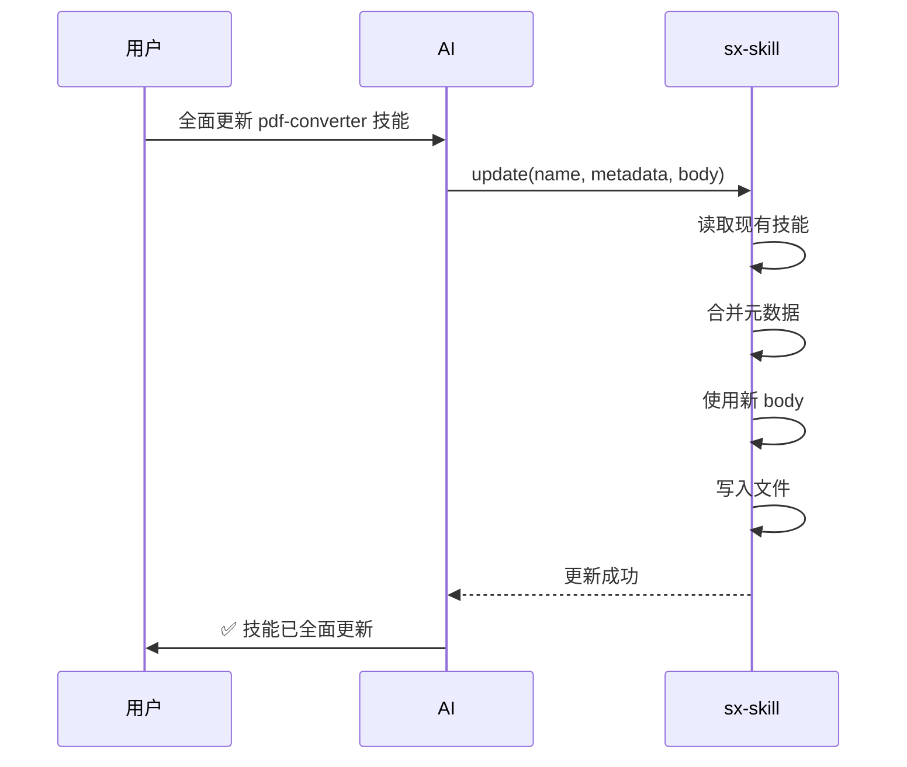
```mermaid
sequenceDiagram
    participant U as 用户
    participant AI as AI
    participant T as sx-skill
    
    U->>AI: 全面更新 pdf-converter 技能
    AI->>T: update(name, metadata, body)
    T->>T: 读取现有技能
    T->>T: 合并元数据
    T->>T: 使用新 body
    T->>T: 写入文件
    T-->>AI: 更新成功
    AI->>U: ✅ 技能已全面更新
```

**调用示例**：

```typescript
sx-skill({
  action: "update",
  name: "pdf-converter",
  metadata: {
    description: "更新后的描述，支持更多格式...",
    version: "2.0.0",
    tags: ["pdf", "converter", "image", "text"]
  },
  body: `# PDF 转换器 v2.0

## 新功能

- 支持 PDF 转图片
- 支持 PDF 转文本
- 支持批量处理

## 使用说明

...
`
})
```

### 4.4 更新项目级技能

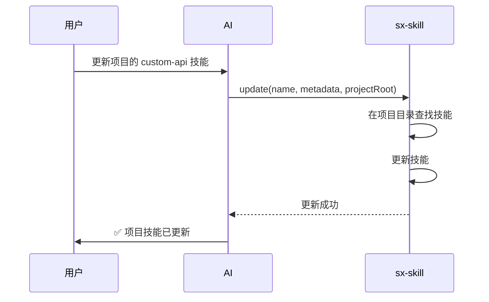
```mermaid
sequenceDiagram
    participant U as 用户
    participant AI as AI
    participant T as sx-skill
    
    U->>AI: 更新项目的 custom-api 技能
    AI->>T: update(name, metadata, projectRoot)
    T->>T: 在项目目录查找技能
    T->>T: 更新技能
    T-->>AI: 更新成功
    AI->>U: ✅ 项目技能已更新
```

**调用示例**：

```typescript
sx-skill({
  action: "update",
  name: "custom-api",
  metadata: {
    version: "1.2.0"
  },
  projectRoot: "/path/to/project"
})
```

---

## 五、技能进化支持

### 5.1 进化触发场景

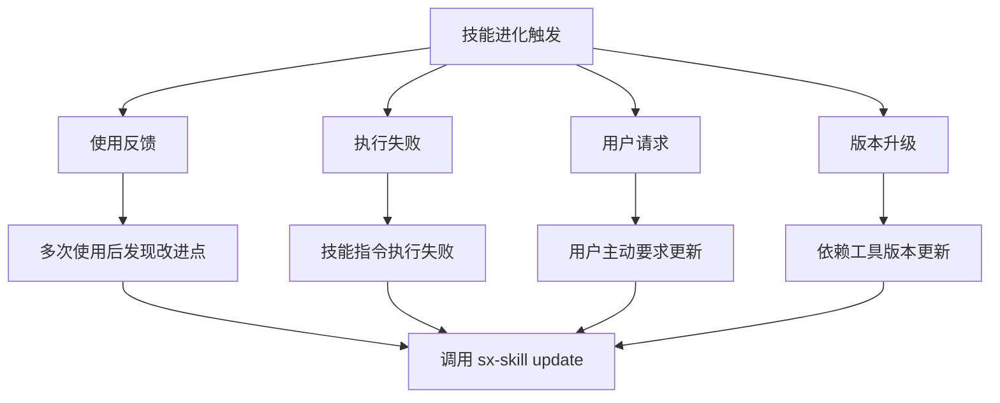
```mermaid
flowchart TD
    A[技能进化触发] --> B[使用反馈]
    A --> C[执行失败]
    A --> D[用户请求]
    A --> E[版本升级]
    
    B --> B1["多次使用后发现改进点"]
    C --> C1["技能指令执行失败"]
    D --> D1["用户主动要求更新"]
    E --> E1["依赖工具版本更新"]
    
    B1 --> F[调用 sx-skill update]
    C1 --> F
    D1 --> F
    E1 --> F
```

### 5.2 基于反馈的更新

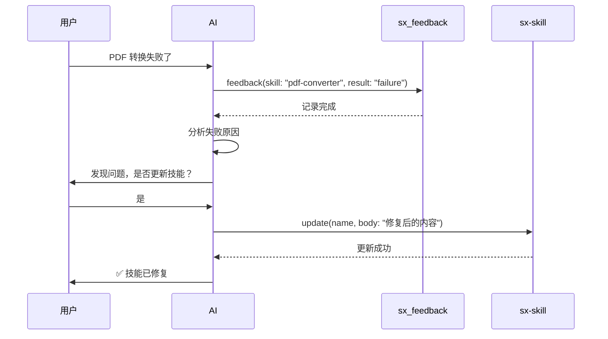
```mermaid
sequenceDiagram
    participant U as 用户
    participant AI as AI
    participant F as sx_feedback
    participant T as sx-skill
    
    U->>AI: PDF 转换失败了
    AI->>F: feedback(skill: "pdf-converter", result: "failure")
    F-->>AI: 记录完成
    AI->>AI: 分析失败原因
    AI->>U: 发现问题，是否更新技能？
    U->>AI: 是
    AI->>T: update(name, body: "修复后的内容")
    T-->>AI: 更新成功
    AI->>U: ✅ 技能已修复
```

### 5.3 版本管理

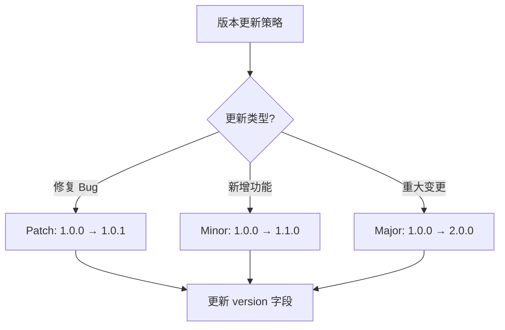
```mermaid
flowchart TD
    A[版本更新策略] --> B{更新类型?}
    
    B -->|修复 Bug| C["Patch: 1.0.0 → 1.0.1"]
    B -->|新增功能| D["Minor: 1.0.0 → 1.1.0"]
    B -->|重大变更| E["Major: 1.0.0 → 2.0.0"]
    
    C --> F[更新 version 字段]
    D --> F
    E --> F
```

**版本更新示例**：

```typescript
// Bug 修复
sx-skill({
  action: "update",
  name: "pdf-converter",
  metadata: { version: "1.0.1" },
  body: "修复后的内容..."
})

// 新增功能
sx-skill({
  action: "update",
  name: "pdf-converter",
  metadata: { 
    version: "1.1.0",
    description: "新增图片转换功能..."
  },
  body: "包含新功能的内容..."
})
```

---

## 六、错误处理

### 6.1 错误场景

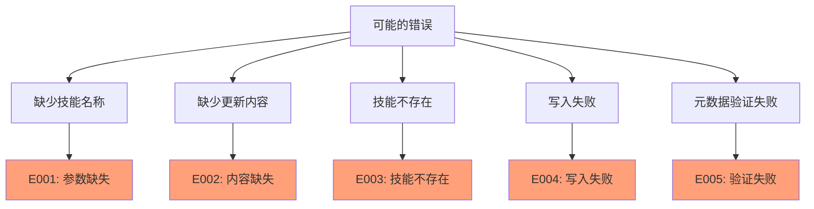
```mermaid
flowchart TD
    A[可能的错误] --> B[缺少技能名称]
    A --> C[缺少更新内容]
    A --> D[技能不存在]
    A --> E[写入失败]
    A --> F[元数据验证失败]
    
    B --> B1["E001: 参数缺失"]
    C --> C1["E002: 内容缺失"]
    D --> D1["E003: 技能不存在"]
    E --> E1["E004: 写入失败"]
    F --> F1["E005: 验证失败"]
    
    style B1 fill:#FFA07A
    style C1 fill:#FFA07A
    style D1 fill:#FFA07A
    style E1 fill:#FFA07A
    style F1 fill:#FFA07A
```

### 6.2 错误码定义

| 错误码 | 错误类型 | 说明 | 处理建议 |
|--------|----------|------|----------|
| `E001` | 参数缺失 | 未提供技能名称 | 提供 name 参数 |
| `E002` | 内容缺失 | 未提供 metadata 或 body | 至少提供一个更新内容 |
| `E003` | 技能不存在 | 指定的技能未找到 | 检查技能名称或先创建技能 |
| `E004` | 写入失败 | 文件写入失败 | 检查权限和磁盘空间 |
| `E005` | 验证失败 | 元数据格式错误 | 检查元数据格式 |

### 6.3 错误响应示例

**缺少技能名称**：

```json
{
  "success": false,
  "message": "缺少技能名称",
  "errors": ["参数 name 是必需的"]
}
```

**缺少更新内容**：

```json
{
  "success": false,
  "message": "缺少更新内容",
  "errors": ["至少需要提供 metadata 或 body 参数"]
}
```

**技能不存在**：

```json
{
  "success": false,
  "message": "技能 \"unknown-skill\" 不存在",
  "errors": ["未找到名为 \"unknown-skill\" 的技能"]
}
```

---

## 七、实现细节

### 7.1 服务层实现

```typescript
/**
 * 更新技能
 */
export function updateSkill(
  skillName: string,
  updates: {
    metadata?: Partial<SkillMetadata>;
    body?: string;
  },
  projectRoot?: string
): Skill | null {
  // 1. 查找现有技能
  const skill = getSkill(skillName, projectRoot);
  
  if (!skill) {
    return null;
  }
  
  // 2. 解析现有内容
  const { body: currentBody } = markdown.parseFrontmatter(skill.content || '');
  
  // 3. 合并元数据
  const newMetadata: SkillMetadata = {
    ...skill.metadata,
    ...updates.metadata,
  };
  
  // 4. 确定正文
  const newBody = updates.body ?? currentBody;
  
  // 5. 生成新内容
  const newContent = markdown.generateSkillMd(newMetadata, newBody);
  
  // 6. 写入文件
  const skillMdPath = paths.getSkillMdPath(skill.path);
  fs.writeFile(skillMdPath, newContent);
  
  // 7. 返回更新后的技能
  return {
    ...skill,
    description: newMetadata.description || skill.description,
    metadata: newMetadata,
    content: newContent,
  };
}
```

### 7.2 工具层实现

```typescript
/**
 * 更新技能
 */
export function handleUpdate(params: SxSkillParams): ToolResponse {
  const { name, projectRoot, metadata, body } = params;
  
  // 1. 验证必需参数
  if (!name) {
    return error({
      message: '缺少技能名称',
      errors: ['参数 name 是必需的'],
    });
  }
  
  // 2. 验证更新内容
  if (!metadata && body === undefined) {
    return error({
      message: '缺少更新内容',
      errors: ['至少需要提供 metadata 或 body 参数'],
    });
  }
  
  // 3. 执行更新
  try {
    const skill = skillService.updateSkill(name, { metadata, body }, projectRoot);
    
    if (!skill) {
      return error({
        message: `技能 "${name}" 不存在`,
        errors: [`未找到名为 "${name}" 的技能`],
      });
    }
    
    return success({
      message: `成功更新技能 "${name}"`,
      data: {
        name: skill.name,
        scope: skill.scope,
        path: skill.path,
        metadata: skill.metadata,
      },
    });
  } catch (e) {
    return errorFromException(`更新技能 "${name}" 失败`, e);
  }
}
```

---

## 八、与其他工具的关系

### 8.1 工具关系图

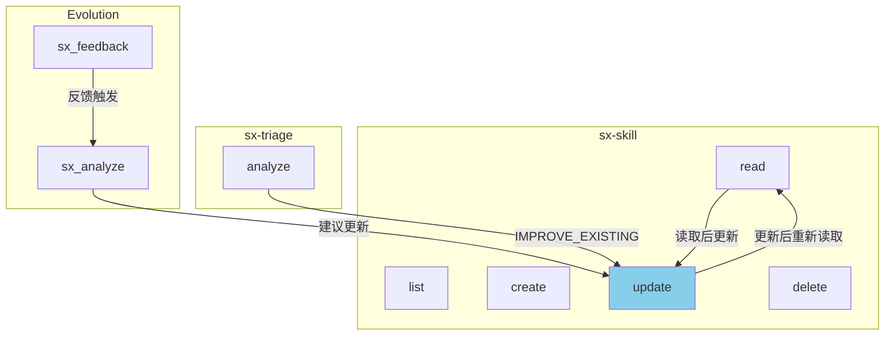
```mermaid
flowchart TD
    subgraph sx-skill
        A[list]
        B[create]
        C[read]
        D[update]
        E[delete]
    end
    
    subgraph sx-triage
        F[analyze]
    end
    
    subgraph Evolution
        G[sx_feedback]
        H[sx_analyze]
    end
    
    C -->|读取后更新| D
    F -->|IMPROVE_EXISTING| D
    G -->|反馈触发| H
    H -->|建议更新| D
    D -->|更新后重新读取| C
    
    style D fill:#87CEEB
```

### 8.2 典型工作流

#### 8.2.1 基于分流的更新

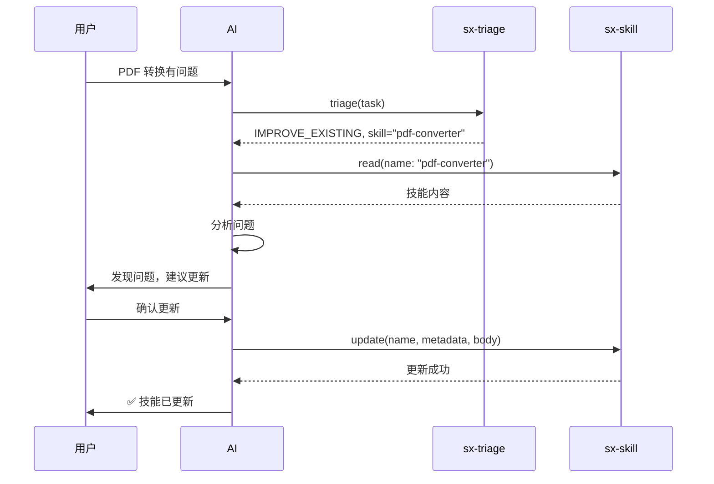
```mermaid
sequenceDiagram
    participant U as 用户
    participant AI as AI
    participant T as sx-triage
    participant S as sx-skill
    
    U->>AI: PDF 转换有问题
    AI->>T: triage(task)
    T-->>AI: IMPROVE_EXISTING, skill="pdf-converter"
    AI->>S: read(name: "pdf-converter")
    S-->>AI: 技能内容
    AI->>AI: 分析问题
    AI->>U: 发现问题，建议更新
    U->>AI: 确认更新
    AI->>S: update(name, metadata, body)
    S-->>AI: 更新成功
    AI->>U: ✅ 技能已更新
```

#### 8.2.2 基于反馈的进化

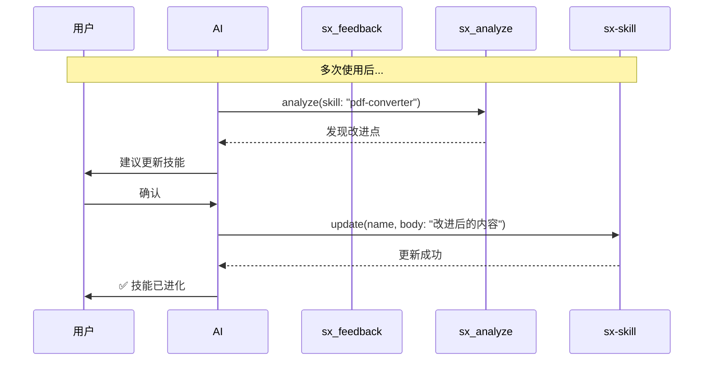
```mermaid
sequenceDiagram
    participant U as 用户
    participant AI as AI
    participant F as sx_feedback
    participant A as sx_analyze
    participant S as sx-skill
    
    Note over U,S: 多次使用后...
    AI->>A: analyze(skill: "pdf-converter")
    A-->>AI: 发现改进点
    AI->>U: 建议更新技能
    U->>AI: 确认
    AI->>S: update(name, body: "改进后的内容")
    S-->>AI: 更新成功
    AI->>U: ✅ 技能已进化
```

---

## 九、最佳实践

### 9.1 更新原则

| 原则 | 说明 |
|------|------|
| **最小更新** | 只更新需要变更的字段 |
| **版本递增** | 有实质性变更时更新版本号 |
| **保持兼容** | 尽量保持向后兼容 |
| **记录变更** | 重要变更在正文中说明 |

### 9.2 版本号规范

| 变更类型 | 版本变化 | 示例 |
|----------|----------|------|
| Bug 修复 | Patch +1 | 1.0.0 → 1.0.1 |
| 新增功能 | Minor +1 | 1.0.0 → 1.1.0 |
| 重大变更 | Major +1 | 1.0.0 → 2.0.0 |

### 9.3 更新建议

```
✅ 好的更新:
- 明确更新目的
- 只更新必要字段
- 更新版本号
- 保持格式规范

❌ 不好的更新:
- 不必要的全量更新
- 忘记更新版本号
- 破坏原有格式
- 删除有用内容
```

---

## 十、使用示例

### 10.1 更新描述

```typescript
sx-skill({
  action: "update",
  name: "pdf-converter",
  metadata: {
    description: "PDF 文件格式转换工具，支持 PDF 转图片、PDF 转文本、PDF 合并拆分。当用户需要处理 PDF 文件时使用此技能。"
  }
})
```

### 10.2 更新标签

```typescript
sx-skill({
  action: "update",
  name: "pdf-converter",
  metadata: {
    tags: ["pdf", "converter", "image", "text", "merge", "split"]
  }
})
```

### 10.3 更新版本和作者

```typescript
sx-skill({
  action: "update",
  name: "pdf-converter",
  metadata: {
    version: "1.2.0",
    author: "team-name"
  }
})
```

### 10.4 完整更新示例

```typescript
sx-skill({
  action: "update",
  name: "pdf-converter",
  metadata: {
    description: "PDF 文件全能处理工具，支持格式转换、内容提取、文件合并拆分等功能。",
    version: "2.0.0",
    author: "skillix-team",
    tags: ["pdf", "converter", "extractor", "merger"]
  },
  body: `# PDF 转换器 v2.0

## 概述

全能 PDF 处理工具，支持多种操作。

## 功能列表

### 1. 格式转换
- PDF → 图片 (PNG/JPEG)
- PDF → 文本 (TXT/Markdown)
- PDF → Word (DOCX)

### 2. 内容提取
- 提取文字
- 提取图片
- 提取表格

### 3. 文件操作
- 合并多个 PDF
- 拆分 PDF 页面
- 旋转页面

## 使用示例

\`\`\`bash
# 转换为图片
pdftoppm -png input.pdf output

# 提取文字
pdftotext input.pdf output.txt
\`\`\`

## 依赖

- poppler-utils
- ghostscript
`
})
```

---

## 十一、版本回退机制

### 11.1 当前实现状态

> ✅ **已实现**：内置备份机制已完成实现。

**实现的功能**：
- `updateSkill` 函数默认在更新前创建备份
- 支持 `.backup/` 目录存储历史版本
- 支持 `evolution.log` 记录更新日志
- 支持 `rollbackSkill` 回退到指定版本
- 支持 `listVersions` 查看版本历史
- 支持 `cleanupOldBackups` 清理旧备份

### 11.2 设计规划中的回退支持

根据项目设计文档（`20260111-03-自动创建与进化设计.md`），规划了以下机制：

#### 11.2.1 技能日志目录

```
skill-name/
├── SKILL.md
└── logs/                  # 技能级日志目录
    ├── execution.log      # 执行日志
    └── evolution.log      # 进化历史日志
```

- `execution.log`：记录技能被调用的历史
- `evolution.log`：记录技能的进化历史，包括版本变更、改进原因等

#### 11.2.2 Git 版本管理（推荐方式）

设计文档建议使用 Git 管理技能变更：

```bash
# 更新技能后
git add skills/existing-skill/SKILL.md
git commit -m "fix: update existing-skill to handle xxx"

# 回退到之前版本
git checkout HEAD~1 -- skills/existing-skill/SKILL.md
```

### 11.3 回退机制实现建议

#### 11.3.1 方案一：Git 集成（推荐）

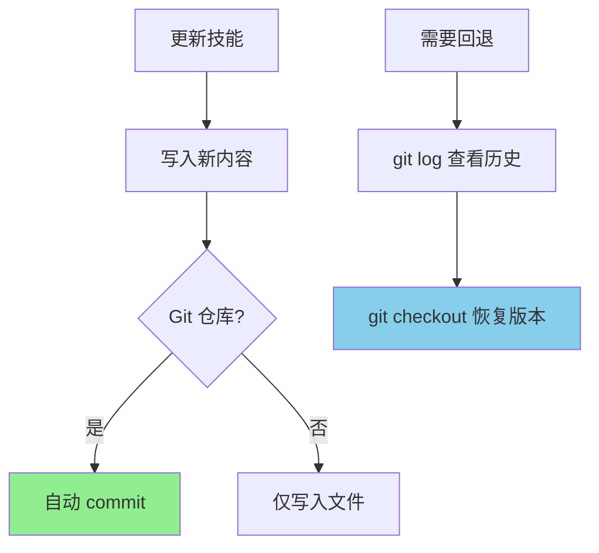
```mermaid
flowchart TD
    A[更新技能] --> B[写入新内容]
    B --> C{Git 仓库?}
    C -->|是| D[自动 commit]
    C -->|否| E[仅写入文件]
    
    F[需要回退] --> G[git log 查看历史]
    G --> H[git checkout 恢复版本]
    
    style D fill:#90EE90
    style H fill:#87CEEB
```

**优点**：
- 利用现有 Git 基础设施
- 完整的版本历史
- 支持任意版本回退
- 可以查看变更差异

**实现方式**：
- 用户手动管理 Git 提交
- 或在 update 后提示用户提交

#### 11.3.2 方案二：内置备份机制（✅ 已实现）

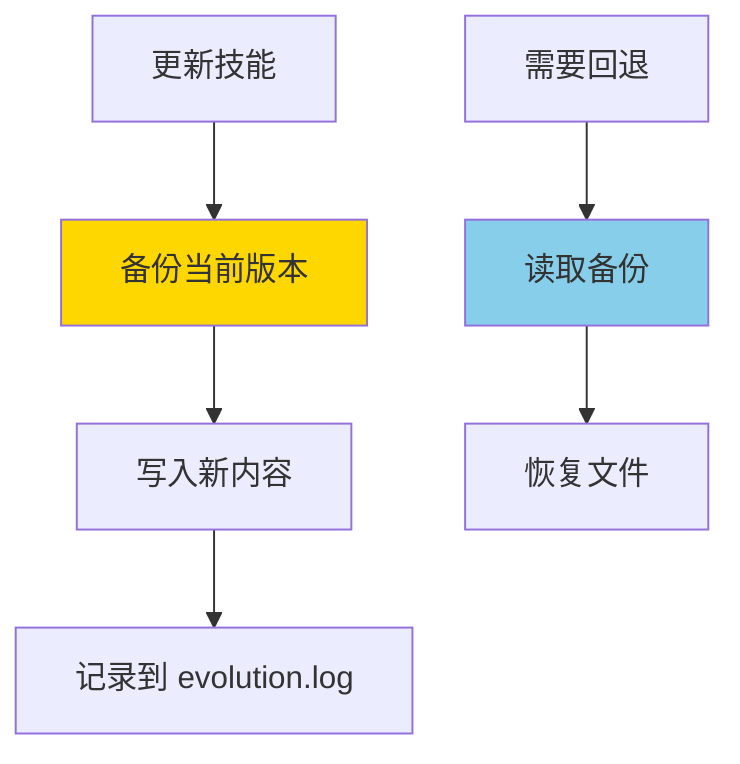
```mermaid
flowchart TD
    A[更新技能] --> B[备份当前版本]
    B --> C[写入新内容]
    C --> D[记录到 evolution.log]
    
    E[需要回退] --> F[读取备份]
    F --> G[恢复文件]
    
    style B fill:#FFD700
    style F fill:#87CEEB
```

**备份策略**：
```
skill-name/
├── SKILL.md
├── .backup/               # 备份目录
│   ├── SKILL.md.1         # 上一个版本
│   ├── SKILL.md.2         # 更早版本
│   └── ...
└── logs/
    └── evolution.log      # 记录每次变更
```

**evolution.log 格式**：
```
[2026-01-19T10:30:00Z] version: 1.0.0 -> 1.1.0
  reason: 修复 PDF 转换失败问题
  backup: .backup/SKILL.md.1

[2026-01-19T11:00:00Z] version: 1.1.0 -> 1.2.0
  reason: 添加批量处理支持
  backup: .backup/SKILL.md.2
```

#### 11.3.3 方案三：版本快照（高级）

```typescript
// 未来可能的 API
sx-skill({
  action: "rollback",
  name: "pdf-converter",
  version: "1.0.0"  // 回退到指定版本
})

sx-skill({
  action: "history",
  name: "pdf-converter"  // 查看版本历史
})
```

### 11.4 多源技能场景下的版本管理挑战

> ⚠️ **问题分析**：在多源技能场景下，简单的 Git 管理方案存在问题。

#### 11.4.1 问题描述

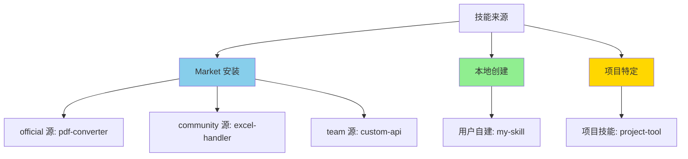
```mermaid
flowchart TD
    A[技能来源] --> B[Market 安装]
    A --> C[本地创建]
    A --> D[项目特定]
    
    B --> B1["official 源: pdf-converter"]
    B --> B2["community 源: excel-handler"]
    B --> B3["team 源: custom-api"]
    
    C --> C1["用户自建: my-skill"]
    D --> D1["项目技能: project-tool"]
    
    style B fill:#87CEEB
    style C fill:#90EE90
    style D fill:#FFD700
```

**核心问题**：
- 从 Market 安装的技能来自不同的 Git 仓库
- 全局技能目录 `~/.skillix/skills/` 不是一个 Git 仓库
- 项目技能目录 `.skillix/skills/` 可能在项目 Git 仓库中，但包含多源技能

#### 11.4.2 为什么不能简单使用 Git

| 场景 | 问题 |
|------|------|
| 每个技能一个 Git repo | 管理复杂，需要管理大量仓库 |
| 所有技能一个 Git repo | 来自不同源的技能混在一起，无法追踪原始来源 |
| 使用项目 Git | 全局技能不在项目中，无法管理 |

#### 11.4.3 现有架构分析

当前 Skillix 的技能管理架构：

```
~/.skillix/
├── config.json              # 全局配置
├── installed.json           # 安装记录（记录来源信息）
├── cache/                   # 缓存目录
│   └── sources/             # 各源的缓存
│       ├── github-user-repo/
│       └── ...
└── skills/                  # 全局技能目录（非 Git 仓库）
    ├── pdf-converter/       # 来自 official 源
    ├── excel-handler/       # 来自 community 源
    └── my-skill/            # 本地创建
```

**installed.json 记录**：
```json
{
  "skills": [
    {
      "name": "pdf-converter",
      "sourceId": "github-skillix-hub",
      "sourceName": "official",
      "installedAt": "2026-01-19T10:00:00Z",
      "updatedAt": "2026-01-19T10:00:00Z",
      "path": "~/.skillix/skills/pdf-converter",
      "commit": "1.0.0"
    }
  ]
}
```

### 11.5 推荐的版本回退方案

#### 11.5.1 方案一：内置备份机制（推荐）

**设计思路**：在技能目录内维护版本历史，不依赖外部 Git。

```
skill-name/
├── SKILL.md                 # 当前版本
├── .versions/               # 版本历史目录
│   ├── v1.0.0/
│   │   ├── SKILL.md
│   │   └── meta.json        # 版本元信息
│   ├── v1.1.0/
│   │   ├── SKILL.md
│   │   └── meta.json
│   └── ...
└── logs/
    └── evolution.log        # 变更日志
```

**meta.json 格式**：
```json
{
  "version": "1.0.0",
  "createdAt": "2026-01-19T10:00:00Z",
  "reason": "初始版本",
  "previousVersion": null
}
```

**回退流程**：
```mermaid
flowchart TD
    A[需要回退] --> B[列出可用版本]
    B --> C[选择目标版本]
    C --> D[从 .versions 恢复]
    D --> E[更新 SKILL.md]
    E --> F[记录到 evolution.log]
    
    style F fill:#90EE90
```

#### 11.5.2 方案二：基于 installed.json 的重装机制

**设计思路**：利用现有的安装记录，从源重新安装指定版本。

```mermaid
flowchart TD
    A[需要回退] --> B{技能来源?}
    
    B -->|Market 安装| C[查询 installed.json]
    C --> D[获取原始 sourceId]
    D --> E[从源重新安装指定版本]
    
    B -->|本地创建| F[使用内置备份]
    F --> G[从 .versions 恢复]
    
    style E fill:#87CEEB
    style G fill:#90EE90
```

**优点**：
- Market 安装的技能可以从源重新获取任意版本
- 本地创建的技能使用内置备份
- 不需要额外的 Git 管理

#### 11.5.3 方案三：混合方案（最佳实践）

**针对不同场景使用不同策略**：

| 技能类型 | 回退策略 | 说明 |
|----------|----------|------|
| Market 安装 | 重装指定版本 | `sx-market install --version 1.0.0` |
| 本地创建 | 内置备份 | 从 `.versions/` 恢复 |
| 项目技能 | 项目 Git | 随项目版本控制 |

```mermaid
flowchart TD
    A[技能回退请求] --> B{判断技能类型}
    
    B -->|Market 安装| C[检查 installed.json]
    C --> D[从源重装指定版本]
    
    B -->|本地创建| E[检查 .versions/]
    E --> F[恢复历史版本]
    
    B -->|项目技能| G[提示使用 Git]
    G --> H[git checkout]
    
    style D fill:#87CEEB
    style F fill:#90EE90
    style H fill:#FFD700
```

### 11.6 当前推荐做法

由于代码中尚未实现内置回退机制，建议：

1. **Market 安装的技能**
   ```bash
   # 重新安装来回退（会覆盖本地修改）
   sx-market install --name pdf-converter --force
   ```

2. **本地创建的技能**
   ```bash
   # 手动备份重要技能
   cp -r ~/.skillix/skills/my-skill ~/.skillix/skills/my-skill.bak
   ```

3. **项目级技能**
   ```bash
   # 使用项目 Git 管理
   git add .skillix/skills/
   git commit -m "update: project-tool v1.1.0"
   
   # 回退
   git checkout HEAD~1 -- .skillix/skills/project-tool/SKILL.md
   ```

4. **记录版本变更**
   - 在 metadata.version 中维护版本号
   - 在技能正文中添加变更日志章节

### 11.7 实现状态

| 功能 | 优先级 | 状态 | 说明 |
|------|--------|------|------|
| evolution.log 记录 | 中 | ✅ 已实现 | 记录每次更新的变更日志 |
| .backup/ 备份目录 | 中 | ✅ 已实现 | 本地创建技能的版本历史 |
| rollbackSkill 服务 | 中 | ✅ 已实现 | 回退到指定版本 |
| listVersions 服务 | 低 | ✅ 已实现 | 查看版本历史 |
| cleanupOldBackups 服务 | 低 | ✅ 已实现 | 清理旧版本备份 |
| sx-skill rollback 工具 | 中 | 规划中 | MCP 工具层封装 |
| sx-skill history 工具 | 低 | 规划中 | MCP 工具层封装 |
| sx-market install --version | 中 | 规划中 | 安装指定版本的技能 |

### 11.8 已实现的 API

#### 11.8.1 updateSkill 函数

```typescript
// 已实现的 updateSkill 函数
export function updateSkill(
  skillName: string,
  updates: {
    metadata?: Partial<SkillMetadata>;
    body?: string;
  },
  projectRootOrOptions?: string | UpdateOptions
): Skill | null;

// UpdateOptions 接口
interface UpdateOptions {
  projectRoot?: string;
  createBackup?: boolean;  // 默认 true
  reason?: string;         // 更新原因
}
```

**使用示例**：

```typescript
// 基本用法（自动备份）
updateSkill('my-skill', { metadata: { version: '1.1.0' } }, projectRoot);

// 禁用备份
updateSkill('my-skill', { metadata: { version: '1.1.0' } }, { 
  projectRoot, 
  createBackup: false 
});

// 带原因的更新
updateSkill('my-skill', { metadata: { version: '1.1.0' } }, { 
  projectRoot, 
  reason: '修复 bug' 
});
```

#### 11.8.2 rollbackSkill 函数

```typescript
// 已实现的 rollbackSkill 函数
export function rollbackSkill(
  skillName: string,
  targetVersion: string,
  options?: RollbackOptions
): RollbackResult;

// RollbackOptions 接口
interface RollbackOptions {
  projectRoot?: string;
  reason?: string;
  backupCurrent?: boolean;  // 默认 true
}

// RollbackResult 接口
interface RollbackResult {
  success: boolean;
  skill?: Skill;
  fromVersion: string;
  toVersion: string;
  backup?: VersionMeta;
  error?: string;
}
```

**使用示例**：

```typescript
// 回退到指定版本
const result = rollbackSkill('my-skill', '1.0.0', { projectRoot });

// 回退到上一个版本
const result = rollbackToPrevious('my-skill', { projectRoot });

// 查看版本历史
const history = getVersionHistory('my-skill', projectRoot);
```

#### 11.8.3 版本管理函数

```typescript
// 创建备份
createVersionBackup(skill: Skill, reason?: string): VersionMeta | null;

// 列出版本
listVersions(skillDir: string): VersionMeta[];

// 从备份恢复
restoreFromBackup(skillDir: string, backupFile: string): { success: boolean; ... };

// 清理旧备份
cleanupOldBackups(skillDir: string, keepCount?: number): number;
```

---

*本文档为 sx-skill update 设计文档*
*最后更新: 2026-01-19*
