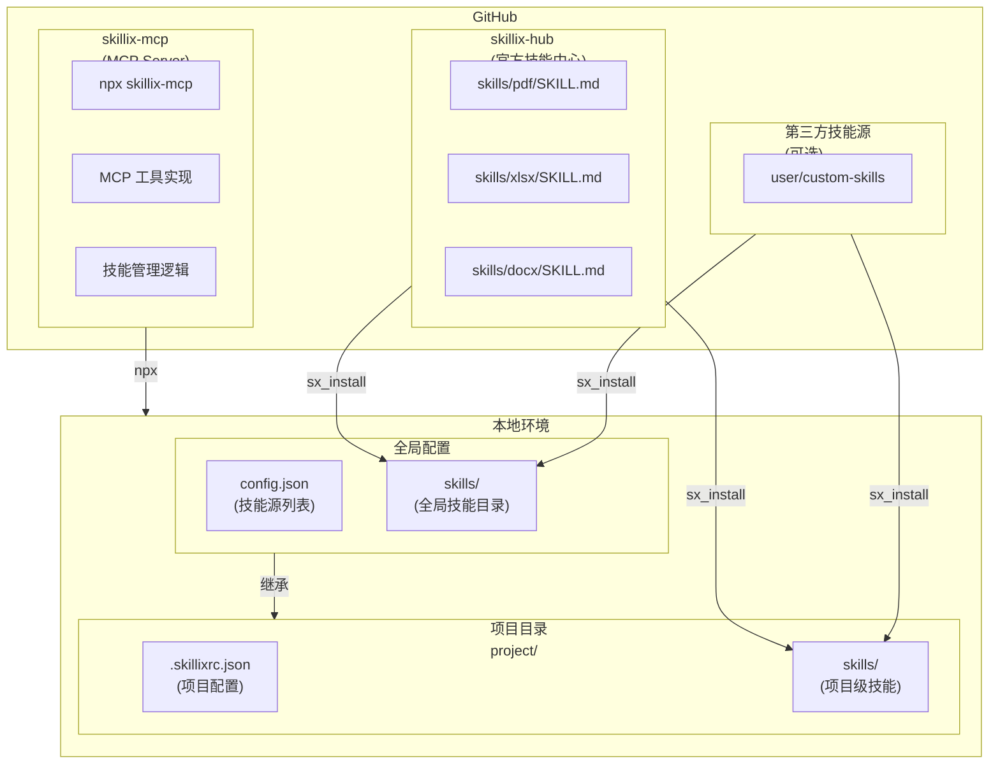
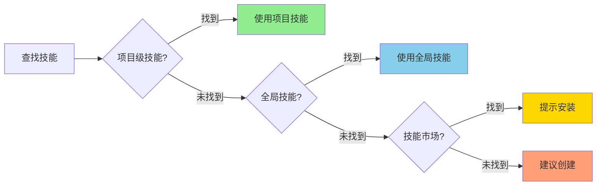
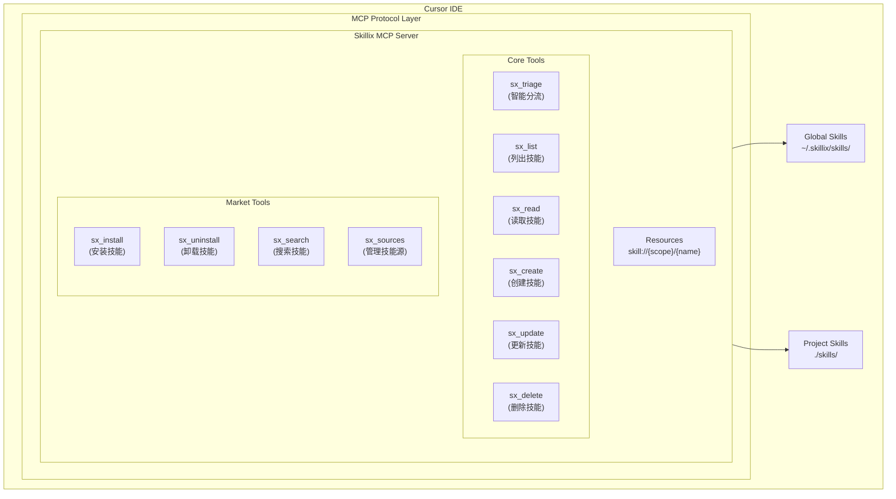
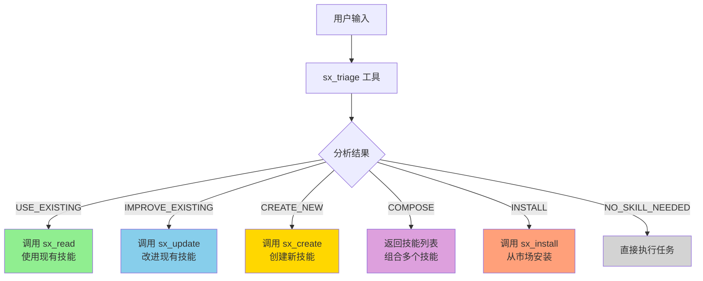
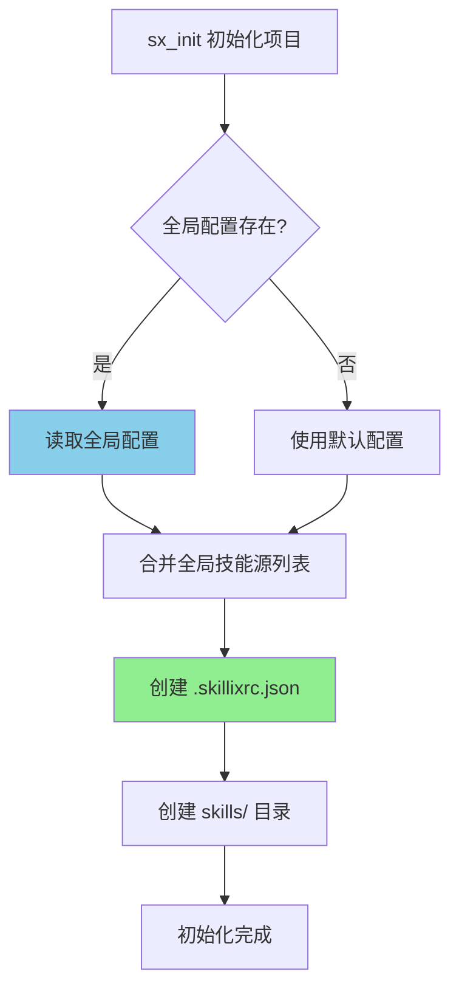
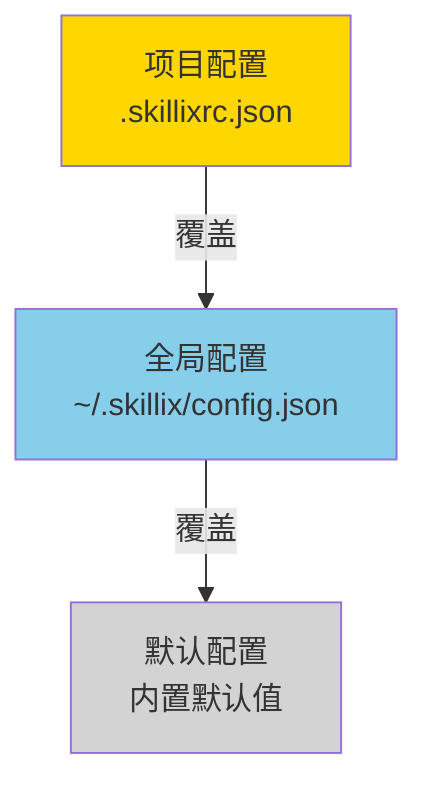
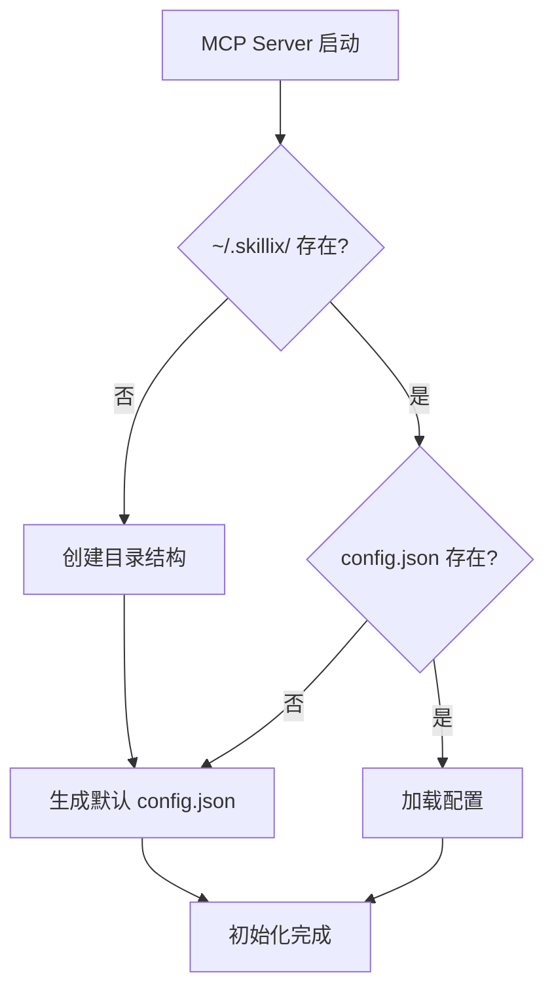
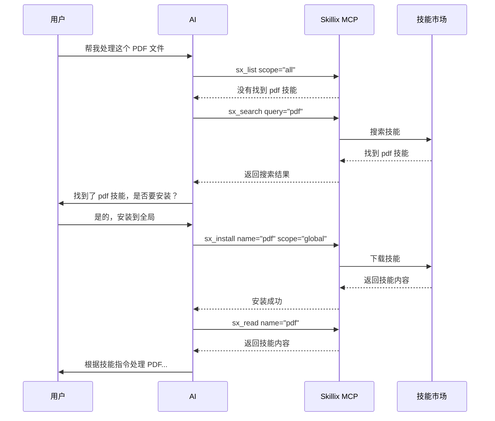
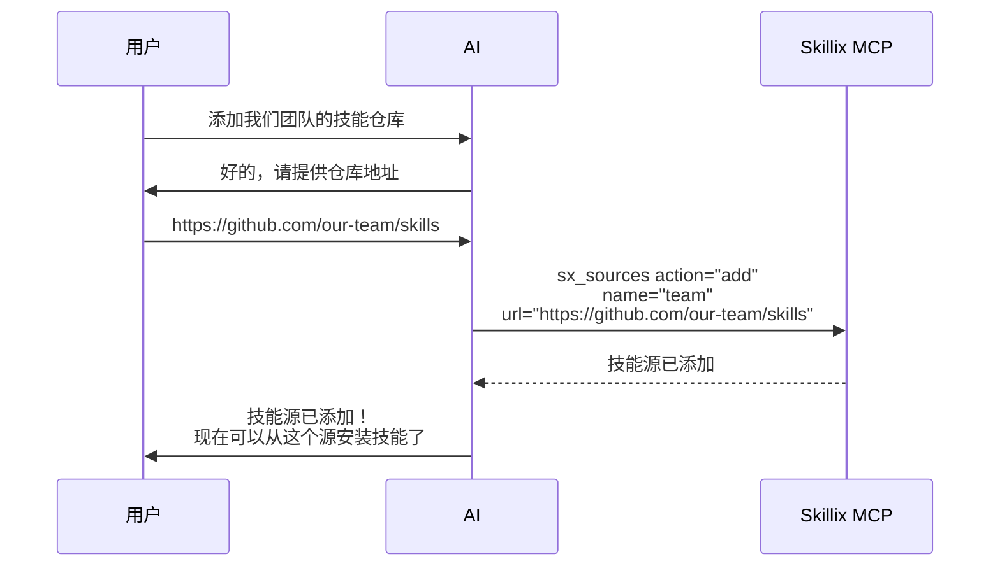

# Skillix 项目设计

> 日期: 2026-01-11
> 来源: 从初步设计构想拆分
> 更新: 添加双仓库架构和技能市场设计，使用 Mermaid 流程图

---

## 一、项目概述

### 1.1 项目名称

**Skillix** (技能管理系统)

### 1.2 项目定位

Skillix 是一个基于 MCP (Model Context Protocol) 的技能管理系统，为 AI 编码代理（如 Cursor）提供技能的创建、管理、加载和进化能力。

### 1.3 核心理念

> "Skill + Mix = Skillix"
> 混合技能，智能赋能

### 1.4 项目目标

1. **简化技能管理** - 通过 MCP 工具原生集成，无需执行 Bash 命令
2. **智能分流** - 自动判断使用现有技能、改进技能或创建新技能
3. **支持技能进化** - AI 可以自动创建和更新技能
4. **技能市场** - 支持从 GitHub 技能源下载和共享技能
5. **全局/项目技能** - 区分全局技能和项目级技能
6. **兼容 Anthropic 规范** - 100% 兼容 SKILL.md 格式
7. **跨平台支持** - 支持 Cursor、Claude Code 等多种 AI 编码工具

### 1.5 与 SkillForge 的区别

| 方面 | SkillForge | Skillix |
|------|------------|---------|
| 定位 | 元技能（用于创建技能） | MCP Server（管理技能） |
| 实现方式 | SKILL.md + Python 脚本 | MCP 工具调用 |
| 运行环境 | Claude Code CLI | Cursor + MCP |
| 核心功能 | 技能创建流程 | 技能 CRUD + 市场 + 管理 |
| 技能来源 | 本地 | 本地 + GitHub 技能市场 |

---

## 二、双仓库架构

### 2.1 仓库规划

Skillix 采用**双仓库架构**：

| 仓库 | GitHub 名称 | npm 包名 | 说明 |
|------|-------------|----------|------|
| **MCP Server 仓库** | `skillix-mcp` | `skillix-mcp` | MCP Server 实现，通过 npx 运行 |
| **技能中心仓库** | `skillix-hub` | - | 官方技能中心，存放可共享的技能 |

> **当前状态**：GitHub 仓库名为 `skillix`，建议重命名为 `skillix-mcp` 以保持一致性。

### 2.2 架构图



> **说明**：
> - 官方技能市场和第三方技能源的技能都可以安装到**全局**或**项目级**目录
> - 用户可以在安装时通过 `scope` 参数选择安装位置
> - 项目级技能优先级高于全局技能

### 2.4 技能来源优先级



---

## 三、命名规范

### 3.1 仓库命名

| 类型 | 名称 | 说明 |
|------|------|------|
| MCP Server | `skillix-mcp` | npm 包，通过 npx 运行 |
| 技能中心 | `skillix-hub` | 官方技能仓库 |
| 项目名 | **Skillix** | 技能管理系统 |

### 3.2 目录命名

| 类型 | 路径 | 说明 |
|------|------|------|
| 全局配置 | `~/.skillix/config.json` | 全局配置文件 |
| 全局技能 | `~/.skillix/skills/` | 全局技能目录 |
| 项目配置 | `.skillixrc.json` | 项目级配置 |
| 项目技能 | `skills/` | 项目级技能目录 |

### 3.3 MCP 工具命名

| 工具名 | 说明 |
|--------|------|
| `sx_triage` | 智能分流 |
| `sx_init` | **初始化项目配置（继承全局配置）** |
| `sx_list` | 列出所有技能（区分全局/项目） |
| `sx_read` | 读取技能内容 |
| `sx_create` | 创建新技能 |
| `sx_update` | 更新技能 |
| `sx_delete` | 删除技能 |
| `sx_install` | **从技能市场安装技能** |
| `sx_uninstall` | **卸载技能** |
| `sx_search` | **搜索技能市场** |
| `sx_sources` | **管理技能源** |

---

## 四、系统架构

### 4.1 整体架构



### 4.2 智能分流机制



### 4.3 代码目录结构

```
skillix-mcp/
├── src/
│   ├── index.ts                 # MCP Server 入口
│   ├── server.ts                # Server 实现
│   ├── tools/                   # 工具实现
│   │   ├── index.ts
│   │   ├── triage.ts            # 智能分流
│   │   ├── init.ts              # 初始化项目（新增）
│   │   ├── list.ts              # 列出技能
│   │   ├── read.ts              # 读取技能
│   │   ├── create.ts            # 创建技能
│   │   ├── update.ts            # 更新技能
│   │   ├── delete.ts            # 删除技能
│   │   ├── install.ts           # 安装技能（新增）
│   │   ├── uninstall.ts         # 卸载技能（新增）
│   │   ├── search.ts            # 搜索技能（新增）
│   │   └── sources.ts           # 管理技能源（新增）
│   ├── resources/               # 资源实现
│   │   └── skill-resource.ts
│   ├── utils/                   # 工具函数
│   │   ├── skill-parser.ts      # SKILL.md 解析
│   │   ├── skill-matcher.ts     # 技能匹配
│   │   ├── skill-loader.ts      # 技能加载（新增）
│   │   ├── github-client.ts     # GitHub API 客户端（新增）
│   │   ├── file-utils.ts        # 文件操作
│   │   └── config.ts            # 配置管理
│   └── types/                   # 类型定义
│       └── index.ts
├── package.json
├── tsconfig.json
└── README.md
```

---

## 五、核心功能设计

### 5.1 项目初始化工具

#### sx_init（初始化项目）

初始化项目配置，可继承全局配置。

```typescript
{
  name: "sx_init",
  description: "初始化项目 Skillix 配置，可继承全局配置",
  inputSchema: {
    type: "object",
    properties: {
      inheritGlobal: {
        type: "boolean",
        description: "是否继承全局配置（默认 true）"
      },
      skillsDir: {
        type: "string",
        description: "技能目录路径（默认 ./skills）"
      },
      force: {
        type: "boolean",
        description: "强制覆盖已存在的配置（默认 false）"
      }
    }
  }
}
```

**返回示例**：
```xml
<init_result>
  <status>success</status>
  <config_file>.skillixrc.json</config_file>
  <skills_dir>./skills</skills_dir>
  <inherited_sources>
      <source name="official" url="https://github.com/user/skillix-hub" />
    <source name="team-skills" url="https://github.com/team/custom-skills" />
  </inherited_sources>
</init_result>
```

---

### 5.2 技能管理工具

#### sx_list（列出技能）

列出所有可用技能，区分全局和项目级。

```typescript
{
  name: "sx_list",
  description: "列出所有可用技能，区分全局和项目级",
  inputSchema: {
    type: "object",
    properties: {
      scope: {
        type: "string",
        enum: ["all", "global", "project"],
        description: "技能范围：all=全部, global=全局, project=项目级"
      },
      format: {
        type: "string",
        enum: ["json", "xml", "table"],
        description: "输出格式，默认 xml"
      }
    }
  }
}
```

**返回示例**：
```xml
<available_skills>
  <global_skills>
    <skill>
      <name>pdf</name>
      <description>PDF 处理工具包</description>
      <source>skillix-hub</source>
    </skill>
    <skill>
      <name>xlsx</name>
      <description>Excel 电子表格处理</description>
      <source>skillix-hub</source>
    </skill>
  </global_skills>
  <project_skills>
    <skill>
      <name>custom-api</name>
      <description>项目自定义 API 处理</description>
      <source>local</source>
    </skill>
  </project_skills>
</available_skills>
```

#### sx_read（读取技能）

```typescript
{
  name: "sx_read",
  description: "读取指定技能的 SKILL.md 内容",
  inputSchema: {
    type: "object",
    properties: {
      name: {
        type: "string",
        description: "技能名称"
      },
      scope: {
        type: "string",
        enum: ["auto", "global", "project"],
        description: "技能范围，auto=自动查找（默认）"
      }
    },
    required: ["name"]
  }
}
```

#### sx_create（创建技能）

```typescript
{
  name: "sx_create",
  description: "创建新技能",
  inputSchema: {
    type: "object",
    properties: {
      name: {
        type: "string",
        description: "技能名称（英文，小写，连字符分隔）"
      },
      description: {
        type: "string",
        description: "技能描述"
      },
      content: {
        type: "string",
        description: "技能正文内容（Markdown 格式）"
      },
      scope: {
        type: "string",
        enum: ["global", "project"],
        description: "创建范围：global=全局, project=项目级（默认）"
      }
    },
    required: ["name", "description", "content"]
  }
}
```

### 5.3 技能市场工具

#### sx_install（安装技能）

从技能市场安装技能到本地。

```typescript
{
  name: "sx_install",
  description: "从技能市场安装技能",
  inputSchema: {
    type: "object",
    properties: {
      name: {
        type: "string",
        description: "技能名称"
      },
      source: {
        type: "string",
        description: "技能源（默认使用官方源）"
      },
      scope: {
        type: "string",
        enum: ["global", "project"],
        description: "安装范围：global=全局（默认）, project=项目级"
      }
    },
    required: ["name"]
  }
}
```

#### sx_search（搜索技能）

搜索技能市场中的可用技能。

```typescript
{
  name: "sx_search",
  description: "搜索技能市场中的可用技能",
  inputSchema: {
    type: "object",
    properties: {
      query: {
        type: "string",
        description: "搜索关键词"
      },
      tags: {
        type: "array",
        items: { type: "string" },
        description: "按标签筛选"
      }
    },
    required: ["query"]
  }
}
```

#### sx_sources（管理技能源）

管理技能源列表。

```typescript
{
  name: "sx_sources",
  description: "管理技能源",
  inputSchema: {
    type: "object",
    properties: {
      action: {
        type: "string",
        enum: ["list", "add", "remove"],
        description: "操作：list=列出, add=添加, remove=移除"
      },
      url: {
        type: "string",
        description: "GitHub 仓库 URL（add/remove 时需要）"
      },
      name: {
        type: "string",
        description: "源名称（add 时需要）"
      }
    },
    required: ["action"]
  }
}
```

---

## 六、本地存储设计

### 6.1 全局目录结构 (~/.skillix/)

MCP Server 启动时会自动创建全局配置目录：

```
~/.skillix/
├── config.json              # 全局配置文件
├── skills/                  # 全局技能目录
│   ├── pdf/
│   │   ├── SKILL.md
│   │   └── logs/            # 技能级日志
│   │       ├── execution.log
│   │       └── evolution.log
│   ├── xlsx/
│   │   ├── SKILL.md
│   │   └── logs/
│   └── ...
├── logs/                    # 系统日志目录
│   ├── skillix.log          # 主日志文件
│   ├── skillix.log.1        # 轮转日志
│   └── ...
├── cache/                   # 缓存目录
│   ├── sources/             # 技能源索引缓存
│   │   ├── official.json    # 官方源缓存
│   │   └── team-skills.json # 其他源缓存
│   └── downloads/           # 下载临时目录
└── data/                    # 数据目录
    ├── feedback.json        # 反馈数据
    └── statistics.json      # 使用统计
```

**日志分层说明**：
- `~/.skillix/logs/`：系统级日志，记录 MCP Server 运行状态
- `~/.skillix/skills/{skill-name}/logs/`：技能级日志，记录单个技能的执行和进化历史

### 6.2 全局配置文件 (config.json)

```json
{
  "version": "1.0.0",
  "sources": [
    {
      "name": "official",
      "url": "https://github.com/user/skillix-hub",
      "branch": "main",
      "default": true
    },
    {
      "name": "team-skills",
      "url": "https://github.com/team/custom-skills",
      "branch": "main",
      "default": false
    }
  ],
  "defaultScope": "global",
  "format": "xml",
  "autoSuggest": true,
  "suggestThreshold": {
    "repeatCount": 3,
    "stepCount": 5
  },
  "logging": {
    "level": "info",
    "maxFiles": 5,
    "maxSize": "10MB"
  },
  "cache": {
    "enabled": true,
    "ttl": 3600
  }
}
```

**配置字段说明**：

| 字段 | 类型 | 说明 |
|------|------|------|
| `version` | string | 配置文件版本 |
| `sources` | array | 技能源列表 |
| `sources[].name` | string | 源名称（唯一标识） |
| `sources[].url` | string | GitHub 仓库 URL |
| `sources[].branch` | string | 分支名称（默认 main） |
| `sources[].default` | boolean | 是否为默认源 |
| `defaultScope` | string | 默认技能范围（global/project） |
| `format` | string | 默认输出格式（xml/json） |
| `autoSuggest` | boolean | 是否启用自动建议 |
| `suggestThreshold` | object | 建议触发阈值 |
| `logging` | object | 日志配置 |
| `cache` | object | 缓存配置 |

### 6.3 项目配置文件 (.skillixrc.json)

项目配置文件在项目初始化时可以**继承全局配置**的部分设置。

```json
{
  "skillsDir": "./skills",
  "inheritGlobal": true,
  "sources": [
    {
      "name": "project-specific",
      "url": "https://github.com/project/skills",
      "branch": "main"
    }
  ],
  "format": "xml",
  "autoSuggest": true,
  "feedback": {
    "enabled": true,
    "autoRecord": false
  }
}
```

**项目初始化流程**：



**继承规则**：
- `inheritGlobal: true` 时，项目会继承全局技能源列表
- 项目级 `sources` 会追加到全局源列表后面
- 项目级配置可以覆盖全局配置的 `format`、`autoSuggest` 等设置

**配置字段说明**：

| 字段 | 类型 | 说明 |
|------|------|------|
| `skillsDir` | string | 项目技能目录路径 |
| `inheritGlobal` | boolean | 是否继承全局技能 |
| `sources` | array | 项目级技能源（追加到全局源） |
| `format` | string | 输出格式（覆盖全局） |
| `autoSuggest` | boolean | 是否启用自动建议 |
| `feedback` | object | 反馈配置 |

### 6.4 配置优先级



### 6.5 日志设计

**日志级别**：

| 级别 | 说明 |
|------|------|
| `error` | 错误信息 |
| `warn` | 警告信息 |
| `info` | 一般信息（默认） |
| `debug` | 调试信息 |

**日志格式**：

```
[2026-01-11T10:30:00.000Z] [INFO] [sx_install] Installing skill: pdf from official
[2026-01-11T10:30:01.234Z] [INFO] [sx_install] Skill installed successfully: ~/.skillix/skills/pdf/
[2026-01-11T10:30:05.000Z] [ERROR] [sx_search] Failed to fetch source: network error
```

**日志轮转**：
- 单个日志文件最大 10MB
- 最多保留 5 个历史日志文件
- 自动清理过期日志

---

## 七、技能格式规范

### 7.1 SKILL.md 格式

```markdown
---
name: skill-name
description: 清晰描述技能用途和触发场景
version: 1.0.0
author: your-name
tags: [tag1, tag2]
---

# 技能标题

## 使用说明

[详细指令]

## 依赖

[依赖列表]

## 示例

[使用示例]
```

### 7.2 目录结构

```
skill-name/
├── SKILL.md           # 必需：技能定义文件
├── scripts/           # 可选：辅助脚本
├── references/        # 可选：参考文档
├── assets/            # 可选：资源文件
└── logs/              # 可选：技能执行日志
    ├── execution.log  # 执行日志
    └── evolution.log  # 进化历史日志
```

**logs 目录说明**：
- `execution.log`：记录技能被调用的历史，包括调用时间、参数、结果等
- `evolution.log`：记录技能的进化历史，包括版本变更、改进原因等
- 日志文件由 MCP Server 自动管理，支持轮转和清理

---

## 八、使用方式

### 8.1 全局 MCP 配置（一次性）

```json
// ~/.cursor/mcp.json
{
  "mcpServers": {
    "skillix": {
      "command": "npx",
      "args": ["skillix-mcp"]
    }
  }
}
```

### 8.2 初始化全局配置

首次使用时，MCP Server 会自动创建全局配置目录：

```
~/.skillix/
├── config.json              # 全局配置
├── skills/                  # 全局技能目录
├── logs/                    # 日志目录
├── cache/                   # 缓存目录
│   ├── sources/             # 技能源索引缓存
│   └── downloads/           # 下载临时目录
└── data/                    # 数据目录
```

**初始化流程**：



### 8.3 使用流程示例



### 8.4 管理技能源流程



---

*本文档为 Skillix 项目设计文档*
*采用双仓库架构：skillix-mcp (MCP Server) + skillix-hub (技能中心)*
*支持全局技能和项目级技能，可配置多个技能源*
