# sx-triage 智能分流设计

> 日期: 2026-01-14
> 更新: 2026-01-19 (AI First 实现调整)
> 关联: 20260111-03-自动创建与进化设计.md
> 状态: 已实现

---

## 一、概述

### 1.1 功能定位

`sx-triage` 是 Skillix 的智能分流工具，负责分析用户任务并推荐最佳操作。

**核心职责**：
- 分析用户输入的任务描述
- 匹配现有技能
- 推荐操作类型（使用/创建/安装等）
- 返回置信度和推荐理由

### 1.2 设计目标

1. **智能匹配** - 准确识别任务与技能的关联
2. **多策略** - 支持多种操作类型
3. **可解释** - 提供推荐理由
4. **低延迟** - 快速返回结果

---

## 二、分流流程

### 2.1 主流程

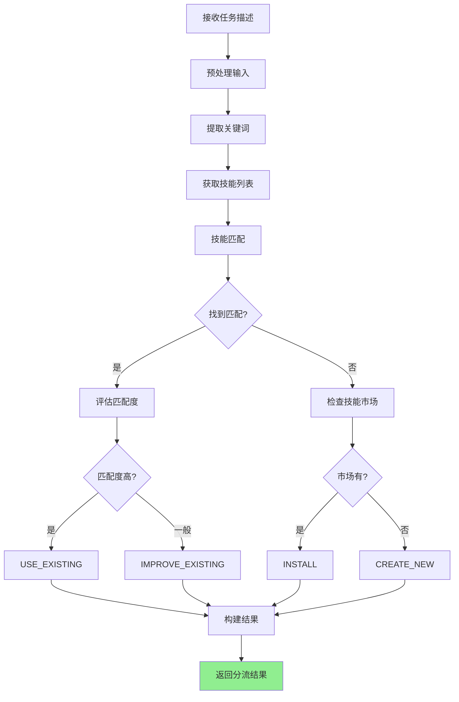

### 2.2 关键词提取流程

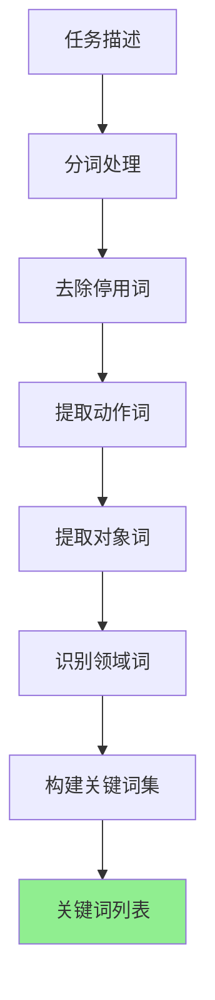

### 2.3 技能匹配流程

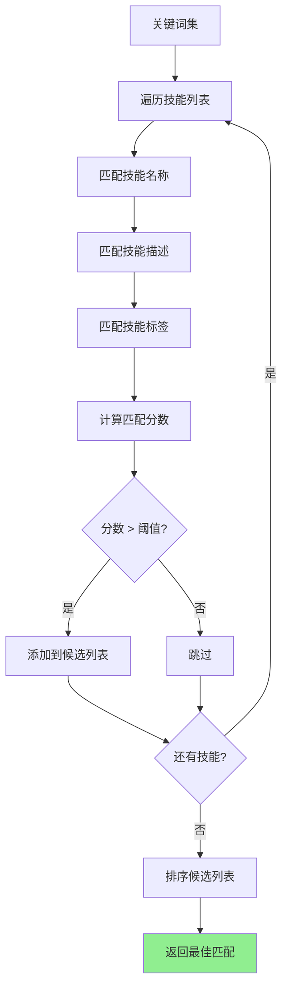

---

## 三、分流策略

### 3.1 操作类型

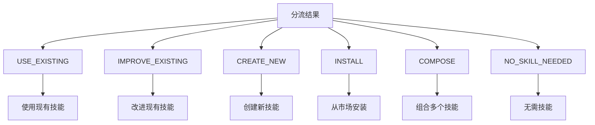

### 3.2 决策逻辑

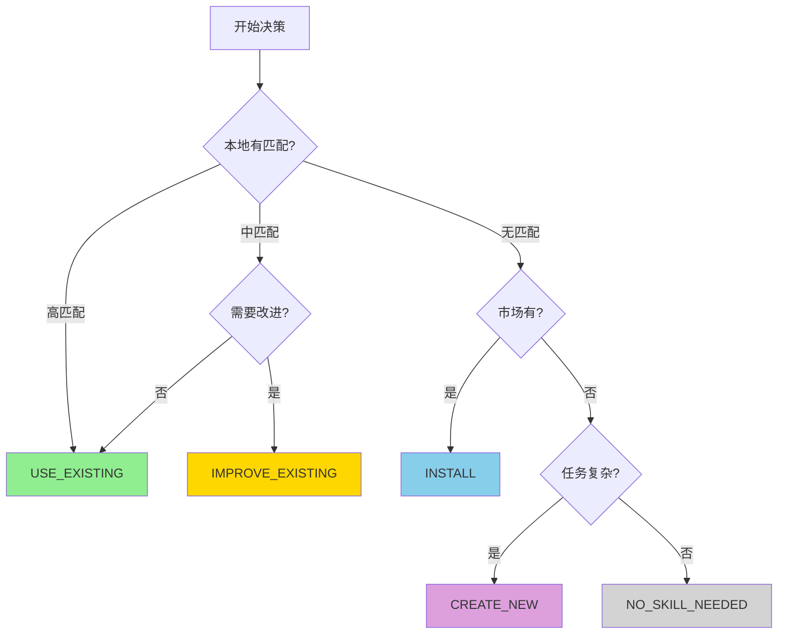

### 3.3 匹配度计算

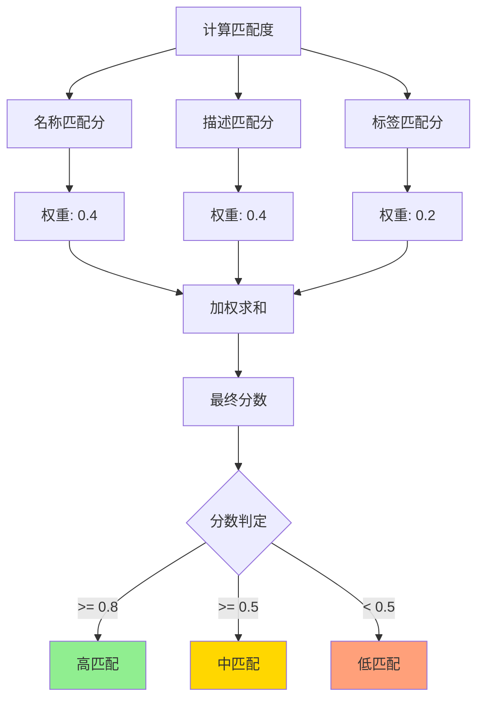

---

## 四、输入输出设计

### 4.1 输入参数

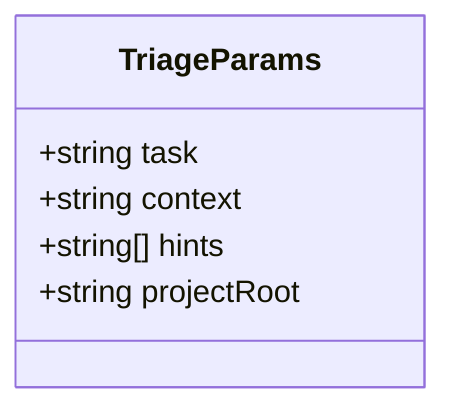

| 参数 | 类型 | 必需 | 说明 |
|------|------|------|------|
| task | string | ✅ | 任务描述 |
| context | string | ❌ | 上下文信息 |
| hints | string[] | ❌ | 提示词列表 |
| projectRoot | string | ❌ | 项目根目录 |

### 4.2 输出响应

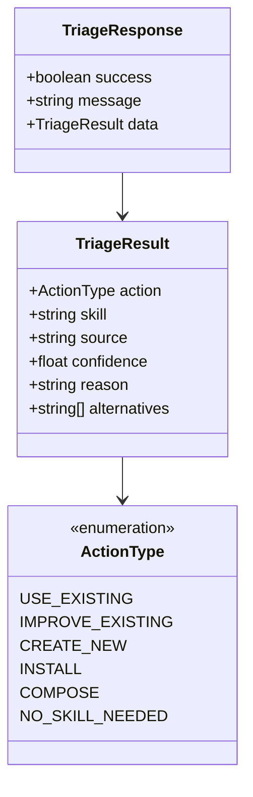

---

## 五、典型场景

### 5.1 使用现有技能

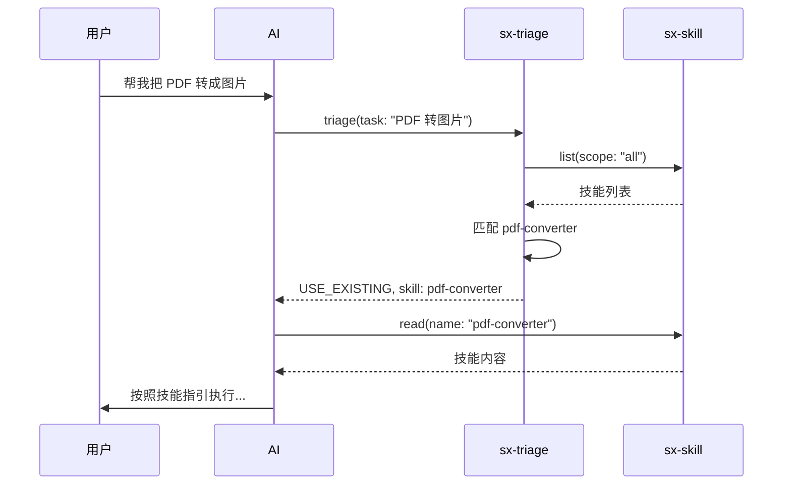

### 5.2 创建新技能

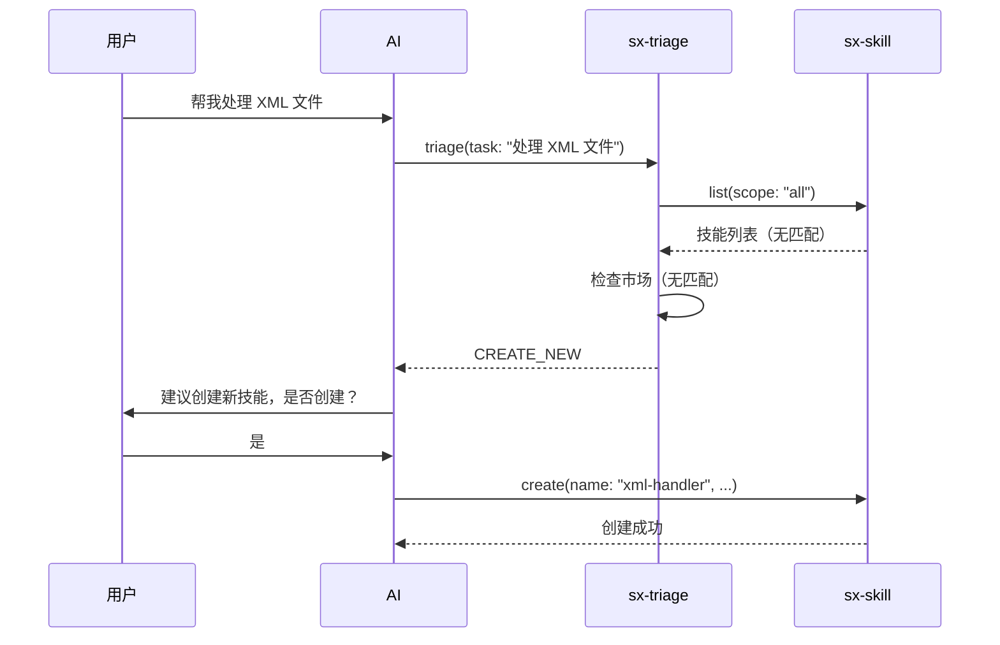

### 5.3 从市场安装

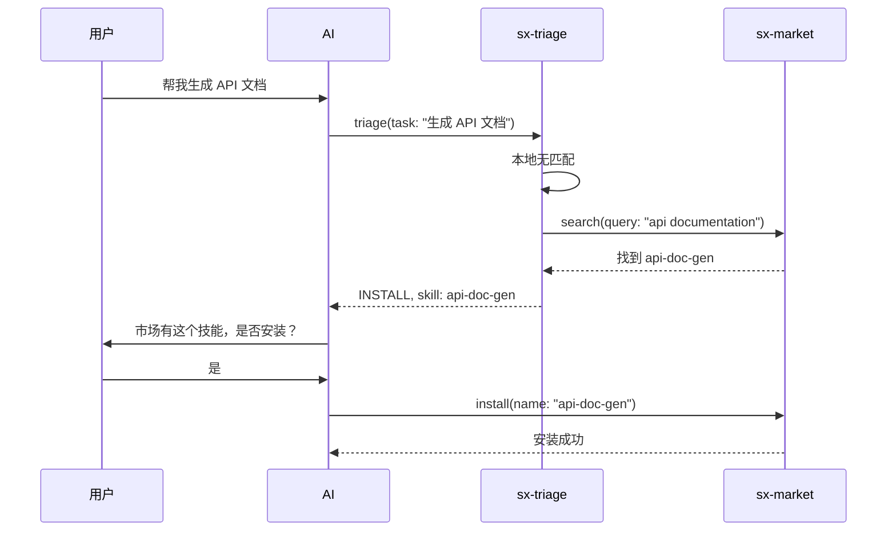

---

## 六、匹配算法

### 6.1 文本相似度

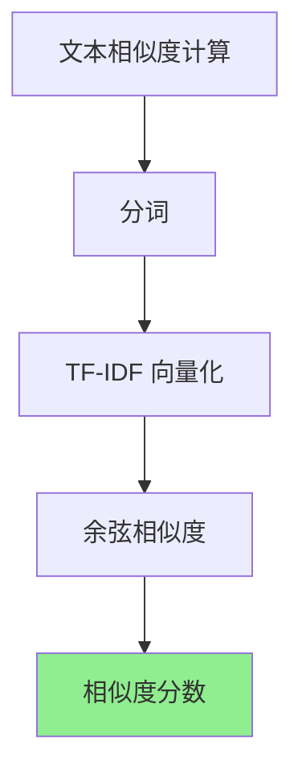

### 6.2 关键词匹配

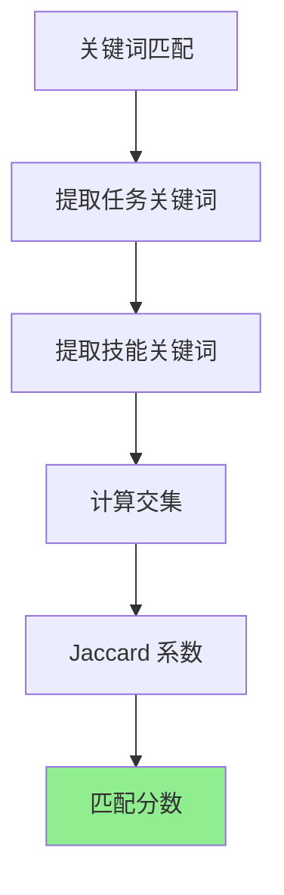

### 6.3 综合评分

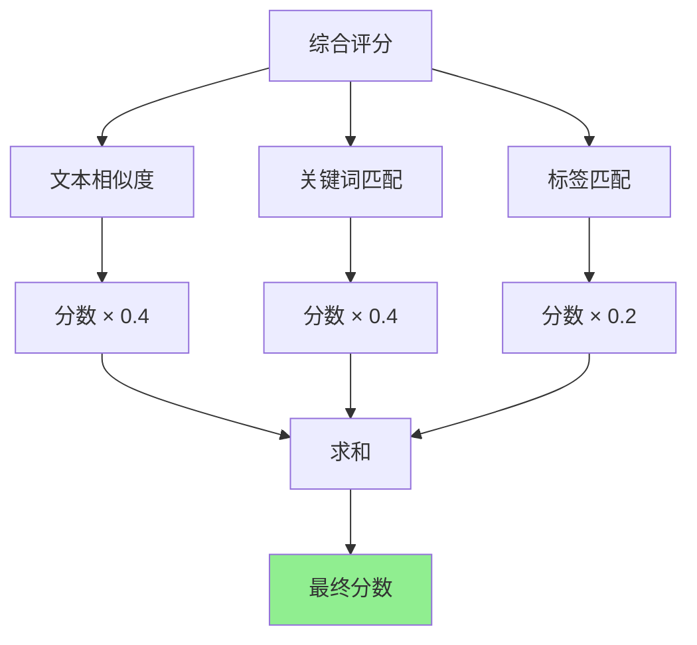

---

## 七、置信度计算

### 7.1 置信度因素

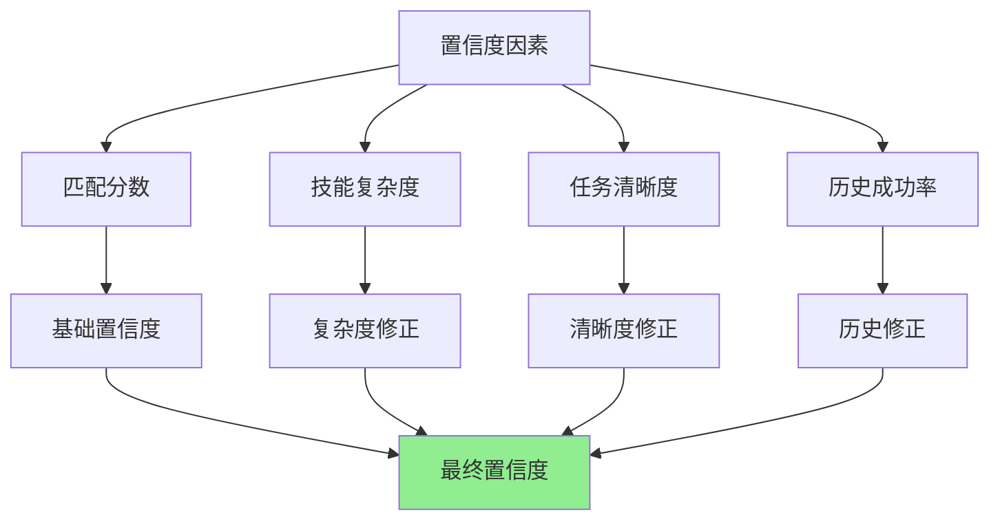

### 7.2 置信度级别

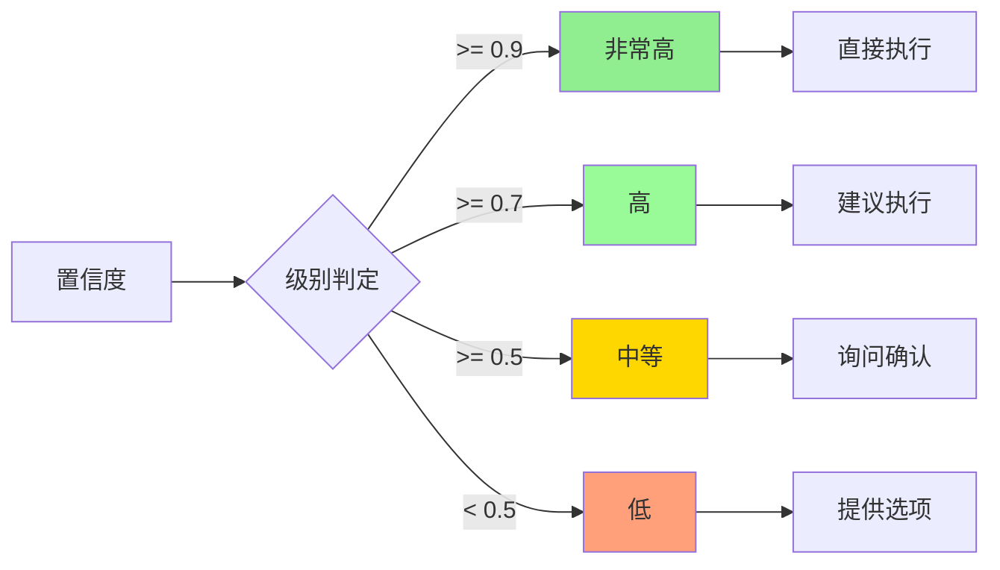

---

## 八、错误处理

### 8.1 错误场景

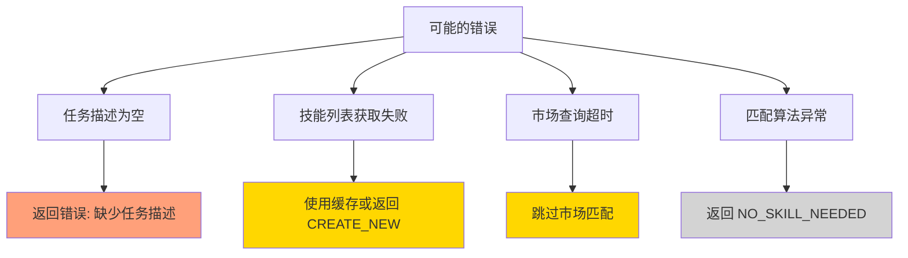

### 8.2 降级策略

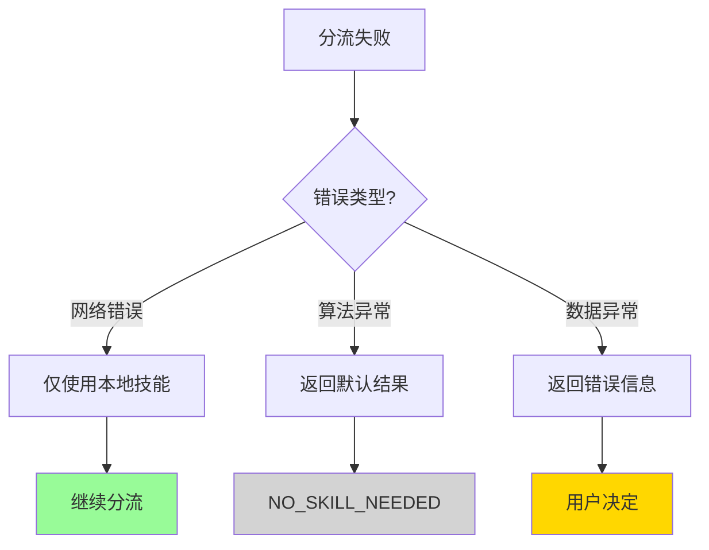

---

## 九、与其他工具的关系

### 9.1 工具关系图

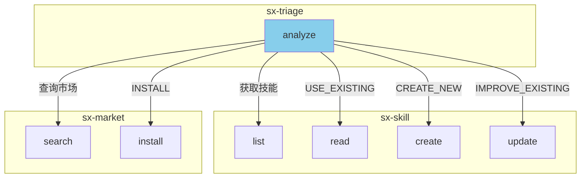

### 9.2 完整工作流

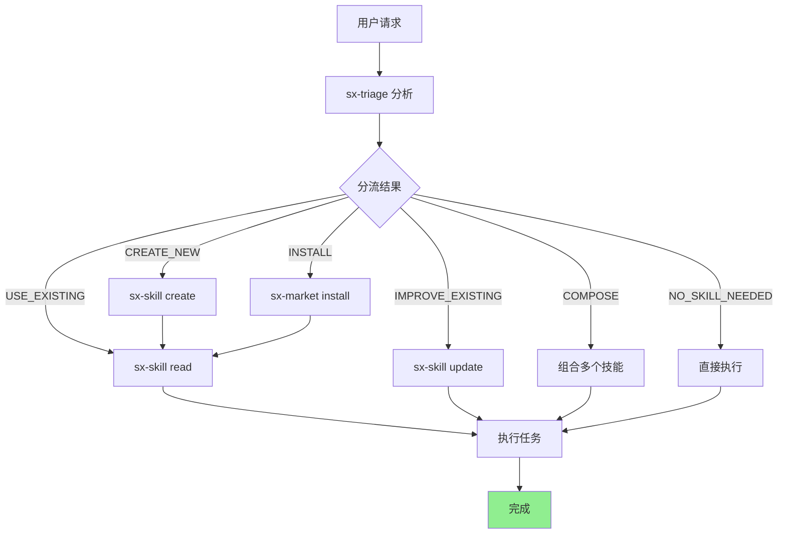

---

## 十、配置选项

### 10.1 分流配置

```mermaid
classDiagram
    class TriageConfig {
        +float matchThreshold
        +float confidenceThreshold
        +boolean enableMarketSearch
        +int marketSearchTimeout
        +string[] preferredSources
    }
```

| 配置项 | 类型 | 默认值 | 说明 |
|--------|------|--------|------|
| matchThreshold | float | 0.5 | 匹配阈值 |
| confidenceThreshold | float | 0.7 | 置信度阈值 |
| enableMarketSearch | boolean | true | 启用市场搜索 |
| marketSearchTimeout | int | 5000 | 市场搜索超时(ms) |
| preferredSources | string[] | ["official"] | 首选技能源 |

### 10.2 全局配置示例

```json
{
  "triage": {
    "matchThreshold": 0.5,
    "confidenceThreshold": 0.7,
    "enableMarketSearch": true,
    "marketSearchTimeout": 5000,
    "preferredSources": ["official"]
  }
}
```

---

## 十一、实现调整：AI First 设计

> 更新日期: 2026-01-19

### 11.1 设计理念调整

由于 Skillix 是给 AI 模型使用的 MCP 工具，实际实现采用了 **AI First** 设计理念：

**核心思想**：
- triage 工具只负责**收集信息**（本地技能、市场技能）
- **决策权交给 AI**
- AI 根据任务描述和技能列表自行判断最佳匹配

```mermaid
flowchart TD
    A[用户任务] --> B[sx-triage]
    B --> C[收集技能信息]
    C --> D[返回结构化数据]
    D --> E[AI 自行分析决策]
    E --> F[执行推荐操作]
    
    style E fill:#87CEEB
```

### 11.2 简化的实现

原设计中的复杂关键词处理（动作词、领域词、TF-IDF等）被简化为：

1. **基本分词** - 按空格和标点分割
2. **简单停用词过滤** - 只保留最常见的无意义词
3. **字符串匹配** - 简单的包含匹配计算相关性分数

**原因**：
- AI 本身具有强大的语义理解能力
- 复杂的关键词匹配反而可能干扰 AI 的判断
- 维护大量关键词列表成本高且覆盖不全

### 11.3 响应结构调整

返回给 AI 的结构化数据：

```typescript
{
  // 任务信息
  task: string,
  context: string | null,
  hints: string[],
  
  // 初步推荐（仅供参考，AI 可自行判断）
  recommendation: {
    action: TriageActionType,
    skill: string | null,
    source: string | null,
    confidence: number,
    reason: string,
  },
  
  // 可用技能列表（供 AI 分析选择）
  availableSkills: Array<{
    name: string,
    description: string,
    scope: 'global' | 'project' | 'market',
    source: string,
    relevanceScore: number,
  }>,
  
  // 下一步操作建议
  nextSteps: string[],
  
  // AI 决策提示
  aiHint: string,
}
```

### 11.4 AI 决策流程

AI 收到 triage 响应后：

1. 查看 `availableSkills` 列表
2. 根据任务描述判断哪个技能最匹配
3. 参考 `recommendation` 但可自行决策
4. 根据 `aiHint` 提示选择操作类型
5. 执行相应的后续操作

### 11.5 优势

| 方面 | 原设计（关键词匹配） | AI First 设计 |
|------|---------------------|---------------|
| 维护成本 | 高（需维护关键词列表） | 低 |
| 语义理解 | 弱（字面匹配） | 强（AI 理解） |
| 覆盖范围 | 有限 | 广泛 |
| 准确性 | 中等 | 高 |
| 灵活性 | 低 | 高 |

---

*本文档为 sx-triage 智能分流设计文档*
*最后更新: 2026-01-19*
