# sx-market 技能市场设计

> 日期: 2026-01-14
> 关联: 20260111-01-项目设计.md
> 状态: 设计中

---

## 一、概述

### 1.1 功能定位

`sx-market` 是 Skillix 的技能市场工具，负责从远程技能源搜索、安装和卸载技能。

**核心职责**：
- 搜索远程技能源中的技能
- 从技能源下载并安装技能到本地
- 卸载已安装的技能
- 管理技能的版本和来源

### 1.2 设计目标

1. **易于发现** - 快速搜索和发现所需技能
2. **安全可靠** - 验证技能来源和完整性
3. **灵活安装** - 支持全局和项目级安装
4. **版本管理** - 支持技能版本控制

### 1.3 与其他工具的区别

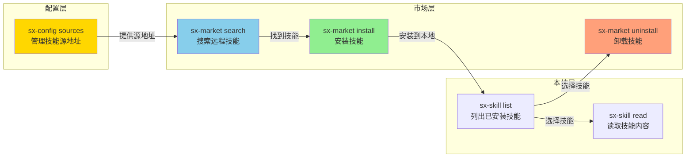

---

## 二、操作类型

### 2.1 支持的操作

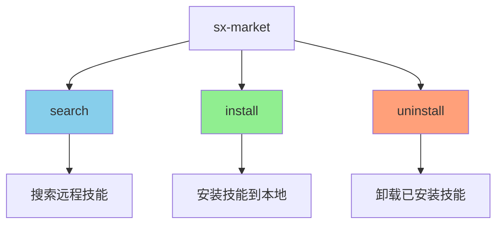

| 操作 | 说明 | 主要参数 |
|------|------|----------|
| search | 搜索技能市场 | query, tags, source |
| install | 安装技能 | name, source, scope, version |
| uninstall | 卸载技能 | name, scope |

---

## 三、搜索功能 (search)

### 3.1 搜索流程

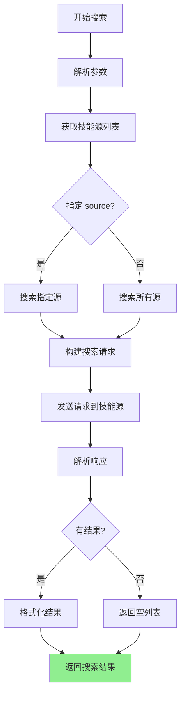

### 3.2 搜索参数

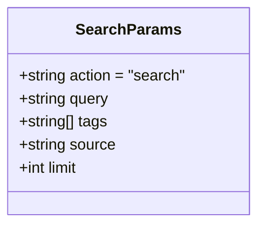

| 参数 | 类型 | 必需 | 说明 |
|------|------|------|------|
| action | string | ✅ | 固定为 "search" |
| query | string | ✅ | 搜索关键词 |
| tags | string[] | ❌ | 按标签筛选 |
| source | string | ❌ | 指定技能源（默认搜索所有源） |
| limit | number | ❌ | 结果数量限制（默认 20） |

### 3.3 搜索响应

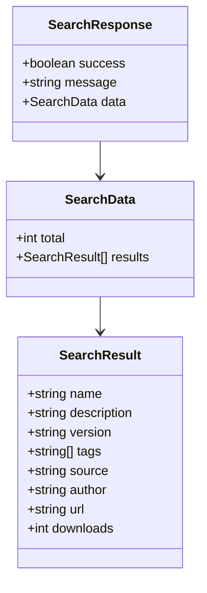

### 3.4 搜索匹配规则

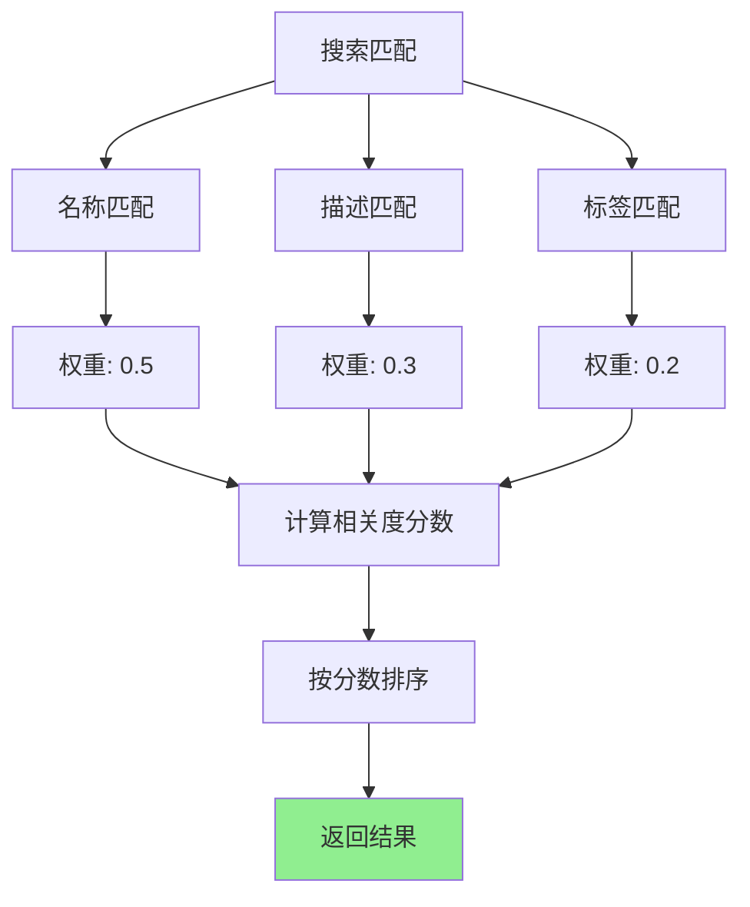

### 3.5 搜索示例

```
用户: 搜索 PDF 相关技能

AI 调用:
sx-market({
  action: "search",
  query: "pdf",
  limit: 10
})

返回结果:
{
  "success": true,
  "message": "找到 3 个技能",
  "data": {
    "total": 3,
    "results": [
      {
        "name": "pdf-converter",
        "description": "PDF 文件格式转换工具",
        "version": "1.2.0",
        "tags": ["pdf", "converter"],
        "source": "official",
        "author": "skillix",
        "downloads": 1250
      },
      {
        "name": "pdf-merger",
        "description": "PDF 文件合并拆分工具",
        "version": "1.0.0",
        "tags": ["pdf", "merge"],
        "source": "official",
        "author": "skillix",
        "downloads": 890
      },
      {
        "name": "pdf-ocr",
        "description": "PDF 文字识别工具",
        "version": "2.0.0",
        "tags": ["pdf", "ocr"],
        "source": "community",
        "author": "user123",
        "downloads": 456
      }
    ]
  }
}
```

---

## 四、安装功能 (install)

### 4.1 安装流程

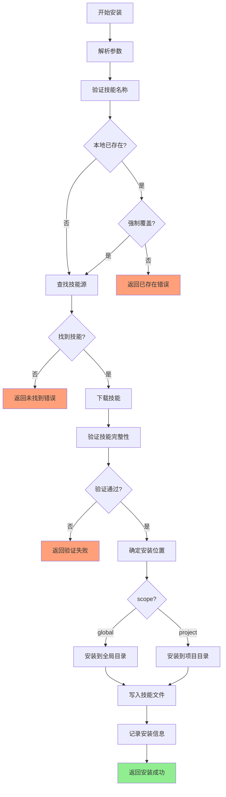

### 4.2 安装参数

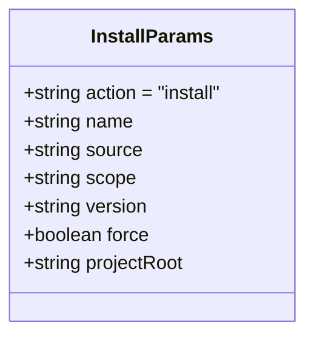

| 参数 | 类型 | 必需 | 说明 |
|------|------|------|------|
| action | string | ✅ | 固定为 "install" |
| name | string | ✅ | 技能名称 |
| source | string | ❌ | 技能源名称（默认使用默认源） |
| scope | string | ❌ | 安装范围：global/project（默认 global） |
| version | string | ❌ | 指定版本（默认最新版） |
| force | boolean | ❌ | 强制覆盖已存在的技能（默认 false） |
| projectRoot | string | ❌ | 项目根目录（scope=project 时使用） |

### 4.3 安装响应

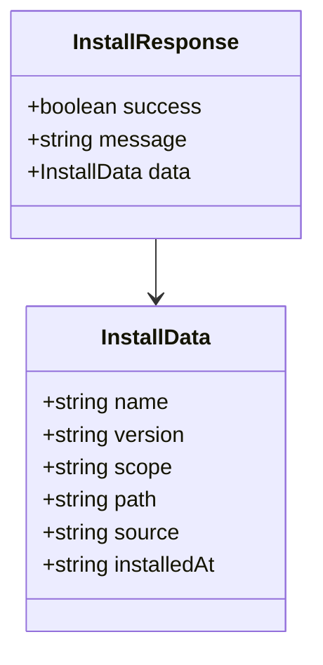

### 4.4 技能源查找流程

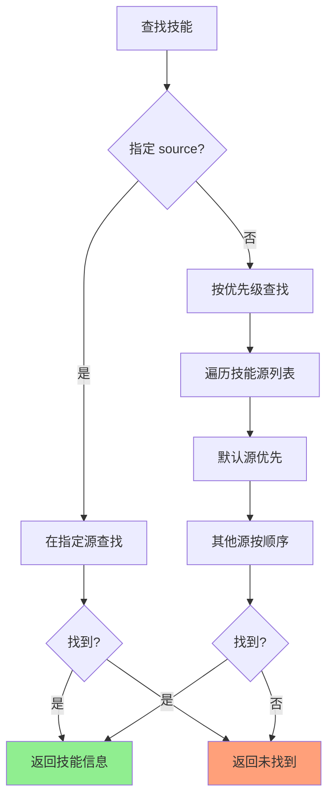

### 4.5 安装位置

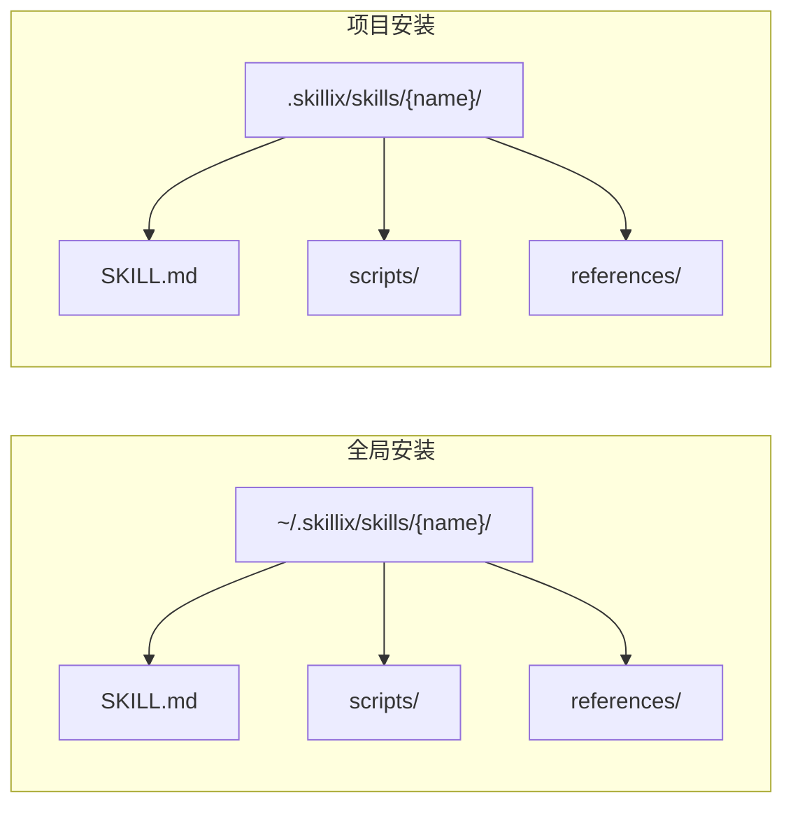

### 4.6 安装示例

```
用户: 安装 pdf-converter 技能到全局

AI 调用:
sx-market({
  action: "install",
  name: "pdf-converter",
  scope: "global"
})

返回结果:
{
  "success": true,
  "message": "成功安装技能 \"pdf-converter\"",
  "data": {
    "name": "pdf-converter",
    "version": "1.2.0",
    "scope": "global",
    "path": "~/.skillix/skills/pdf-converter/",
    "source": "official",
    "installedAt": "2026-01-14T10:30:00.000Z"
  }
}
```

---

## 五、卸载功能 (uninstall)

### 5.1 卸载流程

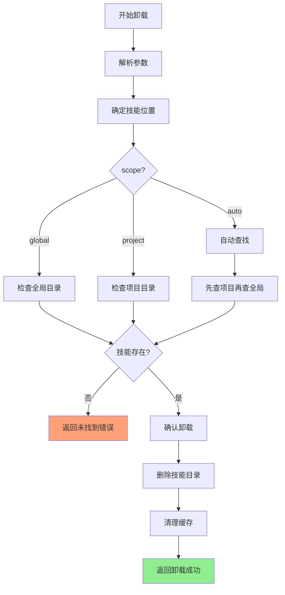

### 5.2 卸载参数

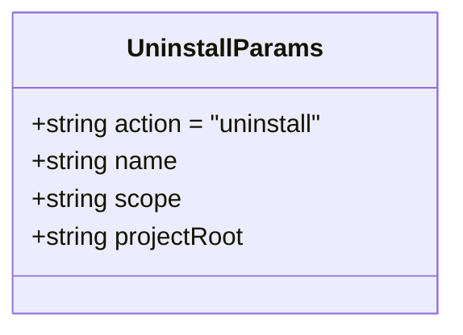

| 参数 | 类型 | 必需 | 说明 |
|------|------|------|------|
| action | string | ✅ | 固定为 "uninstall" |
| name | string | ✅ | 技能名称 |
| scope | string | ❌ | 卸载范围：global/project/auto（默认 auto） |
| projectRoot | string | ❌ | 项目根目录（scope=project 时使用） |

### 5.3 卸载响应

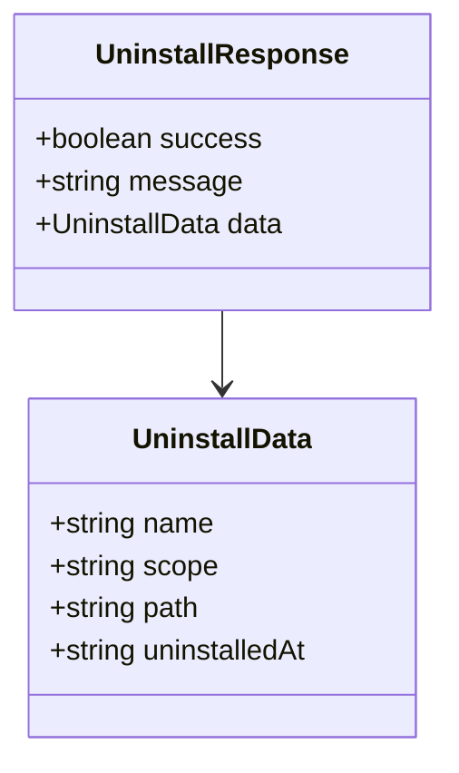

### 5.4 卸载示例

```
用户: 卸载 pdf-converter 技能

AI 调用:
sx-market({
  action: "uninstall",
  name: "pdf-converter",
  scope: "global"
})

返回结果:
{
  "success": true,
  "message": "成功卸载技能 \"pdf-converter\"",
  "data": {
    "name": "pdf-converter",
    "scope": "global",
    "path": "~/.skillix/skills/pdf-converter/",
    "uninstalledAt": "2026-01-14T11:00:00.000Z"
  }
}
```

---

## 六、技能源协议

### 6.1 设计原则

> **统一索引策略**：不依赖远程 `index.json`，由 Skillix 自动拉取技能代码到本地缓存后构建索引。

这种设计的优势：
- **一致性** - 所有源使用相同的索引构建逻辑
- **可靠性** - 不依赖源仓库维护索引文件
- **灵活性** - 支持任意 GitHub 仓库作为技能源
- **可控性** - 索引格式完全由 Skillix 控制

### 6.2 技能源结构要求

技能源仓库只需要遵循简单的目录结构：

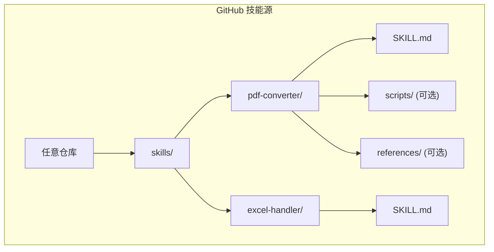

**要求**：
- 技能存放在 `skills/` 目录下（可配置）
- 每个技能一个子目录
- 必须包含 `SKILL.md` 文件
- `SKILL.md` 必须有有效的 YAML frontmatter

### 6.3 本地索引构建流程

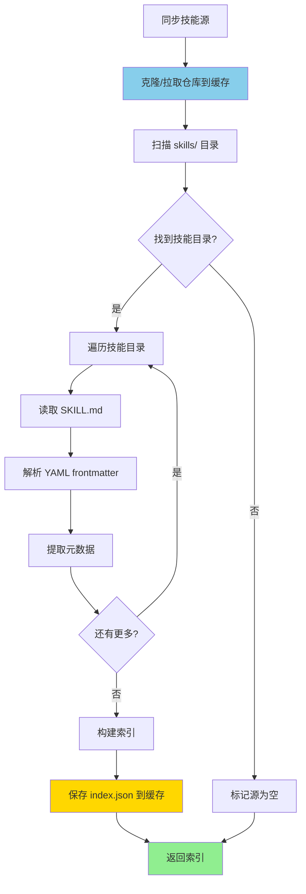

### 6.4 缓存目录结构

```
~/.skillix/cache/
├── repos/                          # 仓库缓存目录
│   ├── official/                   # 官方源仓库
│   │   ├── .git/                   # Git 元数据
│   │   └── skills/                 # 技能目录
│   │       ├── pdf-converter/
│   │       └── excel-handler/
│   ├── team/                       # 团队源仓库
│   │   └── skills/
│   └── custom/                     # 自定义源仓库
│       └── skills/
├── indexes/                        # 索引缓存目录
│   ├── official.json               # 官方源索引
│   ├── team.json                   # 团队源索引
│   └── custom.json                 # 自定义源索引
└── downloads/                      # 下载临时目录
```

### 6.5 索引文件格式

本地生成的 `index.json` 格式：

```json
{
  "version": "1.0.0",
  "generatedAt": "2026-01-14T10:00:00.000Z",
  "source": {
    "name": "official",
    "url": "https://github.com/shetengteng/skillix-hub",
    "branch": "main",
    "commit": "abc123def456"
  },
  "skills": [
    {
      "name": "pdf-converter",
      "description": "PDF 文件格式转换工具",
      "version": "1.2.0",
      "author": "skillix",
      "tags": ["pdf", "converter"],
      "path": "skills/pdf-converter",
      "hasScripts": true,
      "hasReferences": false,
      "hasAssets": false
    },
    {
      "name": "excel-handler",
      "description": "Excel 文件处理工具",
      "version": "1.0.0",
      "author": "skillix",
      "tags": ["excel", "data"],
      "path": "skills/excel-handler",
      "hasScripts": true,
      "hasReferences": true,
      "hasAssets": false
    }
  ]
}
```

### 6.6 源同步流程

#### 6.6.1 首次同步

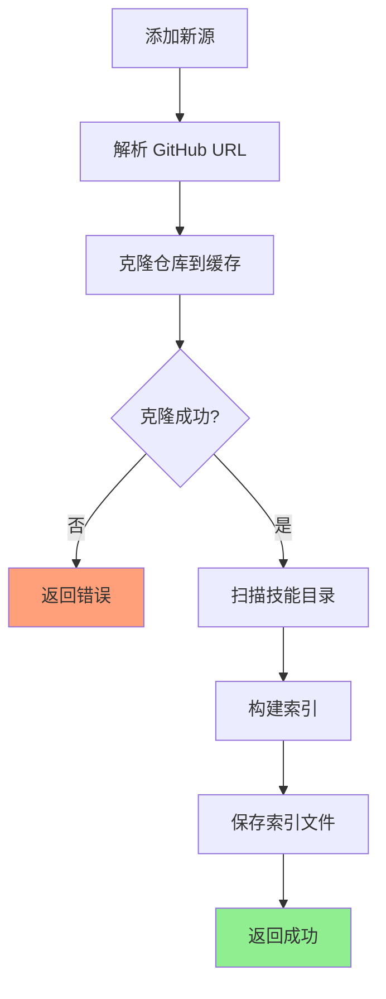

#### 6.6.2 更新同步

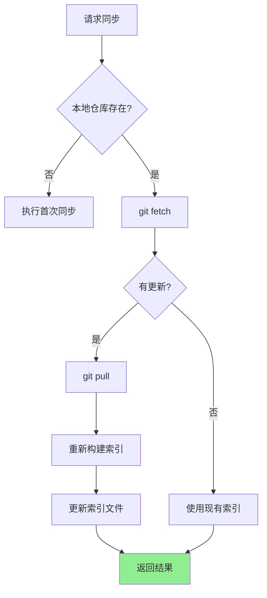

### 6.7 Git 操作封装

```typescript
/**
 * 克隆仓库到本地缓存
 */
async function cloneRepo(
  source: SourceConfig,
  cacheDir: string
): Promise<void> {
  const repoDir = path.join(cacheDir, 'repos', source.name);
  const branch = source.branch || 'main';
  
  // 使用 sparse-checkout 只克隆 skills/ 目录
  await exec(`git clone --depth 1 --filter=blob:none --sparse ${source.url} ${repoDir}`);
  await exec(`cd ${repoDir} && git sparse-checkout set skills`);
  await exec(`cd ${repoDir} && git checkout ${branch}`);
}

/**
 * 更新本地仓库
 */
async function updateRepo(
  source: SourceConfig,
  cacheDir: string
): Promise<boolean> {
  const repoDir = path.join(cacheDir, 'repos', source.name);
  
  // 获取远程更新
  await exec(`cd ${repoDir} && git fetch origin`);
  
  // 检查是否有更新
  const localCommit = await exec(`cd ${repoDir} && git rev-parse HEAD`);
  const remoteCommit = await exec(`cd ${repoDir} && git rev-parse origin/${source.branch || 'main'}`);
  
  if (localCommit === remoteCommit) {
    return false; // 无更新
  }
  
  // 拉取更新
  await exec(`cd ${repoDir} && git pull origin ${source.branch || 'main'}`);
  return true;
}
```

### 6.8 索引构建实现

```typescript
/**
 * 从本地仓库构建索引
 */
function buildIndex(
  source: SourceConfig,
  repoDir: string
): SourceIndex {
  const skillsDir = path.join(repoDir, 'skills');
  const skills: SkillIndexItem[] = [];
  
  // 扫描技能目录
  const skillDirs = fs.readdirSync(skillsDir, { withFileTypes: true })
    .filter(dirent => dirent.isDirectory())
    .map(dirent => dirent.name);
  
  for (const skillName of skillDirs) {
    const skillDir = path.join(skillsDir, skillName);
    const skillMdPath = path.join(skillDir, 'SKILL.md');
    
    // 检查 SKILL.md 是否存在
    if (!fs.existsSync(skillMdPath)) {
      console.warn(`跳过 ${skillName}: 缺少 SKILL.md`);
      continue;
    }
    
    // 解析元数据
    const content = fs.readFileSync(skillMdPath, 'utf-8');
    const metadata = parseYamlFrontmatter(content);
    
    if (!metadata?.name || !metadata?.description) {
      console.warn(`跳过 ${skillName}: 元数据不完整`);
      continue;
    }
    
    skills.push({
      name: metadata.name,
      description: metadata.description,
      version: metadata.version || '1.0.0',
      author: metadata.author || 'unknown',
      tags: metadata.tags || [],
      path: `skills/${skillName}`,
      hasScripts: fs.existsSync(path.join(skillDir, 'scripts')),
      hasReferences: fs.existsSync(path.join(skillDir, 'references')),
      hasAssets: fs.existsSync(path.join(skillDir, 'assets')),
    });
  }
  
  // 获取当前 commit
  const commit = execSync(`cd ${repoDir} && git rev-parse HEAD`).toString().trim();
  
  return {
    version: '1.0.0',
    generatedAt: new Date().toISOString(),
    source: {
      name: source.name,
      url: source.url,
      branch: source.branch || 'main',
      commit,
    },
    skills,
  };
}
```

### 6.9 多源并行同步

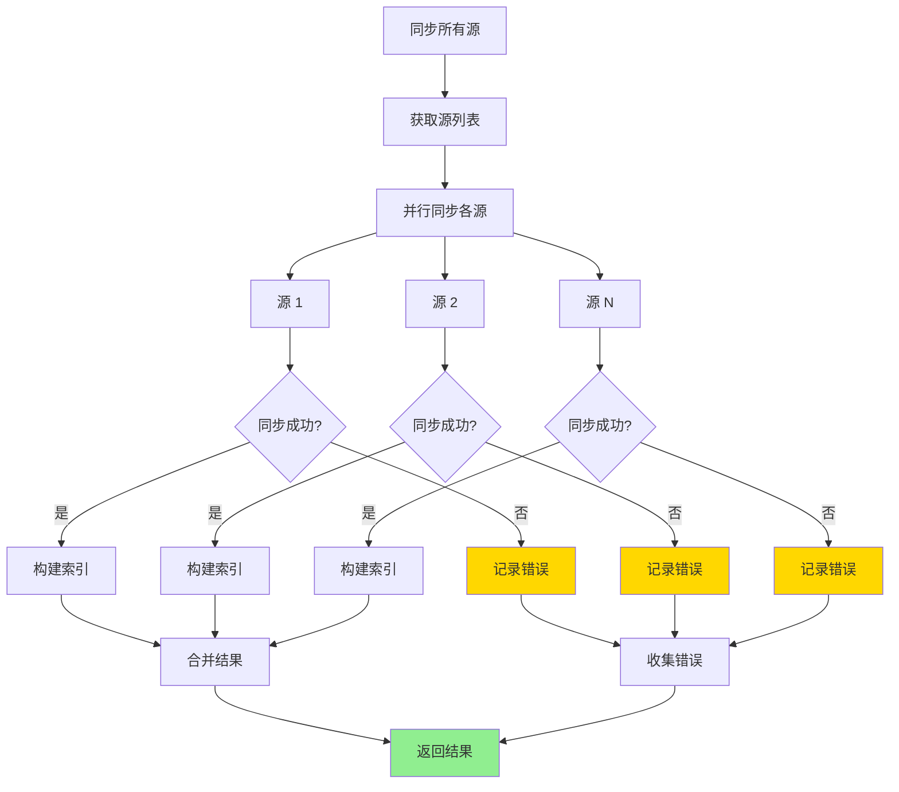

### 6.10 搜索响应格式

```json
{
  "success": true,
  "message": "找到 5 个技能（来自 2 个源）",
  "data": {
    "total": 5,
    "results": [
      {
        "name": "pdf-converter",
        "description": "PDF 文件格式转换工具",
        "version": "1.2.0",
        "tags": ["pdf", "converter"],
        "source": "official",
        "author": "skillix"
      }
    ],
    "sourceStatus": [
      {
        "name": "official",
        "status": "synced",
        "skillCount": 3,
        "lastSync": "2026-01-14T10:00:00.000Z",
        "commit": "abc123"
      },
      {
        "name": "team",
        "status": "synced",
        "skillCount": 2,
        "lastSync": "2026-01-14T09:30:00.000Z",
        "commit": "def456"
      },
      {
        "name": "custom",
        "status": "error",
        "error": "仓库不存在或无访问权限"
      }
    ]
  },
  "warnings": [
    "技能源 \"custom\" 同步失败: 仓库不存在或无访问权限"
  ]
}
```

### 6.11 配置选项

```json
{
  "market": {
    "sync": {
      "autoSync": true,
      "syncInterval": 3600,
      "skillsPath": "skills",
      "sparseCheckout": true
    },
    "git": {
      "depth": 1,
      "timeout": 60000
    }
  }
}
```

| 配置项 | 类型 | 默认值 | 说明 |
|--------|------|--------|------|
| sync.autoSync | boolean | true | 自动同步 |
| sync.syncInterval | number | 3600 | 同步间隔（秒） |
| sync.skillsPath | string | "skills" | 技能目录路径 |
| sync.sparseCheckout | boolean | true | 使用 sparse-checkout |
| git.depth | number | 1 | 克隆深度 |
| git.timeout | number | 60000 | Git 操作超时（毫秒） |

### 6.12 源状态类型

```typescript
/**
 * 技能源状态
 */
export type SourceStatus = 
  | 'synced'         // 已同步
  | 'syncing'        // 同步中
  | 'outdated'       // 需要更新
  | 'error'          // 同步错误
  | 'not_synced';    // 未同步

/**
 * 技能源同步结果
 */
export interface SourceSyncResult {
  name: string;
  url: string;
  status: SourceStatus;
  skillCount?: number;
  lastSync?: string;
  commit?: string;
  error?: string;
}
```

### 6.13 错误处理

| 错误场景 | 处理方式 | 用户提示 |
|----------|----------|----------|
| 仓库不存在 | 标记错误，跳过 | "仓库不存在或无访问权限" |
| 网络超时 | 使用缓存（如有） | "同步超时，使用缓存数据" |
| 无 skills 目录 | 标记为空源 | "未找到 skills 目录" |
| Git 错误 | 记录详细错误 | "Git 操作失败: {error}" |
| 所有源失败 | 返回错误 | "所有技能源同步失败" |

---

## 七、缓存机制

### 7.1 缓存结构

```
~/.skillix/cache/
├── sources/                    # 技能源索引缓存
│   ├── official.json          # 官方源缓存
│   ├── community.json         # 社区源缓存
│   └── custom.json            # 自定义源缓存
└── downloads/                  # 下载临时目录
    └── {skill-name}/          # 技能下载临时文件
```

### 7.2 缓存策略

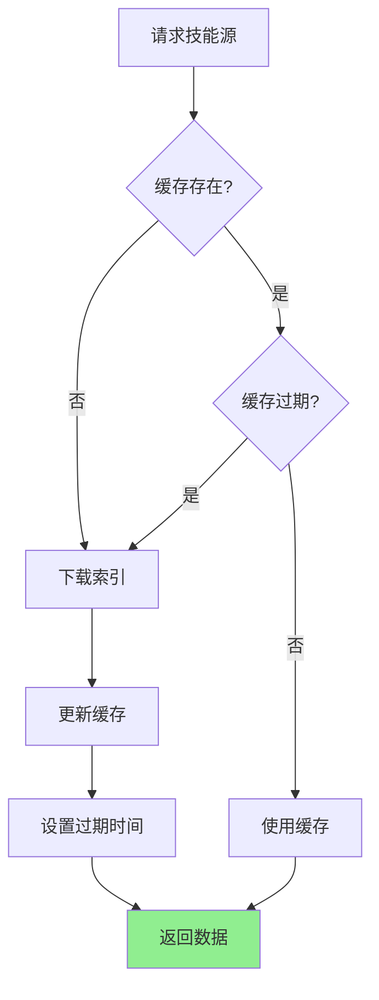

### 7.3 缓存配置

| 配置项 | 类型 | 默认值 | 说明 |
|--------|------|--------|------|
| cache.enabled | boolean | true | 启用缓存 |
| cache.ttl | number | 3600 | 缓存有效期（秒） |
| cache.maxSize | string | "100MB" | 最大缓存大小 |

---

## 八、错误处理

### 8.1 错误场景

```mermaid
flowchart TD
    A[可能的错误] --> B[网络错误]
    A --> C[技能未找到]
    A --> D[版本不存在]
    A --> E[权限不足]
    A --> F[磁盘空间不足]
    A --> G[技能已存在]
    
    B --> B1["E001: 网络连接失败"]
    C --> C1["E002: 技能未找到"]
    D --> D1["E003: 版本不存在"]
    E --> E1["E004: 权限不足"]
    F --> F1["E005: 磁盘空间不足"]
    G --> G1["E006: 技能已存在"]
    
    style B1 fill:#FFA07A
    style C1 fill:#FFA07A
    style D1 fill:#FFA07A
    style E1 fill:#FFA07A
    style F1 fill:#FFA07A
    style G1 fill:#FFD700
```

### 8.2 错误响应

| 错误码 | 错误类型 | 说明 | 建议操作 |
|--------|----------|------|----------|
| E001 | 网络错误 | 无法连接到技能源 | 检查网络连接 |
| E002 | 未找到 | 技能不存在 | 检查技能名称或换源 |
| E003 | 版本错误 | 指定版本不存在 | 使用有效版本 |
| E004 | 权限错误 | 无写入权限 | 检查目录权限 |
| E005 | 空间不足 | 磁盘空间不足 | 清理磁盘空间 |
| E006 | 已存在 | 技能已安装 | 使用 force 参数覆盖 |

### 8.3 重试策略

```mermaid
flowchart TD
    A[请求失败] --> B{可重试?}
    
    B -->|是| C{重试次数 < 3?}
    B -->|否| D[返回错误]
    
    C -->|是| E[等待退避]
    C -->|否| D
    
    E --> F["延迟: 1s, 2s, 4s"]
    F --> G[重试请求]
    G --> H{成功?}
    
    H -->|是| I[返回结果]
    H -->|否| C
    
    style I fill:#90EE90
    style D fill:#FFA07A
```

---

## 九、安全机制

### 9.1 技能验证

```mermaid
flowchart TD
    A[下载技能] --> B[验证来源]
    B --> C{来源可信?}
    
    C -->|否| D[警告用户]
    C -->|是| E[验证结构]
    
    D --> F{用户确认?}
    F -->|否| G[取消安装]
    F -->|是| E
    
    E --> H{结构有效?}
    H -->|否| I[返回验证失败]
    H -->|是| J[验证内容]
    
    J --> K{内容安全?}
    K -->|否| L[返回安全警告]
    K -->|是| M[允许安装]
    
    style M fill:#90EE90
    style G fill:#D3D3D3
    style I fill:#FFA07A
    style L fill:#FFD700
```

### 9.2 验证规则

| 验证项 | 说明 | 失败处理 |
|--------|------|----------|
| 来源验证 | 检查技能源是否在配置列表中 | 警告用户 |
| 结构验证 | 检查 SKILL.md 是否存在且格式正确 | 拒绝安装 |
| 内容验证 | 检查是否包含危险代码 | 警告用户 |
| 完整性验证 | 检查文件是否完整 | 重新下载 |

### 9.3 危险模式检测

```mermaid
flowchart TD
    A[内容检查] --> B[检查脚本文件]
    B --> C{包含危险命令?}
    
    C -->|是| D[标记警告]
    C -->|否| E[检查外部链接]
    
    E --> F{包含可疑链接?}
    F -->|是| D
    F -->|否| G[检查权限请求]
    
    G --> H{请求敏感权限?}
    H -->|是| D
    H -->|否| I[验证通过]
    
    D --> J[返回警告列表]
    
    style I fill:#90EE90
    style J fill:#FFD700
```

---

## 十、使用场景

### 10.1 搜索并安装技能

```mermaid
sequenceDiagram
    participant U as 用户
    participant AI as AI
    participant M as sx-market
    
    U->>AI: 我需要处理 PDF 文件
    AI->>M: search(query: "pdf")
    M-->>AI: 找到 3 个技能
    AI->>U: 找到以下技能：<br/>1. pdf-converter<br/>2. pdf-merger<br/>3. pdf-ocr<br/>要安装哪个？
    U->>AI: 安装 pdf-converter
    AI->>M: install(name: "pdf-converter")
    M-->>AI: 安装成功
    AI->>U: 技能已安装到全局目录
```

### 10.2 从指定源安装

```mermaid
sequenceDiagram
    participant U as 用户
    participant AI as AI
    participant M as sx-market
    
    U->>AI: 从团队源安装 custom-api 技能
    AI->>M: install(name: "custom-api", source: "team")
    M-->>AI: 安装成功
    AI->>U: 技能已从 team 源安装
```

### 10.3 安装到项目

```mermaid
sequenceDiagram
    participant U as 用户
    participant AI as AI
    participant M as sx-market
    
    U->>AI: 把 api-doc-gen 安装到当前项目
    AI->>M: install(name: "api-doc-gen", scope: "project")
    M-->>AI: 安装成功
    AI->>U: 技能已安装到 .skillix/skills/
```

### 10.4 卸载技能

```mermaid
sequenceDiagram
    participant U as 用户
    participant AI as AI
    participant M as sx-market
    
    U->>AI: 卸载 pdf-converter 技能
    AI->>M: uninstall(name: "pdf-converter")
    M-->>AI: 卸载成功
    AI->>U: 技能已卸载
```

---

## 十一、与其他工具的集成

### 11.1 与 sx-triage 集成

```mermaid
sequenceDiagram
    participant U as 用户
    participant AI as AI
    participant T as sx-triage
    participant M as sx-market
    participant S as sx-skill
    
    U->>AI: 帮我生成 API 文档
    AI->>T: triage(task: "生成 API 文档")
    T->>S: list(scope: "all")
    S-->>T: 本地无匹配
    T->>M: search(query: "api documentation")
    M-->>T: 找到 api-doc-gen
    T-->>AI: INSTALL, skill: api-doc-gen
    AI->>U: 市场有这个技能，是否安装？
    U->>AI: 是
    AI->>M: install(name: "api-doc-gen")
    M-->>AI: 安装成功
    AI->>S: read(name: "api-doc-gen")
    S-->>AI: 技能内容
    AI->>U: 按照技能指引执行...
```

### 11.2 与 sx-config 集成

```mermaid
sequenceDiagram
    participant U as 用户
    participant AI as AI
    participant C as sx-config
    participant M as sx-market
    
    U->>AI: 添加团队技能源并搜索技能
    AI->>C: sources(action: "add", name: "team", url: "...")
    C-->>AI: 源已添加
    AI->>M: search(query: "api", source: "team")
    M-->>AI: 搜索结果
    AI->>U: 在团队源找到以下技能...
```

### 11.3 工具关系图

```mermaid
flowchart TD
    subgraph sx-config
        A[sources]
    end
    
    subgraph sx-market
        B[search]
        C[install]
        D[uninstall]
    end
    
    subgraph sx-skill
        E[list]
        F[read]
    end
    
    subgraph sx-triage
        G[analyze]
    end
    
    A -->|提供源配置| B
    B -->|搜索结果| C
    C -->|安装后| E
    D -->|卸载后| E
    G -->|查询市场| B
    G -->|推荐安装| C
    E -->|技能列表| G
    
    style B fill:#87CEEB
    style C fill:#90EE90
    style D fill:#FFA07A
```

---

## 十二、配置选项

### 12.1 市场配置

```mermaid
classDiagram
    class MarketConfig {
        +int searchTimeout
        +int downloadTimeout
        +int maxRetries
        +boolean verifySource
        +boolean autoUpdate
    }
```

| 配置项 | 类型 | 默认值 | 说明 |
|--------|------|--------|------|
| searchTimeout | number | 5000 | 搜索超时（毫秒） |
| downloadTimeout | number | 30000 | 下载超时（毫秒） |
| maxRetries | number | 3 | 最大重试次数 |
| verifySource | boolean | true | 验证技能源 |
| autoUpdate | boolean | false | 自动更新已安装技能 |

### 12.2 全局配置示例

```json
{
  "market": {
    "searchTimeout": 5000,
    "downloadTimeout": 30000,
    "maxRetries": 3,
    "verifySource": true,
    "autoUpdate": false
  },
  "sources": [
    {
      "name": "official",
      "url": "https://github.com/user/skillix-hub",
      "branch": "main",
      "default": true
    }
  ]
}
```

---

## 十三、输入输出设计

### 13.1 工具参数 Schema

```typescript
{
  name: "sx-market",
  description: "技能市场：搜索、安装、卸载技能",
  inputSchema: {
    type: "object",
    properties: {
      action: {
        type: "string",
        enum: ["search", "install", "uninstall"],
        description: "操作类型"
      },
      query: {
        type: "string",
        description: "搜索关键词（search 时需要）"
      },
      name: {
        type: "string",
        description: "技能名称（install/uninstall 时需要）"
      },
      source: {
        type: "string",
        description: "技能源名称（search/install 时可选）"
      },
      scope: {
        type: "string",
        enum: ["global", "project"],
        description: "安装/卸载范围（默认 global）"
      },
      version: {
        type: "string",
        description: "指定版本（install 时可选）"
      },
      tags: {
        type: "array",
        items: { type: "string" },
        description: "按标签筛选（search 时可选）"
      },
      force: {
        type: "boolean",
        description: "强制覆盖（install 时可选）"
      },
      limit: {
        type: "number",
        description: "结果数量限制（search 时可选）"
      },
      projectRoot: {
        type: "string",
        description: "项目根目录（scope=project 时使用）"
      }
    },
    required: ["action"]
  }
}
```

### 13.2 TypeScript 类型定义

```typescript
/**
 * sx-market 工具参数
 */
export interface SxMarketParams {
  /** 操作类型 */
  action: 'search' | 'install' | 'uninstall';
  /** 搜索关键词（search 时需要） */
  query?: string;
  /** 技能名称（install/uninstall 时需要） */
  name?: string;
  /** 技能源名称 */
  source?: string;
  /** 安装/卸载范围 */
  scope?: 'global' | 'project';
  /** 指定版本 */
  version?: string;
  /** 按标签筛选 */
  tags?: string[];
  /** 强制覆盖 */
  force?: boolean;
  /** 结果数量限制 */
  limit?: number;
  /** 项目根目录 */
  projectRoot?: string;
}

/**
 * 搜索结果项
 */
export interface SearchResultItem {
  name: string;
  description: string;
  version: string;
  tags: string[];
  source: string;
  author: string;
  url?: string;
  downloads?: number;
}

/**
 * 安装结果
 */
export interface InstallResult {
  name: string;
  version: string;
  scope: 'global' | 'project';
  path: string;
  source: string;
  installedAt: string;
}

/**
 * 卸载结果
 */
export interface UninstallResult {
  name: string;
  scope: 'global' | 'project';
  path: string;
  uninstalledAt: string;
}
```

---

## 十四、最佳实践

### 14.1 搜索建议

| 建议 | 说明 |
|------|------|
| 使用具体关键词 | "pdf converter" 比 "file" 更精确 |
| 结合标签筛选 | 使用 tags 缩小范围 |
| 指定源 | 如果知道技能在哪个源，直接指定 |

### 14.2 安装建议

| 建议 | 说明 |
|------|------|
| 优先全局安装 | 通用技能安装到全局 |
| 项目特定技能 | 项目专用技能安装到项目 |
| 指定版本 | 生产环境指定具体版本 |

### 14.3 卸载建议

| 建议 | 说明 |
|------|------|
| 确认范围 | 明确是卸载全局还是项目技能 |
| 检查依赖 | 确保没有其他技能依赖 |

---

*本文档为 sx-market 技能市场设计文档*
*最后更新: 2026-01-14*
