# sx-market 技能市场设计

> 日期: 2026-01-14
> 关联: 20260111-01-项目设计.md
> 状态: 设计中

---

## 一、概述

### 1.1 功能定位

`sx-market` 是 Skillix 的技能市场工具，负责从远程技能源搜索、安装和卸载技能。

**核心职责**：
- 搜索远程技能源中的技能
- 从技能源下载并安装技能到本地
- 卸载已安装的技能
- 管理技能的版本和来源

### 1.2 设计目标

1. **易于发现** - 快速搜索和发现所需技能
2. **安全可靠** - 验证技能来源和完整性
3. **灵活安装** - 支持全局和项目级安装
4. **版本管理** - 支持技能版本控制

### 1.3 与其他工具的区别


---

## 二、操作类型

### 2.1 支持的操作

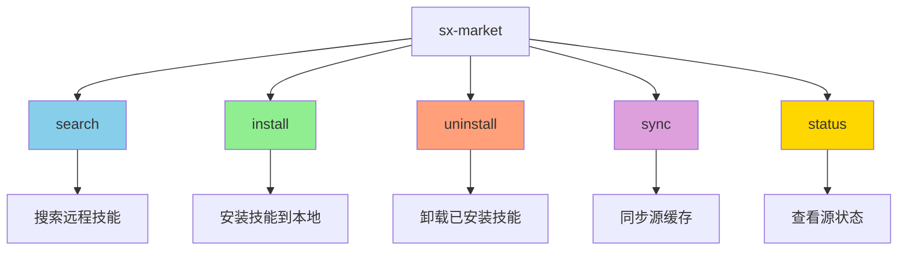

| 操作 | 说明 | 主要参数 | 阶段 |
|------|------|----------|------|
| search | 搜索技能市场 | query, tags, source | Phase 1 |
| install | 安装技能 | name, source, scope, force | Phase 1 |
| uninstall | 卸载技能 | name, scope | Phase 1 |
| sync | 同步源缓存（从 GitHub 拉取最新） | source, force | Phase 2 |
| status | 查看源状态 | source | Phase 2 |

> **更新已安装技能**：使用 `install --force` 重新安装来更新

---

## 三、搜索功能 (search)

### 3.1 搜索流程


### 3.2 搜索参数

| 参数 | 类型 | 必需 | 说明 |
|------|------|------|------|
| action | string | ✅ | 固定为 "search" |
| query | string | ✅ | 搜索关键词 |
| tags | string[] | ❌ | 按标签筛选 |
| source | string | ❌ | 指定技能源（默认搜索所有源） |
| limit | number | ❌ | 结果数量限制（默认 20） |

### 3.3 搜索匹配规则

| 匹配项 | 权重 | 说明 |
|--------|------|------|
| 名称匹配 | 0.5 | 技能名称包含关键词 |
| 描述匹配 | 0.3 | 技能描述包含关键词 |
| 标签匹配 | 0.2 | 技能标签包含关键词 |

按相关度分数排序后返回结果。

### 3.5 搜索示例

```
用户: 搜索 PDF 相关技能

AI 调用:
sx-market({
  action: "search",
  query: "pdf",
  limit: 10
})

返回结果:
{
  "success": true,
  "message": "找到 3 个技能",
  "data": {
    "total": 3,
    "results": [
      {
        "name": "pdf-converter",
        "description": "PDF 文件格式转换工具",
        "version": "1.2.0",
        "tags": ["pdf", "converter"],
        "source": "official",
        "author": "skillix",
        "downloads": 1250
      },
      {
        "name": "pdf-merger",
        "description": "PDF 文件合并拆分工具",
        "version": "1.0.0",
        "tags": ["pdf", "merge"],
        "source": "official",
        "author": "skillix",
        "downloads": 890
      },
      {
        "name": "pdf-ocr",
        "description": "PDF 文字识别工具",
        "version": "2.0.0",
        "tags": ["pdf", "ocr"],
        "source": "community",
        "author": "user123",
        "downloads": 456
      }
    ]
  }
}
```

---

## 四、安装功能 (install)

### 4.1 安装流程


### 4.2 安装参数

| 参数 | 类型 | 必需 | 说明 |
|------|------|------|------|
| action | string | ✅ | 固定为 "install" |
| name | string | ✅ | 技能名称 |
| source | string | ❌ | 技能源名称（默认使用默认源） |
| scope | string | ❌ | 安装范围：global/project（默认 global） |
| version | string | ❌ | 指定版本（默认最新版） |
| force | boolean | ❌ | 强制覆盖已存在的技能（默认 false） |
| projectRoot | string | ❌ | 项目根目录（scope=project 时使用） |

### 4.3 安装位置

| scope | 安装路径 | 说明 |
|-------|----------|------|
| global | `~/.skillix/skills/{name}/` | 全局安装，所有项目可用 |
| project | `.skillix/skills/{name}/` | 项目安装，仅当前项目可用 |

技能目录结构：
```
{name}/
├── SKILL.md           # 技能定义文件
├── scripts/           # 可选：脚本文件
├── references/        # 可选：参考文档
└── assets/            # 可选：资源文件
```

### 4.4 技能源查找顺序

1. 如果指定了 `source`，只在该源查找
2. 否则按优先级遍历：默认源 → 其他源（按配置顺序）
3. 找到第一个匹配的技能即返回

### 4.5 安装流程说明

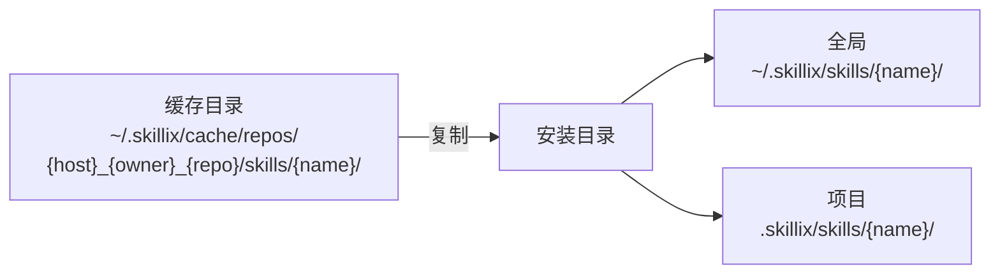

**安装步骤**：
1. 确定安装目录
   - `scope=global` → `~/.skillix/skills/{name}/`
   - `scope=project` → `{projectRoot}/.skillix/skills/{name}/`
2. 检查是否已存在（已存在且未设置 force 则报错）
3. 从缓存索引中查找技能（按源优先级：默认源 → 其他源）
4. **从缓存复制到安装目录**
   - 源路径：`~/.skillix/cache/repos/{host}_{owner}_{repo}/skills/{name}/`
   - 目标路径：安装目录
5. 记录安装信息到 `installed.json`

**安装记录**（`~/.skillix/installed.json` 或 `.skillix/installed.json`）：
```json
{
  "name": "pdf-converter",
  "version": "1.2.0",
  "scope": "global",
  "path": "~/.skillix/skills/pdf-converter/",
  "sourceId": "github.com/shetengteng/skillix-hub",
  "sourceName": "official",
  "installedAt": "2026-01-14T10:30:00.000Z"
}
```

### 4.6 安装示例

```
用户: 安装 pdf-converter 技能到全局

AI 调用:
sx-market({
  action: "install",
  name: "pdf-converter",
  scope: "global"
})

返回结果:
{
  "success": true,
  "message": "成功安装技能 \"pdf-converter\"",
  "data": {
    "name": "pdf-converter",
    "version": "1.2.0",
    "scope": "global",
    "path": "~/.skillix/skills/pdf-converter/",
    "sourceId": "github.com/shetengteng/skillix-hub",
    "sourceName": "official",
    "installedAt": "2026-01-14T10:30:00.000Z"
  }
}
```

---

## 五、卸载功能 (uninstall)

### 5.1 卸载流程


### 5.2 卸载参数

| 参数 | 类型 | 必需 | 说明 |
|------|------|------|------|
| action | string | ✅ | 固定为 "uninstall" |
| name | string | ✅ | 技能名称 |
| scope | string | ❌ | 卸载范围：global/project/auto（默认 auto） |
| projectRoot | string | ❌ | 项目根目录（scope=project 时使用） |

### 5.3 查找顺序（scope=auto）

1. 先查项目目录 `.skillix/skills/{name}/`
2. 再查全局目录 `~/.skillix/skills/{name}/`
3. 找到第一个即执行卸载

### 5.4 卸载流程说明

**卸载步骤**：
1. 根据 scope 查找技能位置
   - `auto`：先查项目目录，再查全局目录
   - `project`：只查项目目录
   - `global`：只查全局目录
2. 删除技能目录（递归删除）
3. 从 `installed.json` 中移除安装记录

**卸载响应**：
```json
{
  "name": "pdf-converter",
  "scope": "global",
  "path": "~/.skillix/skills/pdf-converter/",
  "uninstalledAt": "2026-01-14T11:00:00.000Z"
}
```

### 5.5 卸载示例

```
用户: 卸载 pdf-converter 技能

AI 调用:
sx-market({
  action: "uninstall",
  name: "pdf-converter",
  scope: "global"
})

返回结果:
{
  "success": true,
  "message": "成功卸载技能 \"pdf-converter\"",
  "data": {
    "name": "pdf-converter",
    "scope": "global",
    "path": "~/.skillix/skills/pdf-converter/",
    "uninstalledAt": "2026-01-14T11:00:00.000Z"
  }
}
```

---

## 六、技能源协议

### 6.1 设计原则

> **统一索引策略**：不依赖远程 `index.json`，由 Skillix 自动拉取技能代码到本地缓存后构建索引。

这种设计的优势：
- **一致性** - 所有源使用相同的索引构建逻辑
- **可靠性** - 不依赖源仓库维护索引文件
- **灵活性** - 支持任意 GitHub 仓库作为技能源
- **可控性** - 索引格式完全由 Skillix 控制

### 6.2 技能源结构要求

技能源仓库只需要遵循简单的目录结构：


**要求**：
- 技能存放在 `skills/` 目录下（可配置）
- 每个技能一个子目录
- 必须包含 `SKILL.md` 文件
- `SKILL.md` 必须有有效的 YAML frontmatter

### 6.3 本地索引构建流程


### 6.4 缓存目录结构

> **设计原则**：基于 URL 扁平化命名，不区分官方/团队/自定义，统一按 Git 仓库 URL 映射。

```
~/.skillix/cache/
├── repos/                                      # 仓库缓存目录（扁平化命名）
│   ├── github.com_shetengteng_skillix-hub/     # 官方技能仓库
│   │   ├── .git/                               # Git 元数据
│   │   └── skills/                             # 技能目录
│   │       ├── pdf-converter/
│   │       └── excel-handler/
│   ├── github.com_company_team-skills/         # 团队技能仓库
│   │   ├── .git/
│   │   └── skills/
│   └── gitlab.com_org_custom-skills/           # 其他 Git 平台
│       ├── .git/
│       └── skills/
├── indexes/                                    # 索引缓存目录
│   ├── sources/                                # 各源独立索引
│   │   ├── github.com_shetengteng_skillix-hub.json
│   │   ├── github.com_company_team-skills.json
│   │   └── gitlab.com_org_custom-skills.json
│   └── manifest.json                           # 聚合清单（轻量级）
└── downloads/                                  # 下载临时目录
```

**目录映射规则**：
- URL `https://github.com/shetengteng/skillix-hub` → `repos/github.com_shetengteng_skillix-hub/`
- URL `https://gitlab.com/org/custom-skills` → `repos/gitlab.com_org_custom-skills/`
- 使用下划线 `_` 连接 host、owner、repo

**优势**：
- 扁平化结构，减少目录层级
- 直观映射 URL 到目录，避免命名冲突
- 支持多平台（GitHub、GitLab、自建 Git）
- 不依赖用户定义的源名称

### 6.5 索引文件格式

> **索引策略**：采用「多个独立索引 + 轻量级聚合清单」方案，兼顾独立更新和快速查询。

#### 6.5.1 聚合清单 (manifest.json)

轻量级清单文件，提供所有源的概览信息：

```json
{
  "version": "1.0.0",
  "updatedAt": "2026-01-14T10:00:00.000Z",
  "sources": [
    {
      "id": "github.com/shetengteng/skillix-hub",
      "name": "official",
      "url": "https://github.com/shetengteng/skillix-hub",
      "branch": "main",
      "commit": "abc123def456",
      "syncedAt": "2026-01-14T10:00:00.000Z",
      "skillCount": 15,
      "status": "synced",
      "indexFile": "sources/github.com_shetengteng_skillix-hub.json"
    },
    {
      "id": "github.com/company/team-skills",
      "name": "team",
      "url": "https://github.com/company/team-skills",
      "branch": "main",
      "commit": "def456789abc",
      "syncedAt": "2026-01-14T09:30:00.000Z",
      "skillCount": 8,
      "status": "synced",
      "indexFile": "sources/github.com_company_team-skills.json"
    },
    {
      "id": "gitlab.com/org/custom-skills",
      "name": "custom",
      "url": "https://gitlab.com/org/custom-skills",
      "branch": "main",
      "status": "error",
      "error": "仓库不存在或无访问权限"
    }
  ]
}
```

**manifest.json 字段说明**：

| 字段 | 类型 | 说明 |
|------|------|------|
| id | string | 源唯一标识（基于 URL 路径） |
| name | string | 用户定义的源名称（别名） |
| url | string | Git 仓库 URL |
| branch | string | 分支名称 |
| commit | string | 最后同步的 commit hash |
| syncedAt | string | 最后同步时间 |
| skillCount | number | 技能数量 |
| status | string | 同步状态 |
| indexFile | string | 对应的索引文件路径 |
| error | string | 错误信息（status=error 时） |

#### 6.5.2 源索引文件 (sources/*.json)

每个源独立的详细索引文件：

```json
{
  "version": "1.0.0",
  "generatedAt": "2026-01-14T10:00:00.000Z",
  "source": {
    "id": "github.com/shetengteng/skillix-hub",
    "name": "official",
    "url": "https://github.com/shetengteng/skillix-hub",
    "branch": "main",
    "commit": "abc123def456"
  },
  "skills": [
    {
      "name": "pdf-converter",
      "description": "PDF 文件格式转换工具",
      "version": "1.2.0",
      "author": "skillix",
      "tags": ["pdf", "converter"],
      "path": "skills/pdf-converter",
      "hasScripts": true,
      "hasReferences": false,
      "hasAssets": false
    },
    {
      "name": "excel-handler",
      "description": "Excel 文件处理工具",
      "version": "1.0.0",
      "author": "skillix",
      "tags": ["excel", "data"],
      "path": "skills/excel-handler",
      "hasScripts": true,
      "hasReferences": true,
      "hasAssets": false
    }
  ]
}
```

#### 6.5.3 索引策略优势

| 特性 | 说明 |
|------|------|
| **独立更新** | 每个源独立索引文件，更新互不影响 |
| **快速概览** | manifest.json 提供快速的源状态查询 |
| **按需加载** | 搜索时可先查 manifest，再按需加载具体索引 |
| **故障隔离** | 单个源索引损坏不影响其他源 |
| **并行同步** | 多源可并行构建索引，无并发冲突 |
| **易于调试** | 每个文件独立，便于排查问题 |

### 6.6 源同步流程

#### 6.6.1 URL 解析与目录映射

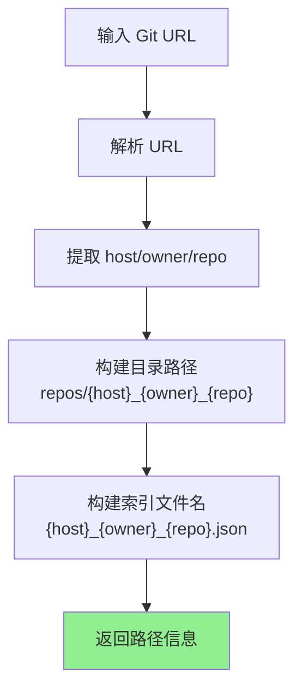

**URL 解析示例**：

| 输入 URL | 仓库目录 | 索引文件 |
|----------|----------|----------|
| `https://github.com/shetengteng/skillix-hub` | `repos/github.com_shetengteng_skillix-hub/` | `github.com_shetengteng_skillix-hub.json` |
| `https://gitlab.com/org/skills` | `repos/gitlab.com_org_skills/` | `gitlab.com_org_skills.json` |
| `git@github.com:user/repo.git` | `repos/github.com_user_repo/` | `github.com_user_repo.json` |

#### 6.6.2 首次同步

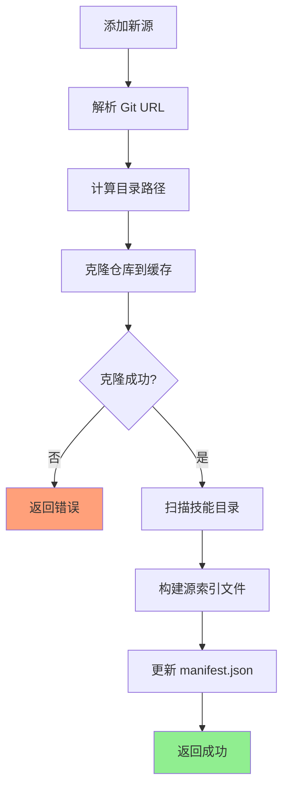

#### 6.6.3 更新同步

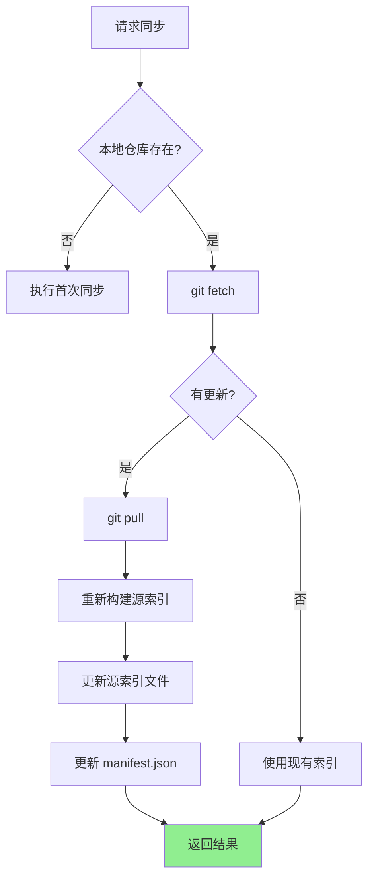

### 6.7 Git 操作说明

#### 6.7.1 URL 解析规则

| URL 格式 | 解析结果 |
|----------|----------|
| `https://github.com/owner/repo` | host=github.com, owner=owner, repo=repo |
| `https://github.com/owner/repo.git` | host=github.com, owner=owner, repo=repo |
| `git@github.com:owner/repo.git` | host=github.com, owner=owner, repo=repo |

**生成规则**：
- 仓库目录：`repos/{host}_{owner}_{repo}/`
- 索引文件：`{host}_{owner}_{repo}.json`
- 源 ID：`{host}/{owner}/{repo}`

#### 6.7.2 Git 克隆策略

使用 sparse-checkout 优化克隆：
- `--depth 1`：浅克隆，只获取最新提交
- `--filter=blob:none`：延迟加载文件内容
- `sparse-checkout set skills`：只检出 skills 目录

### 6.8 索引构建说明

**构建流程**：
1. 扫描 `skills/` 目录下的所有子目录
2. 读取每个子目录的 `SKILL.md` 文件
3. 解析 YAML frontmatter 提取元数据
4. 检查可选目录（scripts/references/assets）
5. 生成源索引文件并更新 manifest.json

**跳过条件**：
- 缺少 `SKILL.md` 文件
- 元数据不完整（缺少 name 或 description）

### 6.9 多源并行同步

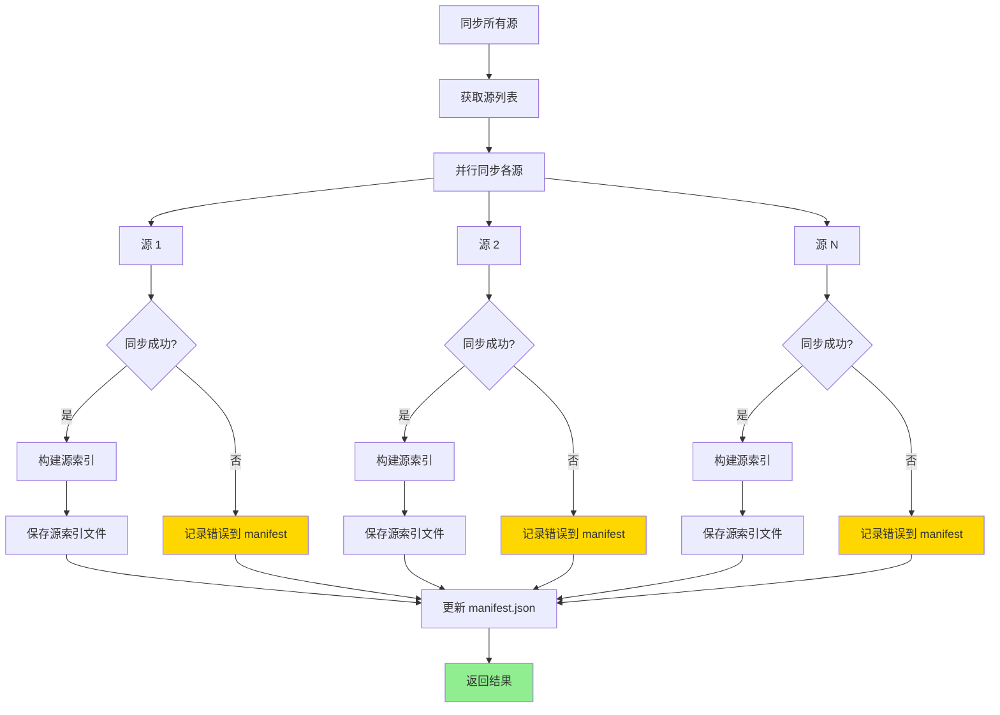

**并行同步优势**：
- 各源独立索引文件，无并发写入冲突
- 单个源失败不影响其他源
- manifest.json 最后统一更新

### 6.10 搜索实现

#### 6.10.1 搜索流程

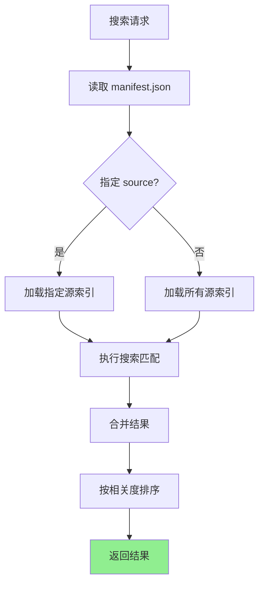

#### 6.10.2 搜索响应格式

```json
{
  "success": true,
  "message": "找到 5 个技能（来自 2 个源）",
  "data": {
    "total": 5,
    "results": [
      {
        "name": "pdf-converter",
        "description": "PDF 文件格式转换工具",
        "version": "1.2.0",
        "tags": ["pdf", "converter"],
        "sourceId": "github.com/shetengteng/skillix-hub",
        "sourceName": "official",
        "author": "skillix"
      }
    ],
    "sourceStatus": [
      {
        "id": "github.com/shetengteng/skillix-hub",
        "name": "official",
        "status": "synced",
        "skillCount": 3,
        "lastSync": "2026-01-14T10:00:00.000Z",
        "commit": "abc123"
      },
      {
        "id": "github.com/company/team-skills",
        "name": "team",
        "status": "synced",
        "skillCount": 2,
        "lastSync": "2026-01-14T09:30:00.000Z",
        "commit": "def456"
      },
      {
        "id": "gitlab.com/org/custom-skills",
        "name": "custom",
        "status": "error",
        "error": "仓库不存在或无访问权限"
      }
    ]
  },
  "warnings": [
    "技能源 \"custom\" (gitlab.com/org/custom-skills) 同步失败: 仓库不存在或无访问权限"
  ]
}
```

### 6.11 配置选项

```json
{
  "market": {
    "sync": {
      "autoSync": true,
      "syncInterval": 3600,
      "skillsPath": "skills",
      "sparseCheckout": true
    },
    "git": {
      "depth": 1,
      "timeout": 60000
    }
  }
}
```

| 配置项 | 类型 | 默认值 | 说明 |
|--------|------|--------|------|
| sync.autoSync | boolean | true | 自动同步 |
| sync.syncInterval | number | 3600 | 同步间隔（秒） |
| sync.skillsPath | string | "skills" | 技能目录路径 |
| sync.sparseCheckout | boolean | true | 使用 sparse-checkout |
| git.depth | number | 1 | 克隆深度 |
| git.timeout | number | 60000 | Git 操作超时（毫秒） |

### 6.12 类型定义

```typescript
/**
 * 技能源状态
 */
export type SourceStatus = 
  | 'synced'         // 已同步
  | 'syncing'        // 同步中
  | 'outdated'       // 需要更新
  | 'error'          // 同步错误
  | 'not_synced';    // 未同步

/**
 * 聚合清单
 */
export interface Manifest {
  version: string;
  updatedAt: string;
  sources: ManifestSource[];
}

/**
 * 清单中的源信息
 */
export interface ManifestSource {
  /** 源唯一标识（基于 URL 路径） */
  id: string;
  /** 用户定义的源名称（别名） */
  name: string;
  /** Git 仓库 URL */
  url: string;
  /** 分支名称 */
  branch: string;
  /** 最后同步的 commit hash */
  commit?: string;
  /** 最后同步时间 */
  syncedAt?: string;
  /** 技能数量 */
  skillCount?: number;
  /** 同步状态 */
  status: SourceStatus;
  /** 对应的索引文件路径 */
  indexFile?: string;
  /** 错误信息 */
  error?: string;
}

/**
 * 源索引
 */
export interface SourceIndex {
  version: string;
  generatedAt: string;
  source: {
    id: string;
    name: string;
    url: string;
    branch: string;
    commit: string;
  };
  skills: SkillIndexItem[];
}

/**
 * 技能索引项
 */
export interface SkillIndexItem {
  name: string;
  description: string;
  version: string;
  author: string;
  tags: string[];
  path: string;
  hasScripts: boolean;
  hasReferences: boolean;
  hasAssets: boolean;
}

/**
 * 技能源同步结果
 */
export interface SourceSyncResult {
  id: string;
  name: string;
  url: string;
  status: SourceStatus;
  skillCount?: number;
  lastSync?: string;
  commit?: string;
  error?: string;
}
```

### 6.13 错误处理

| 错误场景 | 处理方式 | 用户提示 |
|----------|----------|----------|
| 仓库不存在 | 标记错误，跳过 | "仓库不存在或无访问权限" |
| 网络超时 | 使用缓存（如有） | "同步超时，使用缓存数据" |
| 无 skills 目录 | 标记为空源 | "未找到 skills 目录" |
| Git 错误 | 记录详细错误 | "Git 操作失败: {error}" |
| 所有源失败 | 返回错误 | "所有技能源同步失败" |

---

## 七、缓存机制

### 7.1 缓存结构

> **注意**：缓存结构已在 6.4 节详细说明，此处为简要回顾。

```
~/.skillix/cache/
├── repos/                                      # 仓库缓存（扁平化命名）
│   └── {host}_{owner}_{repo}/                  # 扁平化目录名
│       ├── .git/
│       └── skills/
├── indexes/                                    # 索引缓存
│   ├── sources/                                # 各源独立索引
│   │   └── {host}_{owner}_{repo}.json
│   └── manifest.json                           # 聚合清单
└── downloads/                                  # 下载临时目录
    └── {skill-name}/                           # 技能下载临时文件
```

### 7.2 缓存策略

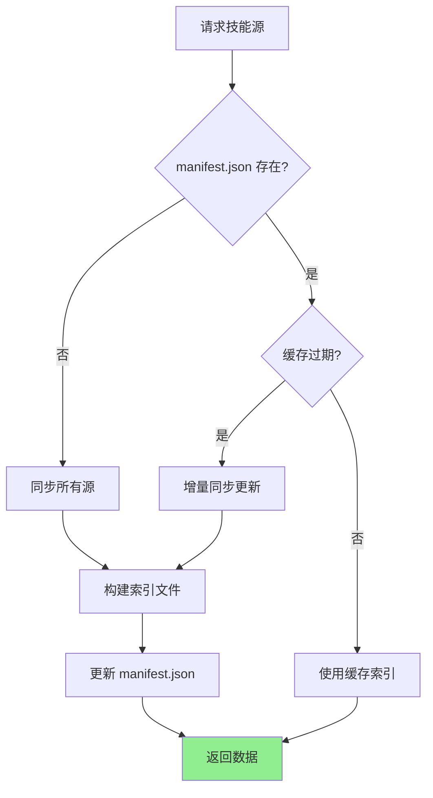

**缓存过期判断**：
- 检查 manifest.json 中各源的 `syncedAt` 时间
- 与配置的 `cache.ttl` 比较
- 过期的源执行增量同步

### 7.3 缓存配置

| 配置项 | 类型 | 默认值 | 说明 |
|--------|------|--------|------|
| cache.enabled | boolean | true | 启用缓存 |
| cache.ttl | number | 3600 | 缓存有效期（秒） |
| cache.maxSize | string | "100MB" | 最大缓存大小 |

---

## 八、错误处理

### 8.1 错误场景

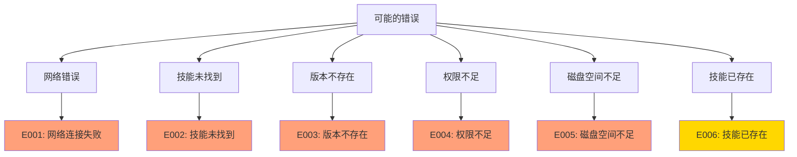

### 8.2 错误响应

| 错误码 | 错误类型 | 说明 | 建议操作 |
|--------|----------|------|----------|
| E001 | 网络错误 | 无法连接到技能源 | 检查网络连接 |
| E002 | 未找到 | 技能不存在 | 检查技能名称或换源 |
| E003 | 版本错误 | 指定版本不存在 | 使用有效版本 |
| E004 | 权限错误 | 无写入权限 | 检查目录权限 |
| E005 | 空间不足 | 磁盘空间不足 | 清理磁盘空间 |
| E006 | 已存在 | 技能已安装 | 使用 force 参数覆盖 |

### 8.3 重试策略

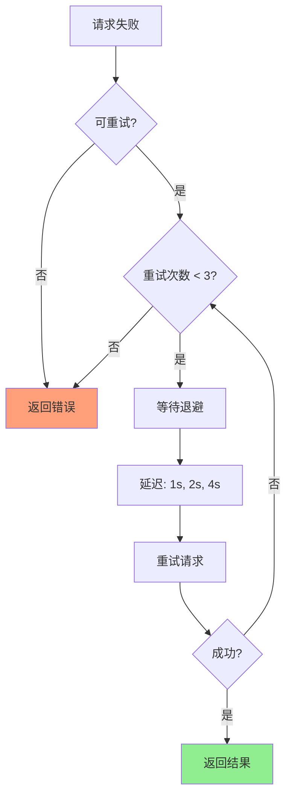

---

## 九、安全机制

### 9.1 技能验证

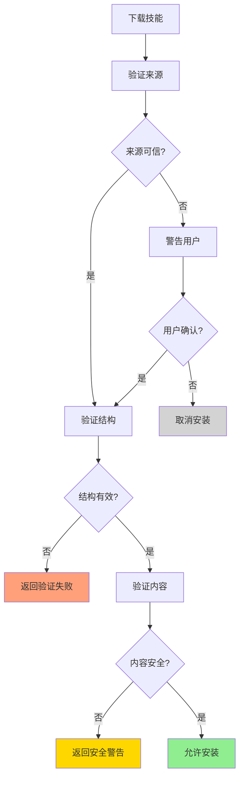

### 9.2 验证规则

| 验证项 | 说明 | 失败处理 |
|--------|------|----------|
| 来源验证 | 检查技能源是否在配置列表中 | 警告用户 |
| 结构验证 | 检查 SKILL.md 是否存在且格式正确 | 拒绝安装 |
| 内容验证 | 检查是否包含危险代码 | 警告用户 |
| 完整性验证 | 检查文件是否完整 | 重新下载 |

### 9.3 危险模式检测

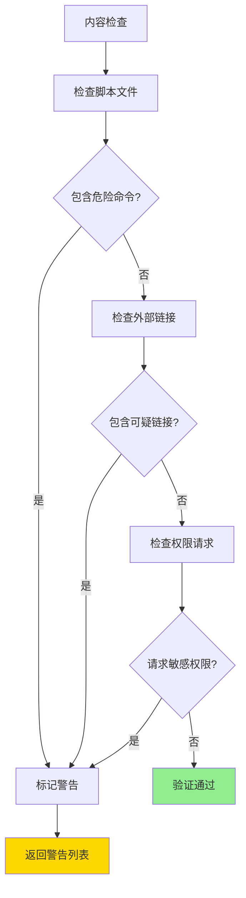

---

## 十、使用场景

### 10.1 搜索并安装技能

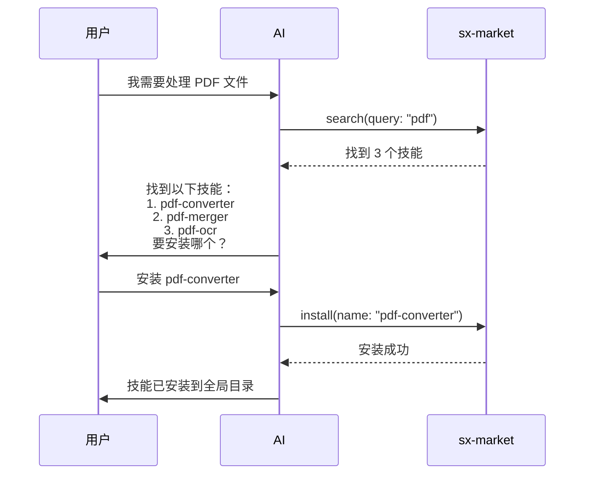

### 10.2 从指定源安装

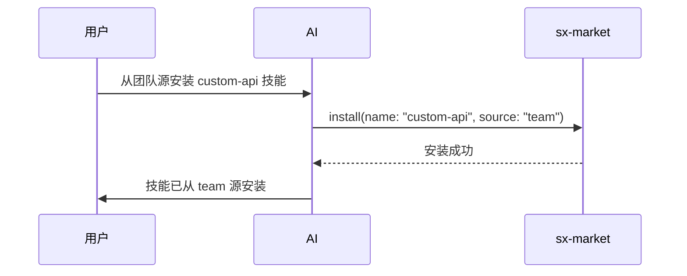

### 10.3 安装到项目

```mermaid
sequenceDiagram
    participant U as 用户
    participant AI as AI
    participant M as sx-market
    
    U->>AI: 把 api-doc-gen 安装到当前项目
    AI->>M: install(name: "api-doc-gen", scope: "project")
    M-->>AI: 安装成功
    AI->>U: 技能已安装到 .skillix/skills/
```

### 10.4 卸载技能

```mermaid
sequenceDiagram
    participant U as 用户
    participant AI as AI
    participant M as sx-market
    
    U->>AI: 卸载 pdf-converter 技能
    AI->>M: uninstall(name: "pdf-converter")
    M-->>AI: 卸载成功
    AI->>U: 技能已卸载
```

---

## 十一、与其他工具的集成

### 11.1 与 sx-triage 集成

```mermaid
sequenceDiagram
    participant U as 用户
    participant AI as AI
    participant T as sx-triage
    participant M as sx-market
    participant S as sx-skill
    
    U->>AI: 帮我生成 API 文档
    AI->>T: triage(task: "生成 API 文档")
    T->>S: list(scope: "all")
    S-->>T: 本地无匹配
    T->>M: search(query: "api documentation")
    M-->>T: 找到 api-doc-gen
    T-->>AI: INSTALL, skill: api-doc-gen
    AI->>U: 市场有这个技能，是否安装？
    U->>AI: 是
    AI->>M: install(name: "api-doc-gen")
    M-->>AI: 安装成功
    AI->>S: read(name: "api-doc-gen")
    S-->>AI: 技能内容
    AI->>U: 按照技能指引执行...
```

### 11.2 与 sx-config 集成

```mermaid
sequenceDiagram
    participant U as 用户
    participant AI as AI
    participant C as sx-config
    participant M as sx-market
    
    U->>AI: 添加团队技能源并搜索技能
    AI->>C: sources(action: "add", name: "team", url: "...")
    C-->>AI: 源已添加
    AI->>M: search(query: "api", source: "team")
    M-->>AI: 搜索结果
    AI->>U: 在团队源找到以下技能...
```

### 11.3 工具关系图

```mermaid
flowchart TD
    subgraph sx-config
        A[sources]
    end
    
    subgraph sx-market
        B[search]
        C[install]
        D[uninstall]
    end
    
    subgraph sx-skill
        E[list]
        F[read]
    end
    
    subgraph sx-triage
        G[analyze]
    end
    
    A -->|提供源配置| B
    B -->|搜索结果| C
    C -->|安装后| E
    D -->|卸载后| E
    G -->|查询市场| B
    G -->|推荐安装| C
    E -->|技能列表| G
    
    style B fill:#87CEEB
    style C fill:#90EE90
    style D fill:#FFA07A
```

---

## 十二、配置选项

### 12.1 市场配置

| 配置项 | 类型 | 默认值 | 说明 |
|--------|------|--------|------|
| searchTimeout | number | 5000 | 搜索超时（毫秒） |
| downloadTimeout | number | 30000 | 下载超时（毫秒） |
| maxRetries | number | 3 | 最大重试次数 |
| verifySource | boolean | true | 验证技能源 |
| autoUpdate | boolean | false | 自动更新已安装技能 |

> 同步相关配置见 6.11 节。

### 12.2 全局配置示例

```json
{
  "market": {
    "searchTimeout": 5000,
    "downloadTimeout": 30000,
    "maxRetries": 3,
    "verifySource": true,
    "autoUpdate": false
  },
  "sources": [
    {
      "name": "official",
      "url": "https://github.com/shetengteng/skillix-hub",
      "branch": "main",
      "default": true
    },
    {
      "name": "team",
      "url": "https://github.com/company/team-skills",
      "branch": "main"
    },
    {
      "name": "custom",
      "url": "https://gitlab.com/org/custom-skills",
      "branch": "develop"
    }
  ]
}
```

**说明**：
- `name` 是用户定义的别名，用于搜索/安装时指定源
- `url` 是 Git 仓库地址，系统会自动解析并映射到本地缓存目录
- 同一个 URL 只能添加一次，但可以有不同的别名

---

## 十三、输入输出设计

### 13.1 工具参数 Schema

```typescript
{
  name: "sx-market",
  description: "技能市场：搜索、安装、卸载、同步、状态",
  inputSchema: {
    type: "object",
    properties: {
      action: {
        type: "string",
        enum: ["search", "install", "uninstall", "sync", "status"],
        description: "操作类型"
      },
      query: {
        type: "string",
        description: "搜索关键词（search 时需要）"
      },
      name: {
        type: "string",
        description: "技能名称（install/uninstall 时需要）"
      },
      source: {
        type: "string",
        description: "技能源名称（search/install/sync/status 时可选）"
      },
      scope: {
        type: "string",
        enum: ["global", "project"],
        description: "操作范围（默认 global）"
      },
      tags: {
        type: "array",
        items: { type: "string" },
        description: "按标签筛选（search 时可选）"
      },
      force: {
        type: "boolean",
        description: "强制操作（install 覆盖已存在/sync 忽略缓存有效期）"
      },
      limit: {
        type: "number",
        description: "结果数量限制（search 时可选）"
      },
      projectRoot: {
        type: "string",
        description: "项目根目录（scope=project 时使用）"
      }
    },
    required: ["action"]
  }
}
```

### 13.2 TypeScript 类型定义

> 完整类型定义见 6.12 节，此处仅列出工具参数类型。

```typescript
/**
 * sx-market 工具参数
 */
export interface SxMarketParams {
  action: 'search' | 'install' | 'uninstall' | 'sync' | 'status';
  query?: string;           // search 时需要
  name?: string;            // install/uninstall 时需要
  source?: string;          // 技能源名称
  scope?: 'global' | 'project';
  tags?: string[];          // search 时可选
  force?: boolean;          // install/sync 时可选
  limit?: number;           // search 时可选
  projectRoot?: string;     // scope=project 时使用
}
```

---

## 十四、最佳实践

### 14.1 搜索建议

| 建议 | 说明 |
|------|------|
| 使用具体关键词 | "pdf converter" 比 "file" 更精确 |
| 结合标签筛选 | 使用 tags 缩小范围 |
| 指定源 | 如果知道技能在哪个源，直接指定 |

### 14.2 安装建议

| 建议 | 说明 |
|------|------|
| 优先全局安装 | 通用技能安装到全局 |
| 项目特定技能 | 项目专用技能安装到项目 |
| 指定版本 | 生产环境指定具体版本 |

### 14.3 卸载建议

| 建议 | 说明 |
|------|------|
| 确认范围 | 明确是卸载全局还是项目技能 |
| 检查依赖 | 确保没有其他技能依赖 |

---

## 十五、扩展操作设计

### 15.1 sync 操作（同步源缓存）

> **更新已安装技能**：先执行 `sync` 更新缓存，再使用 `install --force` 重新安装。

#### 15.1.1 同步参数

| 参数 | 类型 | 必需 | 说明 |
|------|------|------|------|
| action | string | ✅ | 固定为 "sync" |
| source | string | ❌ | 指定源名称，不指定则同步所有 |
| force | boolean | ❌ | 强制同步（忽略缓存有效期） |

#### 15.1.2 同步响应

```json
{
  "success": true,
  "message": "同步完成，2 个成功，1 个失败",
  "data": {
    "synced": [
      { "name": "official", "skillCount": 15, "newSkills": 2 },
      { "name": "team", "skillCount": 8, "newSkills": 0 }
    ],
    "failed": [
      { "name": "custom", "error": "网络超时" }
    ]
  }
}
```

---

### 15.2 status 操作（查看源状态）

#### 15.2.1 状态参数

| 参数 | 类型 | 必需 | 说明 |
|------|------|------|------|
| action | string | ✅ | 固定为 "status" |
| source | string | ❌ | 指定源名称，不指定则显示所有 |

#### 15.2.2 状态响应

```json
{
  "success": true,
  "message": "3 个源，2 个已同步，1 个错误",
  "data": {
    "sources": [
      {
        "name": "official",
        "id": "github.com/shetengteng/skillix-hub",
        "status": "synced",
        "lastSync": "2026-01-19T10:00:00.000Z",
        "commit": "abc123",
        "skillCount": 15,
        "cacheSize": "12.5 MB"
      },
      {
        "name": "team",
        "id": "github.com/company/team-skills",
        "status": "outdated",
        "lastSync": "2026-01-18T10:00:00.000Z",
        "commit": "def456",
        "skillCount": 8,
        "cacheSize": "5.2 MB"
      },
      {
        "name": "custom",
        "id": "gitlab.com/org/custom-skills",
        "status": "error",
        "error": "仓库不存在或无访问权限"
      }
    ],
    "totalCacheSize": "17.7 MB"
  }
}
```

---

### 15.3 私有仓库认证

#### 15.3.1 认证方式

| 方式 | 配置 | 说明 |
|------|------|------|
| SSH | 无需配置 | 依赖系统 `~/.ssh/` 配置 |
| Token | `auth.token` | GitHub/GitLab Personal Access Token |
| 环境变量 | `auth.envVar` | 从环境变量读取 Token |

#### 15.3.2 配置示例

```json
{
  "sources": [
    {
      "name": "private-team",
      "url": "https://github.com/company/private-skills",
      "branch": "main",
      "auth": {
        "type": "token",
        "token": "ghp_xxxxxxxxxxxx"
      }
    },
    {
      "name": "env-auth",
      "url": "https://github.com/company/skills",
      "branch": "main",
      "auth": {
        "type": "env",
        "envVar": "GITHUB_TOKEN"
      }
    },
    {
      "name": "ssh-source",
      "url": "git@github.com:company/skills.git",
      "branch": "main"
    }
  ]
}
```

---

### 15.4 安装记录格式

#### 15.4.1 文件位置

- 全局：`~/.skillix/installed.json`
- 项目：`{projectRoot}/.skillix/installed.json`

#### 15.4.2 完整格式

```json
{
  "version": "1.0.0",
  "updatedAt": "2026-01-19T10:00:00.000Z",
  "skills": [
    {
      "name": "pdf-converter",
      "sourceId": "github.com/shetengteng/skillix-hub",
      "sourceName": "official",
      "installedAt": "2026-01-19T10:00:00.000Z",
      "updatedAt": "2026-01-19T10:00:00.000Z",
      "path": "~/.skillix/skills/pdf-converter/",
      "commit": "abc123def456"
    }
  ]
}
```

---

## 十六、操作类型汇总

| 操作 | 说明 | 阶段 |
|------|------|------|
| search | 搜索技能 | Phase 1 |
| install | 安装技能（支持 force 覆盖） | Phase 1 |
| uninstall | 卸载技能 | Phase 1 |
| sync | 同步源缓存 | Phase 2 |
| status | 查看源状态 | Phase 2 |

> **更新已安装技能**：`sync` + `install --force`

---

## 十七、与 sx-triage 的协作

### 17.1 协作弥补

sx-triage 智能分流机制可以弥补部分不足：

| 局限 | sx-triage 弥补情况 |
|------|-------------------|
| 搜索功能较弱 | ✅ **已弥补** - sx-triage 提供智能匹配算法（TF-IDF、余弦相似度） |
| 缺少技能预览 | ✅ **已弥补** - 分流后调用 `sx-skill read` 实现预览 |
| 离线场景 | ⚠️ **部分弥补** - sx-triage 有降级策略，网络错误时仅使用本地技能 |
| 技能依赖关系 | ⚠️ **部分弥补** - sx-triage 有 `COMPOSE` 操作支持组合技能 |

### 17.2 推荐使用方式

```mermaid
flowchart LR
    A[用户请求] --> B[sx-triage<br/>智能分流]
    B --> C{决策}
    C -->|本地有| D[sx-skill read]
    C -->|市场有| E[sx-market install]
    C -->|都没有| F[sx-skill create]
    
    style B fill:#87CEEB
```

**建议**：
- 用户通过 sx-triage 作为入口，由其自动判断是否需要调用 sx-market
- sx-triage 的智能匹配弥补了 sx-market 简单搜索的不足
- 降级策略提供了一定的容错能力

---

*本文档为 sx-market 技能市场设计文档*
*最后更新: 2026-01-19*
