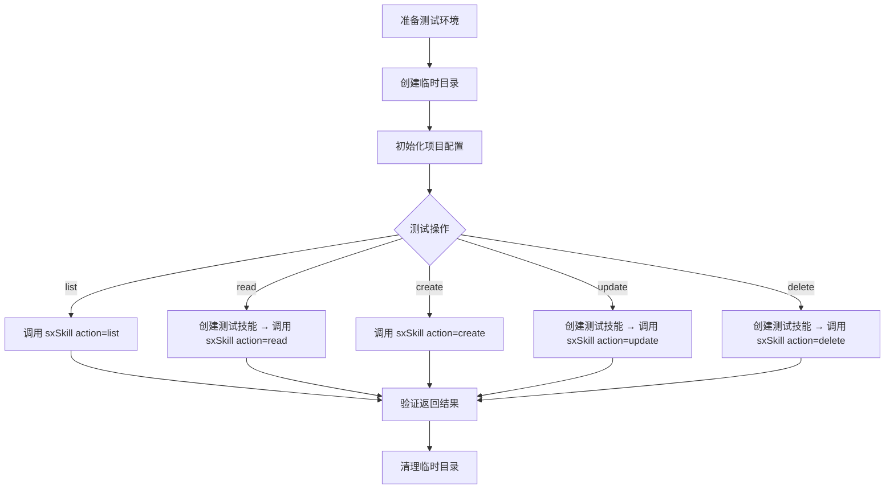

# Skillix 测试计划

> 日期: 2026-01-11
> 状态: 已实现

---

## 一、测试策略概览

### 1.1 测试层次

```
┌─────────────────────────────────────────────────────────┐
│                    E2E 测试 (端到端)                      │
│              验证完整的 MCP 工具调用流程                    │
├─────────────────────────────────────────────────────────┤
│                    集成测试                               │
│           验证服务层与工具层的协作                          │
├─────────────────────────────────────────────────────────┤
│                    单元测试 ✅ 已实现                      │
│        验证各个模块的独立功能                              │
└─────────────────────────────────────────────────────────┘
```

### 1.2 测试框架选型

| 框架 | 用途 | 说明 |
|------|------|------|
| **Vitest** ✅ | 单元测试 + 集成测试 | 快速、TypeScript 原生支持 |
| **@modelcontextprotocol/sdk** | MCP 测试 | 模拟 MCP 客户端 |

### 1.3 当前测试状态

```
测试文件: 8 个
测试用例: 107 个
通过率: 100%
```

---

## 二、已实现的单元测试

### 2.1 工具函数测试 (`tests/utils/`)

#### fs.test.ts ✅ (25 个测试)

```typescript
describe('fs utils', () => {
  describe('exists', () => {
    ✅ 'should return true for existing file'
    ✅ 'should return false for non-existing file'
    ✅ 'should return true for existing directory'
  });

  describe('isDirectory', () => {
    ✅ 'should return true for directory'
    ✅ 'should return false for file'
  });

  describe('isFile', () => {
    ✅ 'should return true for file'
    ✅ 'should return false for directory'
  });

  describe('readFile', () => {
    ✅ 'should read file content'
    ✅ 'should throw for non-existing file'
  });

  describe('writeFile', () => {
    ✅ 'should write content to file'
    ✅ 'should create parent directories if not exist'
  });

  describe('readJson', () => {
    ✅ 'should parse JSON file'
    ✅ 'should return null for non-existing file'
    ✅ 'should return null for invalid JSON'
  });

  describe('writeJson', () => {
    ✅ 'should write JSON with formatting'
  });

  describe('ensureDir', () => {
    ✅ 'should create directory recursively'
    ✅ 'should not throw if directory exists'
  });

  describe('removeDir', () => {
    ✅ 'should remove directory recursively'
    ✅ 'should return true for non-existing directory (force mode)'
  });

  describe('listDir', () => {
    ✅ 'should list directory contents'
    ✅ 'should return empty array for non-existing directory'
  });

  describe('listSubDirs', () => {
    ✅ 'should list only subdirectories'
    ✅ 'should return empty array for non-existing directory'
  });

  describe('copyFile', () => {
    ✅ 'should copy file'
  });

  describe('copyDir', () => {
    ✅ 'should copy directory recursively'
  });
});
```

#### paths.test.ts ✅ (12 个测试)

```typescript
describe('paths utils', () => {
  ✅ 'getGlobalDir - should return ~/.skillix path'
  ✅ 'getGlobalConfigPath - should return ~/.skillix/config.json path'
  ✅ 'getGlobalSkillsDir - should return ~/.skillix/skills path'
  ✅ 'getProjectDir - should return {projectRoot}/.skillix path'
  ✅ 'getProjectConfigPath - should return {projectRoot}/.skillix/config.json path'
  ✅ 'getProjectSkillsDir - should return {projectRoot}/.skillix/skills path'
  ✅ 'getSkillDir - should return {skillsDir}/{skillName} path'
  ✅ 'getSkillMdPath - should return {skillDir}/SKILL.md path'
  ✅ 'getSkillScriptsDir - should return {skillDir}/scripts path'
  ✅ 'getSkillReferencesDir - should return {skillDir}/references path'
  ✅ 'getSkillAssetsDir - should return {skillDir}/assets path'
  ✅ 'getSkillLogsDir - should return {skillDir}/logs path'
});
```

#### markdown.test.ts ✅ (13 个测试)

```typescript
describe('markdown utils', () => {
  describe('parseFrontmatter', () => {
    ✅ 'should parse YAML frontmatter'
    ✅ 'should handle simple frontmatter'
    ✅ 'should return empty metadata for no frontmatter'
    ✅ 'should handle empty content'
  });

  describe('parseSkillMetadata', () => {
    ✅ 'should extract skill metadata from SKILL.md'
    ✅ 'should provide default values for missing fields'
  });

  describe('generateSkillMd', () => {
    ✅ 'should generate valid SKILL.md content'
    ✅ 'should handle optional fields'
    ✅ 'should be parseable by parseFrontmatter'
  });

  describe('getSkillBody', () => {
    ✅ 'should extract body from SKILL.md'
  });

  describe('extractTitle', () => {
    ✅ 'should extract title from markdown'
    ✅ 'should return null for no title'
  });

  describe('extractSections', () => {
    ✅ 'should extract sections from markdown'
  });
});
```

### 2.2 服务层测试 (`tests/services/`)

#### skill.test.ts ✅ (16 个测试)

```typescript
describe('skill service', () => {
  describe('listProjectSkills', () => {
    ✅ 'should list project skills'
    ✅ 'should return empty array when no project skills exist'
  });

  describe('getSkill with projectRoot', () => {
    ✅ 'should get project skill'
    ✅ 'should return null for non-existing skill'
  });

  describe('readSkillContent with projectRoot', () => {
    ✅ 'should read skill content'
    ✅ 'should return null for non-existing skill'
  });

  describe('createSkill', () => {
    ✅ 'should create project skill'
    ✅ 'should create skill with all metadata'
  });

  describe('updateSkill', () => {
    ✅ 'should update existing skill'
    ✅ 'should update skill body'
    ✅ 'should return null for non-existing skill'
  });

  describe('deleteSkill', () => {
    ✅ 'should delete existing skill'
    ✅ 'should return false for non-existing skill'
  });

  describe('skillExists', () => {
    ✅ 'should return true for existing skill'
    ✅ 'should return false for non-existing skill'
  });

  describe('searchSkills', () => {
    ✅ 'should search skills by name'
  });
});
```

#### config.test.ts ✅ (13 个测试)

```typescript
describe('config service', () => {
  describe('getGlobalConfig', () => {
    ✅ 'should return config with required properties'
  });

  describe('getProjectConfig', () => {
    ✅ 'should return null when no project config exists'
    ✅ 'should read existing project config'
  });

  describe('saveProjectConfig', () => {
    ✅ 'should save project config'
  });

  describe('initProjectConfig', () => {
    ✅ 'should initialize project config'
    ✅ 'should create skills directory'
    ✅ 'should accept custom options'
  });

  describe('getEffectiveConfig', () => {
    ✅ 'should return effective config'
    ✅ 'should use project config when available'
  });

  describe('addSource', () => {
    ✅ 'should add source to project config'
  });

  describe('removeSource', () => {
    ✅ 'should remove source from project config'
    ✅ 'should return false for non-existing source'
  });

  describe('getAllSources', () => {
    ✅ 'should return all effective sources'
  });
});
```

### 2.3 工具层测试 (`tests/tools/`)

#### skills.test.ts ✅ (14 个测试)

```typescript
describe('sx-skill tool', () => {
  describe('list action', () => {
    ✅ 'should list project skills'
    ✅ 'should list skills with scope filter'
  });

  describe('read action', () => {
    ✅ 'should read existing project skill'
    ✅ 'should fail without name parameter'
    ✅ 'should fail for non-existing skill'
  });

  describe('create action', () => {
    ✅ 'should create new project skill'
    ✅ 'should fail without name parameter'
  });

  describe('update action', () => {
    ✅ 'should update existing project skill'
    ✅ 'should fail without name parameter'
    ✅ 'should fail for non-existing skill'
  });

  describe('delete action', () => {
    ✅ 'should delete existing project skill'
    ✅ 'should fail without name parameter'
    ✅ 'should fail for non-existing skill'
  });

  describe('unknown action', () => {
    ✅ 'should fail for unknown action'
  });
});
```

#### configs.test.ts ✅ (9 个测试)

```typescript
describe('sx-config tool', () => {
  describe('get action', () => {
    ✅ 'should get global config'
    ✅ 'should get project config'
    ✅ 'should get effective config'
  });

  describe('set action', () => {
    ✅ 'should set global config value'
    ✅ 'should fail without key parameter'
  });

  describe('init action', () => {
    ✅ 'should initialize project config'
    ✅ 'should fail without projectRoot'
  });

  describe('sources action', () => {
    ✅ 'should list sources'
  });

  describe('unknown action', () => {
    ✅ 'should fail for unknown action'
  });
});
```

#### helps.test.ts ✅ (5 个测试)

```typescript
describe('sx-help tool', () => {
  ✅ 'overview topic - should return overview help'
  ✅ 'skill topic - should return skill help'
  ✅ 'config topic - should return config help'
  ✅ 'default topic - should return overview for undefined topic'
  ✅ 'unknown topic - should handle unknown topic gracefully'
});
```

---

## 三、测试数据准备

### 3.1 测试夹具 (Fixtures) ✅

位置: `tests/fixtures/skills.ts`

```typescript
export const TEST_SKILL_METADATA = {
  name: 'test-skill',
  description: 'A test skill for unit testing',
  version: '1.0.0',
  author: 'test',
  tags: ['test', 'unit'],
};

export const TEST_SKILL_MD = `---
name: test-skill
description: A test skill for unit testing
version: 1.0.0
author: test
tags:
  - test
  - unit
---

# Test Skill
...
`;

export const SIMPLE_SKILL_MD = `---
name: simple-skill
description: A simple test skill
---

# Simple Skill

Basic content.
`;

export const INVALID_SKILL_MD = `
# No Frontmatter Skill

This skill has no YAML frontmatter.
`;
```

### 3.2 测试工具函数 ✅

位置: `tests/helpers/setup.ts`

```typescript
export function createTempDir(): string;
export function cleanupTempDir(dir: string): void;
export function createTestSkill(skillsDir: string, name: string, content: string): string;
export function createTestConfig(configDir: string, config: object): string;
```

---

## 四、测试执行

### 4.1 命令

```bash
# 运行所有测试
npm test

# 运行测试（单次）
npm run test:run

# 运行测试（带覆盖率）
npm run test:coverage
```

### 4.2 配置

位置: `vitest.config.ts`

```typescript
export default defineConfig({
  test: {
    globals: true,
    environment: 'node',
    include: ['tests/**/*.test.ts'],
    coverage: {
      provider: 'v8',
      reporter: ['text', 'json', 'html'],
      include: ['src/**/*.ts'],
      exclude: ['src/index.ts'],
    },
  },
});
```

---

## 五、测试流程说明

### 5.1 测试设计原则

#### 5.1.1 测试结构（AAA 模式）

每个测试用例遵循 **Arrange-Act-Assert** 模式：

```typescript
it('should create project skill', async () => {
  // Arrange - 准备测试数据和环境
  const skillName = 'test-skill';
  const metadata = { name: skillName, description: 'Test' };
  
  // Act - 执行被测试的操作
  const result = skillService.createSkill(skillName, metadata, '', 'project', projectRoot);
  
  // Assert - 验证结果
  expect(result).toBeDefined();
  expect(result.name).toBe(skillName);
});
```

#### 5.1.2 测试隔离

每个测试使用独立的临时目录，避免测试间相互影响：

```typescript
describe('skill service', () => {
  let tempDir: string;
  let projectRoot: string;
  
  beforeEach(() => {
    // 创建临时目录
    tempDir = createTempDir();
    projectRoot = path.join(tempDir, 'test-project');
    fs.mkdirSync(projectRoot, { recursive: true });
  });
  
  afterEach(() => {
    // 清理临时目录
    cleanupTempDir(tempDir);
  });
});
```

### 5.2 Tools 测试流程

#### 5.2.1 sx-skill 工具测试流程



#### 5.2.2 测试用例示例

**list 操作测试**：
```typescript
it('should list project skills', async () => {
  // Arrange: 创建测试技能
  createTestSkill(projectSkillsDir, 'skill-1', TEST_SKILL_MD);
  createTestSkill(projectSkillsDir, 'skill-2', SIMPLE_SKILL_MD);
  
  // Act: 调用 list 操作
  const result = sxSkill({ action: 'list', scope: 'project', projectRoot });
  
  // Assert: 验证结果
  expect(result.success).toBe(true);
  expect(result.data.skills).toHaveLength(2);
});
```

**create 操作测试**：
```typescript
it('should create new project skill', async () => {
  // Arrange: 准备元数据
  const metadata = {
    name: 'new-skill',
    description: 'A new skill',
    version: '1.0.0',
  };
  
  // Act: 调用 create 操作
  const result = sxSkill({
    action: 'create',
    name: 'new-skill',
    scope: 'project',
    projectRoot,
    metadata,
    body: '# New Skill\n\nContent here.',
  });
  
  // Assert: 验证结果
  expect(result.success).toBe(true);
  expect(result.data.name).toBe('new-skill');
  
  // 验证文件已创建
  const skillPath = path.join(projectSkillsDir, 'new-skill', 'SKILL.md');
  expect(fs.existsSync(skillPath)).toBe(true);
});
```

### 5.3 测试执行命令

#### 5.3.1 运行所有测试

```bash
# 运行所有测试（watch 模式）
npm test

# 运行所有测试（单次执行）
npx vitest run

# 运行所有测试（带覆盖率）
npx vitest run --coverage
```

#### 5.3.2 运行单个测试文件

```bash
# 运行指定测试文件
npx vitest run tests/utils/fs.test.ts

# 运行指定目录下的测试
npx vitest run tests/services/

# 运行匹配模式的测试
npx vitest run --testNamePattern="should create"
```

#### 5.3.3 运行单个测试用例

```bash
# 使用 -t 参数指定测试名称
npx vitest run -t "should create project skill"

# 使用 describe 和 it 的组合
npx vitest run -t "sx-skill tool > create action > should create new project skill"
```

#### 5.3.4 调试测试

```bash
# 以 UI 模式运行（可视化界面）
npx vitest --ui

# 以 watch 模式运行单个文件
npx vitest tests/tools/skills.test.ts
```

### 5.4 测试输出示例

```
 ✓ tests/utils/fs.test.ts (25 tests) 45ms
 ✓ tests/utils/paths.test.ts (12 tests) 12ms
 ✓ tests/utils/markdown.test.ts (13 tests) 18ms
 ✓ tests/services/config.test.ts (13 tests) 89ms
 ✓ tests/services/skill.test.ts (16 tests) 156ms
 ✓ tests/tools/skills.test.ts (14 tests) 234ms
 ✓ tests/tools/configs.test.ts (9 tests) 67ms
 ✓ tests/tools/helps.test.ts (5 tests) 8ms

 Test Files  8 passed (8)
      Tests  107 passed (107)
   Start at  10:30:00
   Duration  1.23s
```

---

## 六、测试覆盖率目标

| 模块 | 目标覆盖率 | 当前状态 |
|------|-----------|----------|
| `src/utils/` | 90%+ | ✅ 已测试 |
| `src/services/` | 85%+ | ✅ 已测试 |
| `src/tools/` | 80%+ | ✅ 已测试 |
| `src/index.ts` | 70%+ | 待测试 |
| **总体** | **80%+** | 进行中 |

---

## 六、待实现的测试

### 6.1 集成测试 (P1)

- [ ] 技能生命周期测试
- [ ] 配置管理测试
- [ ] 本地优先策略测试

### 6.2 E2E 测试 (P2)

- [ ] MCP 协议测试
- [ ] 完整工具调用流程测试

### 6.3 边界条件测试 (P2)

- [ ] 并发操作
- [ ] 文件系统异常
- [ ] 大文件处理

---

*本文档为 Skillix 项目测试计划*
*最后更新: 2026-01-11*
