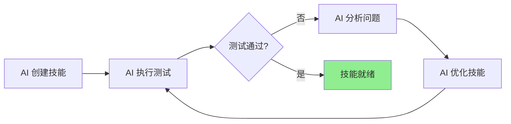
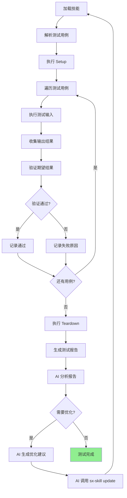
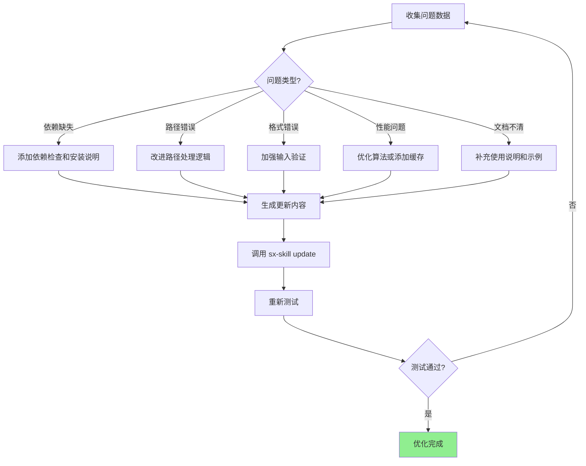

# Skillix 技能测试 Demo

> 日期: 2026-01-14
> 状态: 设计中
> 目标: 演示 AI 如何自动创建、测试、修改优化技能

---

## 一、概述

### 1.1 测试目标

本文档提供一系列技能测试 Demo，用于验证 Skillix 的核心功能：

1. **技能创建** - 通过 `sx-skill action=create` 创建技能
2. **技能测试** - AI 自动验证技能的有效性
3. **技能优化** - 基于测试结果自动改进技能

### 1.2 测试理念

> **AI 闭环测试**: AI 创建 → AI 测试 → AI 优化 → 循环迭代



---

## 二、测试 Demo 列表

### 2.1 Demo 清单

| Demo | 技能名称 | 描述 | 难度 |
|------|---------|------|------|
| Demo 1 | `pdf-to-markdown` | PDF 提取文字转 Markdown | ⭐⭐ |
| Demo 2 | `code-reviewer` | 代码审查助手 | ⭐⭐⭐ |
| Demo 3 | `git-commit-helper` | Git 提交信息生成 | ⭐ |
| Demo 4 | `api-mock-generator` | API Mock 数据生成 | ⭐⭐ |
| Demo 5 | `log-analyzer` | 日志分析器 | ⭐⭐⭐ |

---

## 三、Demo 1: PDF 转 Markdown 技能

### 3.1 需求描述

创建一个技能，能够：
- 读取 PDF 文件内容
- 提取文本并保持结构
- 转换为 Markdown 格式
- 支持中文内容

### 3.2 AI 创建流程

#### 第一步：需求分析对话

```
用户: 我需要一个 PDF 提取文字转 Markdown 的技能

AI: 好的，我来帮你创建这个技能。请问几个问题：
    1. 需要保留 PDF 的排版结构吗？（标题、列表等）
    2. 是否需要处理扫描版 PDF（需要 OCR）？
    3. 输出格式有什么特殊要求？

用户: 需要保留结构，暂时不需要 OCR，输出标准 Markdown

AI: 明白了。我为你规划以下技能结构：

    技能名称: pdf-to-markdown
    核心功能:
    - 提取 PDF 文本内容
    - 识别标题层级
    - 保留列表和段落结构
    - 输出 Markdown 文件
    
    创建到全局还是项目？

用户: 全局

AI: [开始创建技能...]
```

#### 第二步：AI 调用创建

```typescript
// AI 调用 sx-skill 工具
mcp_skillix_sx-skill({
  action: "create",
  name: "pdf-to-markdown",
  metadata: {
    name: "pdf-to-markdown",
    description: "将 PDF 文件转换为 Markdown 格式，提取文本内容并保留结构。当用户需要：(1) 提取 PDF 文字 (2) PDF 转文档 (3) 阅读 PDF 内容时使用此技能。",
    version: "1.0.0",
    author: "skillix-ai",
    tags: ["pdf", "markdown", "converter", "text-extraction"]
  },
  body: `# PDF 转 Markdown

## 使用场景

当需要将 PDF 文件内容转换为可编辑的 Markdown 格式时使用此技能。

## 工作流程

### 1. 准备阶段

确认以下条件：
- 输入 PDF 文件存在且可读
- PDF 为文本型（非扫描版）
- 已安装必要依赖

### 2. 提取文本

使用 Python 脚本提取 PDF 内容：

\`\`\`bash
python scripts/extract_pdf.py input.pdf -o output.md
\`\`\`

### 3. 结构识别

脚本自动识别并转换：
- **标题**: 大字号文本 → # 标题
- **列表**: 项目符号 → - 列表项
- **段落**: 正文内容 → 普通段落
- **代码**: 等宽字体 → \\\`\\\`\\\`代码块\\\`\\\`\\\`

### 4. 输出结果

生成的 Markdown 文件包含：
- 原文标题结构
- 格式化的段落
- 保留的列表和表格

## 脚本说明

### scripts/extract_pdf.py

\`\`\`python
#!/usr/bin/env python3
"""
PDF 文本提取脚本

Usage:
    python extract_pdf.py input.pdf -o output.md
    python extract_pdf.py input.pdf --format markdown
"""

import argparse
from pathlib import Path

def extract_pdf_to_markdown(pdf_path: str, output_path: str) -> str:
    """提取 PDF 内容并转换为 Markdown"""
    try:
        import pdfplumber
    except ImportError:
        print("请安装依赖: pip install pdfplumber")
        return ""
    
    markdown_content = []
    
    with pdfplumber.open(pdf_path) as pdf:
        for i, page in enumerate(pdf.pages, 1):
            # 提取文本
            text = page.extract_text()
            if text:
                # 添加页码标记
                markdown_content.append(f"<!-- Page {i} -->\\n")
                # 处理文本结构
                markdown_content.append(process_text_structure(text))
                markdown_content.append("\\n---\\n")
    
    result = "\\n".join(markdown_content)
    
    # 写入文件
    if output_path:
        Path(output_path).write_text(result, encoding='utf-8')
        print(f"✅ 已保存到: {output_path}")
    
    return result

def process_text_structure(text: str) -> str:
    """处理文本结构，识别标题和列表"""
    lines = text.split("\\n")
    result = []
    
    for line in lines:
        line = line.strip()
        if not line:
            continue
        
        # 简单的标题识别（可扩展）
        if len(line) < 50 and line.isupper():
            result.append(f"## {line.title()}")
        elif line.startswith(('•', '-', '*', '·')):
            result.append(f"- {line[1:].strip()}")
        else:
            result.append(line)
    
    return "\\n\\n".join(result)

if __name__ == "__main__":
    parser = argparse.ArgumentParser(description="PDF 转 Markdown")
    parser.add_argument("input", help="输入 PDF 文件路径")
    parser.add_argument("-o", "--output", help="输出 Markdown 文件路径")
    args = parser.parse_args()
    
    output = args.output or args.input.replace('.pdf', '.md')
    extract_pdf_to_markdown(args.input, output)
\`\`\`

## 依赖安装

\`\`\`bash
pip install pdfplumber
\`\`\`

## 使用示例

### 基本使用

\`\`\`bash
# 转换单个文件
python scripts/extract_pdf.py document.pdf -o document.md

# 使用默认输出名
python scripts/extract_pdf.py report.pdf
# 输出: report.md
\`\`\`

### 批量处理

\`\`\`bash
# 批量转换目录下所有 PDF
for f in *.pdf; do
    python scripts/extract_pdf.py "$f"
done
\`\`\`

## 注意事项

1. **仅支持文本型 PDF** - 扫描版需要 OCR 功能
2. **结构识别有限** - 复杂排版可能需要手动调整
3. **表格支持** - 简单表格可识别，复杂表格建议单独处理
`,
  scope: "global"
})
```

### 3.3 AI 自动测试流程

#### 测试用例设计

```typescript
interface SkillTestCase {
  name: string;
  description: string;
  input: {
    file?: string;
    command: string;
  };
  expected: {
    success: boolean;
    outputContains?: string[];
    outputFormat?: string;
  };
}

const pdfToMarkdownTests: SkillTestCase[] = [
  {
    name: "基本转换测试",
    description: "测试基本 PDF 转换功能",
    input: {
      file: "test-samples/simple.pdf",
      command: "python scripts/extract_pdf.py test-samples/simple.pdf -o output.md"
    },
    expected: {
      success: true,
      outputContains: ["#", "output.md"],
      outputFormat: "markdown"
    }
  },
  {
    name: "中文内容测试",
    description: "测试中文 PDF 处理",
    input: {
      file: "test-samples/chinese.pdf",
      command: "python scripts/extract_pdf.py test-samples/chinese.pdf -o chinese.md"
    },
    expected: {
      success: true,
      outputContains: ["chinese.md"]
    }
  },
  {
    name: "错误处理测试",
    description: "测试文件不存在的错误处理",
    input: {
      command: "python scripts/extract_pdf.py nonexistent.pdf"
    },
    expected: {
      success: false,
      outputContains: ["Error", "not found"]
    }
  }
];
```

#### AI 执行测试

```
AI 测试报告:
━━━━━━━━━━━━━━━━━━━━━━━━━━━━━━━━━━━━━━━━━━━━━━━━━━━
技能: pdf-to-markdown
测试时间: 2026-01-14 10:30:00
━━━━━━━━━━━━━━━━━━━━━━━━━━━━━━━━━━━━━━━━━━━━━━━━━━━

测试用例 1: 基本转换测试
状态: ✅ 通过
输出: 成功生成 output.md，包含 Markdown 标题

测试用例 2: 中文内容测试
状态: ✅ 通过
输出: 成功处理中文内容

测试用例 3: 错误处理测试
状态: ⚠️ 部分通过
问题: 错误信息不够友好，建议改进

━━━━━━━━━━━━━━━━━━━━━━━━━━━━━━━━━━━━━━━━━━━━━━━━━━━
总结: 2/3 通过，1 个需要改进
建议: 优化错误处理逻辑
━━━━━━━━━━━━━━━━━━━━━━━━━━━━━━━━━━━━━━━━━━━━━━━━━━━
```

### 3.4 AI 自动优化

基于测试结果，AI 自动优化技能：

```typescript
// AI 分析测试结果并调用更新
mcp_skillix_sx-skill({
  action: "update",
  name: "pdf-to-markdown",
  body: `... // 更新后的内容，改进错误处理部分

## 错误处理

### 文件不存在

\`\`\`python
if not Path(pdf_path).exists():
    print(f"❌ 错误: 文件 '{pdf_path}' 不存在")
    print("请检查文件路径是否正确")
    sys.exit(1)
\`\`\`

### 依赖缺失

\`\`\`python
try:
    import pdfplumber
except ImportError:
    print("❌ 错误: 缺少依赖 pdfplumber")
    print("请运行: pip install pdfplumber")
    sys.exit(1)
\`\`\`
...`
})
```

---

## 四、Demo 2: 代码审查助手

### 4.1 技能定义

```yaml
name: code-reviewer
description: 自动审查代码，检查代码质量、安全性和最佳实践。
  当用户需要：(1) 代码审查 (2) 检查代码质量 (3) 发现潜在问题时使用。
version: 1.0.0
tags: [code-review, quality, security]
```

### 4.2 AI 创建调用

```typescript
mcp_skillix_sx-skill({
  action: "create",
  name: "code-reviewer",
  metadata: {
    name: "code-reviewer",
    description: "自动审查代码，检查代码质量、安全性和最佳实践。当用户需要：(1) 代码审查 (2) 检查代码质量 (3) 发现潜在问题时使用。",
    version: "1.0.0",
    tags: ["code-review", "quality", "security"]
  },
  body: `# 代码审查助手

## 使用场景

当需要对代码进行质量审查、安全检查或最佳实践验证时使用此技能。

## 审查维度

### 1. 代码质量

检查项：
- [ ] 命名规范（变量、函数、类）
- [ ] 代码复杂度
- [ ] 重复代码
- [ ] 注释完整性
- [ ] 错误处理

### 2. 安全性

检查项：
- [ ] SQL 注入风险
- [ ] XSS 漏洞
- [ ] 敏感信息泄露
- [ ] 权限控制
- [ ] 输入验证

### 3. 最佳实践

检查项：
- [ ] 设计模式使用
- [ ] SOLID 原则遵循
- [ ] 性能优化
- [ ] 可测试性
- [ ] 文档完整性

## 审查流程

### Step 1: 收集代码

\`\`\`
请提供需要审查的代码文件或代码片段。
支持的语言: TypeScript, JavaScript, Python, Go, Java
\`\`\`

### Step 2: 执行审查

按照上述维度逐项检查代码。

### Step 3: 生成报告

输出审查报告，包含：
- 问题列表（按严重程度排序）
- 改进建议
- 优秀实践示例

## 报告模板

\`\`\`markdown
# 代码审查报告

## 概述

- **审查文件**: {文件名}
- **审查时间**: {时间}
- **代码行数**: {行数}

## 问题汇总

| 严重程度 | 数量 |
|---------|------|
| 🔴 严重 | {n} |
| 🟡 警告 | {n} |
| 🔵 建议 | {n} |

## 详细问题

### 🔴 严重问题

1. **问题描述**
   - 位置: 第 {n} 行
   - 原因: ...
   - 建议: ...

### 🟡 警告

...

### 🔵 建议

...

## 总结

{总体评价和改进方向}
\`\`\`

## 使用示例

### 审查单个文件

\`\`\`
请审查以下代码:

[粘贴代码]
\`\`\`

### 审查多个文件

\`\`\`
请审查 src/services/ 目录下的所有 TypeScript 文件
\`\`\`
`,
  scope: "global"
})
```

### 4.3 测试用例

```typescript
const codeReviewerTests: SkillTestCase[] = [
  {
    name: "安全问题检测",
    description: "检测 SQL 注入漏洞",
    input: {
      command: "审查以下代码",
      file: `
        const query = "SELECT * FROM users WHERE id = " + userId;
        db.execute(query);
      `
    },
    expected: {
      success: true,
      outputContains: ["SQL 注入", "严重", "参数化查询"]
    }
  },
  {
    name: "代码质量检测",
    description: "检测命名规范问题",
    input: {
      command: "审查以下代码",
      file: `
        const x = 1;
        const y = 2;
        function f(a, b) { return a + b; }
      `
    },
    expected: {
      success: true,
      outputContains: ["命名", "建议", "描述性"]
    }
  }
];
```

---

## 五、Demo 3: Git 提交信息生成

### 5.1 技能定义

```yaml
name: git-commit-helper
description: 根据代码变更自动生成规范的 Git 提交信息。
  当用户需要：(1) 生成 commit message (2) 规范提交格式时使用。
version: 1.0.0
tags: [git, commit, automation]
```

### 5.2 AI 创建调用

```typescript
mcp_skillix_sx-skill({
  action: "create",
  name: "git-commit-helper",
  metadata: {
    name: "git-commit-helper",
    description: "根据代码变更自动生成规范的 Git 提交信息。当用户需要：(1) 生成 commit message (2) 规范提交格式时使用。",
    version: "1.0.0",
    tags: ["git", "commit", "automation"]
  },
  body: `# Git 提交信息生成器

## 使用场景

当完成代码修改需要提交时，自动生成规范的提交信息。

## 提交格式

遵循 Conventional Commits 规范：

\`\`\`
<type>(<scope>): <subject>

<body>

<footer>
\`\`\`

### Type 类型

| 类型 | 说明 | 示例 |
|------|------|------|
| feat | 新功能 | feat(auth): add login API |
| fix | 修复 Bug | fix(ui): button click issue |
| docs | 文档更新 | docs: update README |
| style | 代码格式 | style: format with prettier |
| refactor | 重构 | refactor: simplify logic |
| test | 测试 | test: add unit tests |
| chore | 构建/工具 | chore: update deps |

## 工作流程

### Step 1: 分析变更

\`\`\`bash
git diff --staged
\`\`\`

### Step 2: 识别变更类型

根据变更内容判断：
- 新增文件/功能 → feat
- 修改现有逻辑 → fix/refactor
- 仅修改文档 → docs
- 仅修改样式 → style

### Step 3: 生成信息

\`\`\`
基于变更内容生成提交信息:
- Subject: 简洁描述（50 字符内）
- Body: 详细说明（可选）
- Footer: Breaking Changes 或 Issue 引用
\`\`\`

## 使用示例

### 请求生成

\`\`\`
请根据当前的 git diff 生成提交信息
\`\`\`

### 输出示例

\`\`\`
feat(skill): add pdf-to-markdown converter

- Add PDF text extraction functionality
- Support Chinese content
- Include structure recognition

Closes #123
\`\`\`

## 最佳实践

1. **Subject 要简洁**: 不超过 50 字符
2. **使用英文**: 保持一致性
3. **动词开头**: add, fix, update, remove
4. **关联 Issue**: 使用 Closes #xxx
`,
  scope: "global"
})
```

---

## 六、AI 自动化测试框架

### 6.1 测试框架设计

```typescript
/**
 * Skillix 技能测试框架
 * 支持 AI 自动创建、执行、分析测试
 */

interface SkillTest {
  skillName: string;
  testCases: TestCase[];
  setup?: () => Promise<void>;
  teardown?: () => Promise<void>;
}

interface TestCase {
  id: string;
  name: string;
  description: string;
  input: TestInput;
  expected: TestExpected;
  timeout?: number;
}

interface TestInput {
  action?: string;
  files?: string[];
  command?: string;
  context?: Record<string, unknown>;
}

interface TestExpected {
  success: boolean;
  contains?: string[];
  notContains?: string[];
  format?: 'markdown' | 'json' | 'text';
  validation?: (result: TestResult) => boolean;
}

interface TestResult {
  passed: boolean;
  duration: number;
  output: string;
  errors?: string[];
  suggestions?: string[];
}
```

### 6.2 AI 测试执行流程



### 6.3 测试报告模板

```markdown
# Skillix 技能测试报告

## 测试概览

| 项目 | 值 |
|-----|---|
| 技能名称 | {skill_name} |
| 测试时间 | {timestamp} |
| 测试环境 | {environment} |
| 总用例数 | {total} |
| 通过数 | {passed} |
| 失败数 | {failed} |
| 通过率 | {pass_rate}% |

## 测试结果

### ✅ 通过的测试

| 用例 | 描述 | 耗时 |
|-----|------|-----|
| {id} | {description} | {duration}ms |

### ❌ 失败的测试

| 用例 | 描述 | 失败原因 |
|-----|------|---------|
| {id} | {description} | {reason} |

## AI 分析

### 问题总结

{AI 分析的问题总结}

### 优化建议

{AI 生成的优化建议}

### 自动修复

{AI 可自动修复的项目}

## 下一步

- [ ] 修复失败的测试用例
- [ ] 应用优化建议
- [ ] 重新运行测试
```

---

## 七、AI 自动优化机制

### 7.1 优化触发条件

```typescript
interface OptimizationTrigger {
  // 测试失败率超过阈值
  failureRateThreshold: 0.2;  // 20%
  
  // 特定类型的错误
  errorPatterns: [
    'FileNotFound',
    'ImportError',
    'SyntaxError',
    'ValidationError'
  ];
  
  // 用户反馈
  negativeFeedbackCount: 3;
  
  // 性能问题
  slowExecutionThreshold: 5000;  // 5秒
}
```

### 7.2 优化策略



### 7.3 AI 优化示例

```
AI 优化报告:
━━━━━━━━━━━━━━━━━━━━━━━━━━━━━━━━━━━━━━━━━━━━━━━━━━━
技能: pdf-to-markdown
优化时间: 2026-01-14 11:00:00
━━━━━━━━━━━━━━━━━━━━━━━━━━━━━━━━━━━━━━━━━━━━━━━━━━━

发现问题:
1. 依赖检查不完整
2. 错误信息不够友好
3. 缺少批量处理示例

优化内容:
1. ✅ 添加依赖检查脚本
2. ✅ 改进错误提示信息
3. ✅ 补充批量处理文档

更新调用:
sx-skill action=update name=pdf-to-markdown ...

验证结果:
- 重新测试: 3/3 通过
- 优化成功 ✅
━━━━━━━━━━━━━━━━━━━━━━━━━━━━━━━━━━━━━━━━━━━━━━━━━━━
```

---

## 八、实战测试流程

### 8.1 完整测试演示

以下是一个完整的 AI 自动化测试演示流程：

```
━━━━━━━━━━━━━━━━━━━━━━━━━━━━━━━━━━━━━━━━━━━━━━━━━━━
          Skillix AI 自动化测试演示
━━━━━━━━━━━━━━━━━━━━━━━━━━━━━━━━━━━━━━━━━━━━━━━━━━━

[Phase 1: 创建技能]

用户: 创建一个 PDF 转 Markdown 的技能

AI: 正在创建技能 pdf-to-markdown...
    → 分析需求
    → 设计结构
    → 生成内容
    → 调用 sx-skill create
    ✅ 技能创建成功

[Phase 2: 自动测试]

AI: 开始自动测试...
    → 加载测试用例
    → 执行测试 1: 基本转换 ✅
    → 执行测试 2: 中文支持 ✅
    → 执行测试 3: 错误处理 ⚠️
    
    测试结果: 2/3 通过

[Phase 3: 分析优化]

AI: 分析测试结果...
    → 发现问题: 错误处理不完善
    → 生成优化方案
    → 调用 sx-skill update
    ✅ 技能优化完成

[Phase 4: 验证优化]

AI: 重新测试...
    → 执行测试 1: 基本转换 ✅
    → 执行测试 2: 中文支持 ✅
    → 执行测试 3: 错误处理 ✅
    
    测试结果: 3/3 通过 ✅

━━━━━━━━━━━━━━━━━━━━━━━━━━━━━━━━━━━━━━━━━━━━━━━━━━━
测试演示完成！
技能 pdf-to-markdown 已就绪
━━━━━━━━━━━━━━━━━━━━━━━━━━━━━━━━━━━━━━━━━━━━━━━━━━━
```

### 8.2 手动触发测试

```typescript
// 用户可以手动触发测试
mcp_skillix_sx-skill({
  action: "read",
  name: "pdf-to-markdown"
})

// AI 读取技能后自动：
// 1. 识别测试用例
// 2. 执行测试
// 3. 报告结果
// 4. 建议优化（如果需要）
```

---

## 九、总结

### 9.1 核心要点

1. **AI First**: AI 主导整个创建-测试-优化循环
2. **自动化**: 减少人工干预，提高效率
3. **持续改进**: 基于测试反馈不断优化
4. **规范一致**: 所有技能遵循统一规范

### 9.2 测试覆盖建议

| 测试类型 | 覆盖范围 | 优先级 |
|---------|---------|-------|
| 功能测试 | 核心功能正确性 | P0 |
| 边界测试 | 异常输入处理 | P1 |
| 性能测试 | 执行时间和资源 | P2 |
| 兼容性测试 | 不同环境/版本 | P2 |

### 9.3 下一步计划

- [ ] 实现自动化测试框架
- [ ] 集成 CI/CD 流程
- [ ] 添加更多测试 Demo
- [ ] 完善 AI 优化策略

---

*本文档为 Skillix 技能测试 Demo 设计文档*
*最后更新: 2026-01-14*
